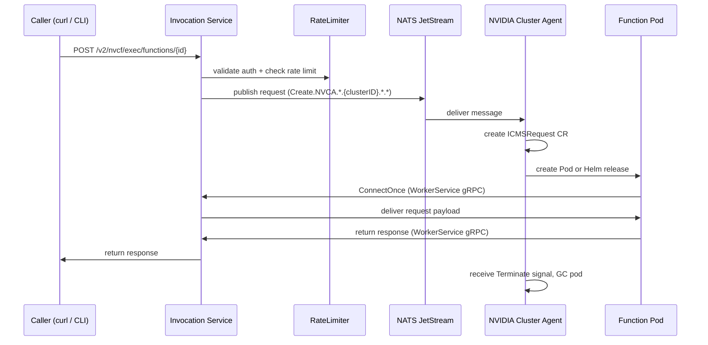

# NVCF Architecture

NVCF is built around three independently scalable planes connected through NATS JetStream as the shared messaging layer. A single control plane manages multiple GPU worker clusters, each registered via the NVIDIA Cluster Agent (NVCA).

## Three-Plane Overview

The diagram below shows the primary components and how requests flow across planes. The control plane contains additional services beyond those shown. See the [manifest page](https://docs.nvidia.com/nvcf/dev/manifest#control-plane-components-1) for the full component list.


## Component Responsibilities

For a full breakdown of component responsibilities by plane, see the [manifest page](https://docs.nvidia.com/nvcf/dev/manifest#control-plane-components-1).

## Single Request Lifecycle

A synchronous HTTP function invocation flows through all three planes:



## Scale-to-Zero

NVCF uses NATS JetStream as a durable request buffer, enabling true scale-to-zero without dropping requests:

1. Autoscaler detects zero utilization and drives desired instance count to 0.
2. No function pods are running.
3. A new request arrives and is published to the NATS JetStream stream. The stream persists it durably.
4. Autoscaler detects queue depth > 0 and sets desired instances to 1 or more.
5. NVCA receives a creation message and launches the pod.
6. Pod connects via WorkerService gRPC and pulls the buffered message.
7. Response is returned to the caller through the still-open Invocation Service connection.

## Multi-Cluster Routing

Each GPU cluster runs its own NVCA instance. NATS JetStream subjects are scoped per cluster:

```
Creation stream:    Create.NVCA.*.{clusterID}.*.*
Termination:        Terminate.NVCA.{clusterID}
Consumer name:      {streamName}-{clusterID}   (durable, per cluster)
```

Creation messages are only delivered to the consumer of the addressed cluster. The invocation plane selects the target cluster based on the function deployment specification (GPU type, region, cluster group).

## Function Workload Types

NVCF supports four workload types on the compute plane:

| Type | Packaging | Invocation | Use case |
|------|-----------|------------|----------|
| Container function | Docker image | HTTP / gRPC / streaming | Long-running inference service |
| Helm function | Helm chart | HTTP | Multi-container or operator-based workload |
| Container task | Docker image | Async (run-to-completion) | Batch inference, fine-tuning |
| Helm task | Helm chart | Async (run-to-completion) | Distributed batch jobs |

## Key Custom Resource Definitions

| CRD | API Group | Purpose |
|-----|-----------|---------|
| `NVCFBackend` | `nvcf/v1` | Cluster-level spec (NVCA image, GPU discovery, feature flags) |
| `ICMSRequest` | `nvca/v2beta1` | Per-request state machine (Pending -> Completed/Failed) |
| `MiniService` | `nvca/v1alpha1` | Per-Helm-function lifecycle (Installing -> Running -> Failed) |

## Per-Component Documentation

Each component ships an `AGENTS.md` with detailed internals, data flows, and API contracts:

- [`src/compute-plane-services/nvca/AGENTS.md`](../../src/compute-plane-services/nvca/AGENTS.md)
- [`src/compute-plane-services/ess-agent/AGENTS.md`](../../src/compute-plane-services/ess-agent/AGENTS.md)
- [`src/compute-plane-services/byoo-otel-collector/AGENTS.md`](../../src/compute-plane-services/byoo-otel-collector/AGENTS.md)
- [`src/invocation-plane-services/http-invocation/AGENTS.md`](../../src/invocation-plane-services/http-invocation/AGENTS.md)
- [`src/invocation-plane-services/grpc-proxy/AGENTS.md`](../../src/invocation-plane-services/grpc-proxy/AGENTS.md)
- [`src/invocation-plane-services/llm-api-gateway/AGENTS.md`](../../src/invocation-plane-services/llm-api-gateway/AGENTS.md)
- [`src/invocation-plane-services/ratelimiter/AGENTS.md`](../../src/invocation-plane-services/ratelimiter/AGENTS.md)
- [`src/control-plane-services/nats-auth-callout/AGENTS.md`](../../src/control-plane-services/nats-auth-callout/AGENTS.md)
- [`src/control-plane-services/function-autoscaler/AGENTS.md`](../../src/control-plane-services/function-autoscaler/AGENTS.md)
- [`examples/AGENTS.md`](../../examples/AGENTS.md)
