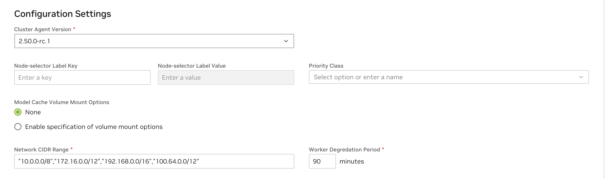
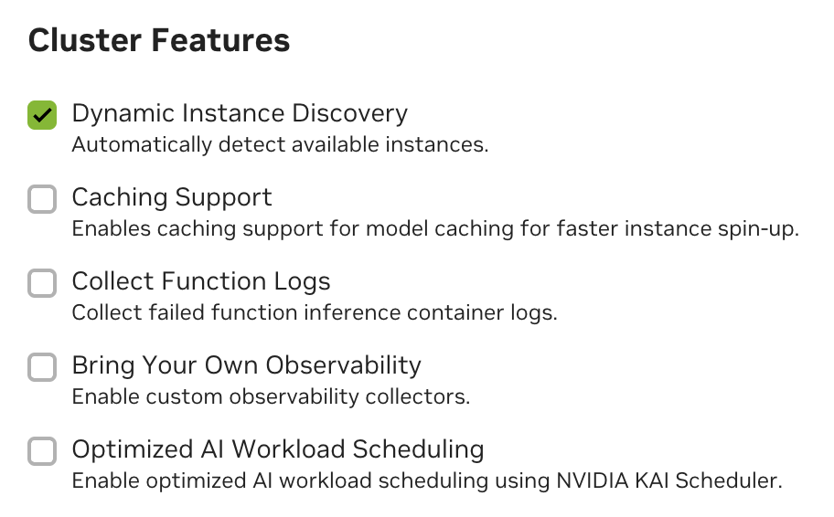
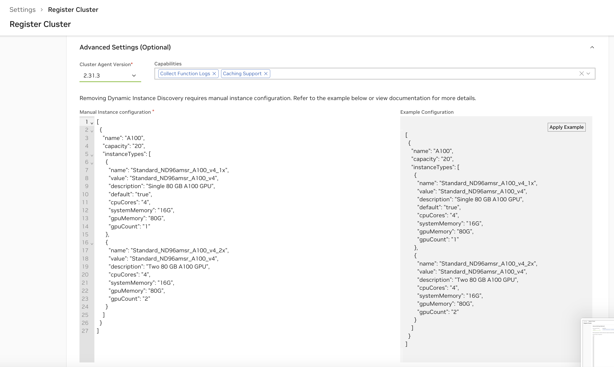

# NVCA Configuration

This page documents NVCA configuration options that apply to **NGC-managed and Helm-managed** deployment modes. Where the configuration steps differ per mode, instructions are provided for each.

For mode-specific lifecycle operations (registration, upgrades, deregistration), see:

- [NGC-Managed Clusters](./ngc-managed.md) for clusters managed through the NGC UI
- [Helm-Managed Clusters](./helm-managed.md) for clusters managed through Helm values

<Note>

This page is being populated incrementally. Additional configuration topics (network
policies, manual instance configuration, feature flag management, node selection, and more)
will be consolidated here in future updates.
</Note>

## Advanced Settings

<Note>
Some of the options below are supported only on Cluster Agent Versions ``2.50.0`` or higher. If you are upgrading from an older version,
you must ``Edit Cluster Configuration`` from ``Settings`` page and enter the cluster specific configuration and hit ``Save and continue``
as soon as the version ``2.50.0`` or higher is selected from ``View Update Instructions``
</Note>



See below for descriptions of all capability options in the "Advanced Settings" section of the cluster configuration.

| Configuration | Description |
| --- | --- |
| Cluster Agent Version | Version of the cluster agent to be installed on the cluster. Defaults to the latest available. Recommended to use the latest version available at the time of registration unless there are business reasons to pick another version. |
| Node Selector Key and Node Selector Value | This Key-Value pair is the label selector key to control the placement of the cluster agent and the cluster agent operator pods to specific nodes on the cluster. Not providing a value will allow these infrastructure components to be placed anywhere on the cluster. Ensure there are matching nodes in the cluster using `kubectl get node -l key=value` before registration as incorrect value will cause operational issues. For additional details: [Labels & Selectors](https://kubernetes.io/docs/concepts/overview/working-with-objects/labels/#label-selectors) |
| Priority Class | Set appropriate kubernetes priority class name for cluster agent and the operator pod. Additional details: [Priority Class](https://kubernetes.io/docs/concepts/scheduling-eviction/pod-priority-preemption/#priorityclass) |
| Model Cache Volume Mount Options | Configure the model cache volume mount options based on the CSI Driver capabilities on the cluster. Refer to the CSI Driver documentation. Defaults to `Enabled` and `ro,norecovery,nouuid` on an upgrade. Requires cluster reconfiguration after upgrade to prevent disruption. Additional details: [Mount options](https://man7.org/linux/man-pages/man8/mount.8.html) |
| Network CIDR Range | Quoted & comma separated list of CIDR range for outbound network access for the infrastructure components & workloads on the cluster. |
| Worker Degradation Period | Stabilization time (in minutes) before cluster agent fails to consider a worker as healthy and initiates a purge. |

## Cluster Features

Cluster Features allow enabling specific features on the cluster. Note that for customer-managed clusters (registered via the Cluster Agent) Dynamic GPU Discovery is enabled by default. For NVIDIA managed clusters, Collect Function Logs is also enabled by default.



See below for descriptions of all cluster features in the cluster configuration.

| Capability | Description |
| --- | --- |
| Dynamic GPU Discovery | Enables automatic detection and management of allocatable GPU capacity within the cluster via the NVIDIA GPU Operator. This capability is **strongly recommended** and would only be disabled in cases where Manual Instance Configuration is required. |
| Collect Function Logs | This capability enables the emission of comprehensive Cluster Agent logs, which are then forwarded to the NVIDIA internal team, aiding in diagnosing and resolving issues effectively. When enabled these will not be visible in the UI, but are always available by running commands to retrieve logs directly on the cluster. |
| Caching Support | Enhances application performance by storing frequently accessed data (models, resources and containers) in a cache. See the Caching Support section below. |
| Bring Your Own Observability | Enable support for custom observability selectors in the cluster. Additional setup details: see the Observability section. |
| Optimized AI Workload Scheduling | Enable support for optimized AI workload scheduling using [KAI Scheduler](https://github.com/kai-scheduler/KAI-Scheduler). Additional setup details: see the KAI Scheduler section. |

<Note>

Removing the Dynamic GPU Discovery will require manual instance configuration. See Manual Instance Configuration.
</Note>

### Caching Support

Enabling caching for models, resources and containers is recommended for optimal performance. You must create `StorageClass` configurations for caching within your cluster to fully enable "Caching Support" with the Cluster Agent. See examples below.

<Warning>

Caching is not supported for Multi-Node Helm functions. If you attempt to deploy a Multi-Node Helm function with Caching Support enabled, the deployment will fail.

Caching is also currently not supported for AWS EKS.
</Warning>

**StorageClass Configurations in GCP**

```yaml

  kind: StorageClass
  apiVersion: storage.k8s.io/v1
  metadata:
      name: nvcf-sc
  provisioner: pd.csi.storage.gke.io
  allowVolumeExpansion: true
  volumeBindingMode: Immediate
  reclaimPolicy: Retain
  parameters:
      type: pd-ssd
      csi.storage.k8s.io/fstype: xfs
```

```yaml

  kind: StorageClass
  apiVersion: storage.k8s.io/v1
  metadata:
      name: nvcf-cc-sc
  provisioner: pd.csi.storage.gke.io
  allowVolumeExpansion: true
  volumeBindingMode: Immediate
  reclaimPolicy: Retain
  parameters:
      type: pd-ssd
      csi.storage.k8s.io/fstype: xfs
```

<Note>

GCP currently allows only [10 VM's](https://cloud.google.com/compute/docs/disks#:~:text=You%20can%20attach%20a%20balanced,VMs%20in%20read%2Donly%20mode) to mount a Persistent Volume in Read-Only mode.
</Note>

**StorageClass Configurations in Azure**

```yaml

  kind: StorageClass
  apiVersion: storage.k8s.io/v1
  metadata:
      name: nvcf-sc
  provisioner: file.csi.azure.com
  allowVolumeExpansion: true
  volumeBindingMode: Immediate
  reclaimPolicy: Retain
  parameters:
      skuName: Standard_LRS
      csi.storage.k8s.io/fstype: xfs
```

```yaml

  kind: StorageClass
  apiVersion: storage.k8s.io/v1
  metadata:
      name: nvcf-cc-sc
  provisioner: file.csi.azure.com
  allowVolumeExpansion: true
  volumeBindingMode: Immediate
  reclaimPolicy: Retain
  parameters:
      skuName: Standard_LRS
      csi.storage.k8s.io/fstype: xfs
```

**StorageClass Configurations in Oracle Cloud**

```yaml

  kind: StorageClass
  apiVersion: storage.k8s.io/v1
  metadata:
    name: nvcf-sc
  provisioner: blockvolume.csi.oraclecloud.com
  allowVolumeExpansion: true
  volumeBindingMode: Immediate
  reclaimPolicy: Retain
  parameters:
    csi.storage.k8s.io/fstype: xfs
```

```yaml

  kind: StorageClass
  apiVersion: storage.k8s.io/v1
  metadata:
    name: nvcf-cc-sc
  provisioner: blockvolume.csi.oraclecloud.com
  allowVolumeExpansion: true
  volumeBindingMode: Immediate
  reclaimPolicy: Retain
  parameters:
    csi.storage.k8s.io/fstype: xfs
```

**Apply the StorageClass Configurations**

Save the StorageClass template to files `nvcf-sc.yaml` and `nvcf-cc-sc.yaml` and apply them as:

```bash

  kubectl create -f nvcf-sc.yaml
  kubectl create -f nvcf-cc-sc.yaml
```

**Override the Default Mount Options for Cache Volumes**

<Note>
Supported in Cluster Agent Versions 2.45.21 or higher
</Note>

<Warning>

Please note this is a Post NVCA Install Operation and needs careful consideration to ensure there are no volume corruptions. Use with caution.
</Warning>

Cluster Agent with caching support by default will enable linux mount-options with `ro,norecovery,nouuid`.

If the CSI Driver in the cluster doesn't support mount options then you may apply the following command on the cluster to disable the mount options

```bash

  nvcf_cluster_name="$(kubectl get nvcfbackends -n nvca-operator -o name | cut -d'/' -f2)"
  kubectl patch nvcfbackend -n nvca-operator "$nvcf_cluster_name" --type=merge -p '{"spec":{"overrides":{"featureGate":{"cacheCSIVolumeMountOptionsConfig":{"disabled":true}}}}}'
```

If you want to update the mount-options to a different value for example: `ro,norecovery`. You may use the following command. Replace these options with desired value as dictated by CSI Driver Volume Mount Options.

```bash

  nvcf_cluster_name="$(kubectl get nvcfbackends -n nvca-operator -o name | cut -d'/' -f2)"
  kubectl patch nvcfbackend -n nvca-operator "$nvcf_cluster_name" --type=merge -p '{"spec":{"overrides":{"featureGate":{"cacheCSIVolumeMountOptionsConfig":{"disabled":false}}}}}'
  kubectl patch nvcfbackend -n nvca-operator "$nvcf_cluster_name" --type=merge -p '{"spec":{"overrides":{"featureGate":{"cacheCSIVolumeMountOptionsConfig":{"mountOptions":"ro,norecovery"}}}}}'
```

### Account-Isolated Clusters

<Note>
Supported in Cluster Agent Versions 2.49.0 or higher
</Note>

Clusters with the `AccountIsolation` attribute have enhanced isolation between workloads, ensuring that function and task instances run on nodes isolated by NCAId. This is particularly important for customers with strict security requirements or those who want to ensure complete separation of workloads at the account level. 

<Warning>
In Account Isolated mode, the cluster might be inefficient in GPU utilization if workloads are not designed to utilize the full capacity of the isolated nodes.
While toggling this attribute, the cluster workloads also have to be drained using CordonAndDrainMaintenance mode to effectively re-balance the workloads as the attribute will not be applied retroactively.
</Warning>

### NVLink-optimized Clusters

Clusters with [MNNVL](https://docs.nvidia.com/datacenter/cloud-native/gpu-operator/latest/dra-cds.html#dra-docs-compute-domains) GPUs like [GB200](https://www.nvidia.com/en-us/data-center/gb200-nvl72/) can run multi-node workloads that require inter-GPU data transfer with [large performance improvements](https://docs.nvidia.com/datacenter/cloud-native/gpu-operator/latest/dra-cds.html#usage-example-a-multi-node-nvbandwidth-test) when properly configured.
The Cluster Agent can be directed to configure multi-node workloads with their own [ComputeDomains](https://docs.nvidia.com/datacenter/cloud-native/gpu-operator/latest/dra-cds.html#computedomains-multi-node-nvlink-simplified) automatically to optimize inter-GPU connections.

Additional prerequisites:
- The [NVIDIA GPU DRA driver](https://docs.nvidia.com/datacenter/cloud-native/gpu-operator/latest/dra-intro-install.html) must be installed.
- The `NVLinkOptimized` cluster attribute must be added during cluster registration.

<Warning>
In NVLink-optimized mode, the NVIDIA GPU DRA driver currently limits one GPU-enabled Pod to a node. To optimally utilize these clusters, GPU-enabled Pods _should_ request a full Node’s worth of GPUs. For example, Nodes in GB200 clusters have 4 GPUs each so all containers and all GPU-enabled Pods in a workload must request ``nvidia.com/gpu``'s that sum to 4.
</Warning>

### Kata Container-Isolated Workloads

Clusters that have this attribute run all function/task Pods in [Kata Containers](https://katacontainers.io/) without exception.

Additional cluster restrictions to be aware of:

- Pod containers _must_ at least have resource `limits` defined for `cpu` and `memory`. If unset, runtime behavior is undefined.

- Object count limits are configured for resource fairness in these clusters:

   - ConfigMaps: 20
   - Secrets: 20
   - Services: 20
   - Pods: 100
   - Jobs: 10
   - CronJobs: 10
   - Deployments: 10
   - ReplicaSets: 10
   - StatefulSets: 10

## Network Configuration

<Warning>

The network policies described in this section are only enforced if your cluster's Container Network Interface (CNI) supports Kubernetes Network Policies. Common CNIs that support network policies include:

- Calico
- Cilium
- Weave Net
- Antrea

If your cluster uses a CNI that doesn't support network policies, the security controls described below will not be enforced, and pods will be able to communicate with each other without restrictions. This could lead to security vulnerabilities.
</Warning>

The NVCA operator requires outbound network connectivity to pull images, charts, and report logs and metrics. During installation, the operator pre-configures the `nvca-namespace-networkpolicies` configmap with the following network policies:

| Policy Name | Description |
| --- | --- |
| allow-egress-gxcache | Allows egress traffic to the GX Cache namespace for caching operations (only relevant for NVIDIA managed clusters) |
| allow-egress-internet-no- internal-no-api | Allows egress traffic to the public internet (0.0.0.0/0) but blocks traffic to common private IP ranges. Also allows DNS resolution via kube-dns. |
| allow-egress-intra-namespace | Controls pod-to-pod communication within the same namespace. This policy is only applied to function namespaces and not to shared pod instance namespaces. |
| allow-egress-nvcf-cache | Allows egress traffic to NVCF cache services (only relevant for NVIDIA managed clusters) |
| allow-egress-prometheus- nvcf-byoo | Allows egress traffic to Prometheus monitoring endpoints (only relevant for NVIDIA managed clusters) |
| allow-ingress-monitoring | Allows ingress traffic for monitoring services |
| allow-ingress-monitoring-dcgm | Allows ingress traffic for DCGM monitoring |
| allow-ingress-monitoring- gxcache | Allows ingress traffic for GX Cache monitoring (only relevant for NVIDIA managed clusters) |

## Key Network Requirements

1. **Kubernetes API Access**

  - NVCA requires access to the Kubernetes API
  - Consult your cloud provider's documentation (e.g., Azure, AWS, GCP) for the Kubernetes API endpoint

2. **Container Registry and NVCF Control Plane Access**

  - Access to `nvcr.io` and `helm.ngc.nvidia.com` is required to pull container images, resources, and helm charts.
  - NVCA requires access to NVIDIA control plane services for coordination of functions and task deployments and invocation, this includes:

    - `connect.pnats.nvcf.nvidia.com`
    - `grpc.api.nvcf.nvidia.com`
    - `*.api.nvcf.nvidia.com`
    - `sqs.*.amazonaws.com`
    - `spot.gdn.nvidia.com`
    - `ess.ngc.nvidia.com`
    - `api.ngc.nvidia.com`

3. **Monitoring and Logging**

  - If your environment requires advanced monitoring or logging (e.g., sending logs to external endpoints), ensure your cluster's NetworkPolicy or firewall rules allow egress to the required monitoring/logging domains

## Network Policy Customization via ConfigMap

The NVCA operator pre-configures the `nvca-namespace-networkpolicies` configmap during installation. If you need to customize these policies for your cluster, you can use a configmap to override the default policies.

To customize a network policy:

1. Create a configmap with your custom network policy, for example:

```yaml

 apiVersion: v1
 kind: ConfigMap
 metadata:
   name: demopatch-configmap
   namespace: nvca-operator
   labels:
     nvca.nvcf.nvidia.io/operator-kustomization: enabled
 data:
   patches: |
     - target:
         group: ""
         version: v1
         kind: ConfigMap
         name: nvca-namespace-networkpolicies
       patch: |-
         - op: replace
           path: /data/allow-egress-internet-no-internal-no-api
           value: |
             apiVersion: networking.k8s.io/v1
             kind: NetworkPolicy
             metadata:
               name: allow-egress-internet-no-internal-no-api
               labels:
                 app.kubernetes.io/name: nvca
                 app.kubernetes.io/instance: nvca
                 app.kubernetes.io/version: "1.0"
                 app.kubernetes.io/managed-by: nvca-operator
             spec:
               podSelector: {}
               policyTypes:
                 - Egress
               egress:
                 - to:
                   - namespaceSelector: {}
                     podSelector:
                       matchLabels:
                         k8s-app: kube-dns
                 - to:
                   - namespaceSelector:
                       matchLabels:
                         kubernetes.io/metadata.name: gxcache
                   ports:
                     - port: 8888
                       protocol: TCP
                     - port: 8889
                       protocol: TCP
```

2. Apply the configmap:

```bash

 kubectl apply -f patchcm.yaml
```

3. Verify the changes:

```bash

 kubectl logs -n nvca-operator -l app.kubernetes.io/name=nvca-operator
```

   You should see a message indicating successful patching:
   `configmap patched successfully`

The changes will be applied to the `nvcf-backend` namespace and will be used for all new namespaces' network policies. The network policies will also be updated across all helm chart namespaces.

## Network Policy Customization via clusterNetworkCIDRs Flag

You can customize the `allow-egress-internet-no-internal-no-api` policy with helm, by adding on the `networkPolicy.clusterNetworkCIDRs` flag. For example:

```bash

 helm upgrade nvca-operator -n nvca-operator --create-namespace -i --reuse-values --wait "https://helm.ngc.nvidia.com/nvidia/nvcf-byoc/charts/nvca-operator-1.14.0.tgz" --username='$oauthtoken' --password=$(helm get values -n nvca-operator nvca-operator -o json | jq -r '.ngcConfig.serviceKey') --set networkPolicy.clusterNetworkCIDRs="{10.0.0.0/8,172.16.0.0/12,192.168.0.0/16,100.64.0.0/12}"
```

This command will override the default k8s networking CIDRs specified in the `allow-egress-internet-no-internal-no-api` with your input.

## Advanced: Additional Configuration Options

## CSI Volume Mount Options

The NVIDIA Cluster Agent supports customizing CSI volume mount options for caching. This allows you to configure specific mount options for the CSI volumes used in your cluster.

<Warning>
CSI volume mount options configuration is an **experimental feature** and may be subject to change in future releases.
</Warning>

To configure CSI volume mount options:

1. Get the NVCF cluster name:

```bash

  nvcf_cluster_name="$(kubectl get nvcfbackends -n nvca-operator -o name | cut -d'/' -f2)"
```

2. View current mount options configuration:

```bash

  kubectl get nvcfbackend -n nvca-operator "$nvcf_cluster_name" -o yaml | grep -A 5 "cacheCSIVolumeMountOptionsConfig"
```

1. Set mount options (example):

```bash

  kubectl patch nvcfbackends.nvcf.nvidia.io -n nvca-operator "$nvcf_cluster_name" --type='json' -p='[{"op": "replace", "path": "/spec/overrides/featureGate/cacheCSIVolumeMountOptionsConfig", "value": {"disabled": false, "mountOptions": "ro,norecovery,nouuid"}}]'
```

4. Verify the changes:

```bash

  kubectl get nvcfbackend -n nvca-operator "$nvcf_cluster_name" -o yaml | grep -A 5 "cacheCSIVolumeMountOptionsConfig"
```

The default mount options are:
- `ro`: Read-only mount
- `norecovery`: Skip journal recovery
- `nouuid`: Ignore filesystem UUID

You can modify these options based on your specific requirements. The configuration will be applied to all CSI volumes created by the NVIDIA Cluster Agent for caching purposes.

## Node Selection for Cloud Functions

By default, the cluster agent uses all nodes discovered with GPU resources to schedule Cloud Functions and there are no additional configuration required.

In order to limit the nodes that can run Cloud Functions, you may use `nvca.nvcf.nvidia.io/schedule=true` label on the specific nodes.

If there are no nodes in the cluster with the `nvca.nvcf.nvidia.io/schedule=true` label set, the cluster agent will switch to the default behavior of using all nodes with GPUs.

For example, to mark specific nodes as schedulable in a cluster:

```bash

  kubectl label node <node-name> nvca.nvcf.nvidia.io/schedule=true
```

To mark a single node from the above set as unschedulable for nvcf workloads, you can unlabel using:

```bash

  kubectl label node <node-name> nvca.nvcf.nvidia.io/schedule-
```

## GPU Product Name Override

The NVIDIA Cluster Agent supports GPU product name override via node label. This is useful for customers who want to use a custom product name or override the default GPU product name.

For example, to set the GPU product name for a node, use the following command:

```bash

  kubectl label node <node-name> nvca.nvcf.nvidia.io/gpu.product=<product-name>
```

**Note:** The GPU Product Name Override via node labeling only takes effect when there are no pre-existing active instances in the cluster. If active instances already exist with the original GPU instance types, the override will not be applied.

## Managing Feature Flags

The NVIDIA Cluster Agent supports various feature flags that can be enabled or disabled to customize its behavior. The following are some commonly used feature flags:

| Feature Flag | Description |
| --- | --- |
| DynamicGPUDiscovery | Dynamically discover GPUs and instance types on this cluster. This is enabled by default for customer-managed clusters. |
| HelmSharedStorage | Configure Helm functions and tasks with shared read-only storage for ESS secrets. This is required for enabling Helm-based tasks in your cluster. Please note turning on this feature flag requires additional configuration, see the Helm Shared Storage section below. |
| LogPosting | Post instance logs to SIS directly. This is enabled by default for NVIDIA managed clusters. |
| MultiNodeWorkloads | Instruct NVCA to report multi-node instance types to SIS during registration. |
| SelfHosted | Enables local vault-based authentication for self-hosted deployments. Required when `ngcConfig.clusterSource` is `self-managed`. |

### Setting Feature Flags at Install Time

Feature flags can be set during the initial NVCA Operator installation through Helm values. The
mechanism differs by deployment mode.

<details>
<summary>Self-Managed (Standalone Helm)</summary>

Set `selfManaged.featureGateValues` in your values file. The chart default is
`["DynamicGPUDiscovery"]`.

**In the values file:**

```yaml
selfManaged:
featureGateValues: ["DynamicGPUDiscovery", "SelfHosted", "LogPosting"]
```

**Or via** `--set` **during install:**

```bash
helm upgrade --install nvca-operator \
oci://${REGISTRY}/${REPOSITORY}/nvca-operator \
--version 1.2.7 \
--namespace nvca-operator --create-namespace \
-f nvca-operator-values.yaml \
--set 'selfManaged.featureGateValues={DynamicGPUDiscovery,SelfHosted,LogPosting}'
```

<Warning>
The `--set` flag **replaces** the entire list. You must include all desired flags,
not just the new one.
</Warning>

To update flags on an existing installation, run `helm upgrade` with the updated values
file or `--set`:

```bash
helm upgrade nvca-operator \
oci://${REGISTRY}/${REPOSITORY}/nvca-operator \
--version 1.2.7 \
--namespace nvca-operator \
-f nvca-operator-values.yaml \
--set 'selfManaged.featureGateValues={DynamicGPUDiscovery,SelfHosted,LogPosting,MultiNodeWorkloads}'
```

</details>

<details>
<summary>Helmfile (Self-Hosted)</summary>

The Helmfile deployment uses the same `selfManaged.featureGateValues` chart value. By
default, the helmfile does not set this field, so the chart default
`["DynamicGPUDiscovery"]` applies.

To override, add `featureGateValues` to the worker release values in
`helmfile.d/03-worker.yaml.gotmpl`:

```yaml
- selfManaged:
featureGateValues: ["DynamicGPUDiscovery", "SelfHosted", "LogPosting"]
imageCredHelper:
imageRepository: {{ .Values.global.image.registry }}/{{ .Values.global.image.repository }}/nvcf-image-credential-helper
sharedStorage:
imageRepository: {{ .Values.global.image.registry }}/{{ .Values.global.image.repository }}/samba
```

Alternatively, set it in an environment-specific values file (e.g.,
`environments/<env>.yaml`) under the same key path, which avoids editing the shared
helmfile template.

After changing, run `helmfile --selector release-group=workers sync` to apply.

</details>

<details>
<summary>Helm-Managed</summary>

Set `helmManaged.featureGateValues` in your values or via `--set` during
`helm upgrade`. The chart default is `[]` (NGC controls flags by default).

```bash
helm upgrade nvca-operator \
oci://helm.ngc.nvidia.com/nvidia/nvcf-byoc/charts/nvca-operator \
--version `<version>` \
--namespace nvca-operator \
--set helmManaged.featureGateValues='["LogPosting","CachingSupport"]'
```

<Warning>
The `--set` flag **replaces** the entire list. Include all desired flags in every
`helm upgrade` command, or use a persistent values file to avoid accidentally
dropping flags.
</Warning>

</details>

<details>
<summary>NGC-Managed</summary>

Feature flags for NGC-managed clusters are controlled through the NGC UI under
**Cluster Configuration > Features**. No Helm values are required.

To manage flags outside the UI, see the Modifying Feature Flags at Runtime section below.

</details>

### Verifying Feature Flags

After installing or upgrading, verify the active feature flags:

```bash
  nvcf_cluster_name="$(kubectl get nvcfbackends -n nvca-operator -o name | cut -d'/' -f2)"
  kubectl get nvcfbackends -n nvca-operator "$nvcf_cluster_name" -o jsonpath='{.spec.featureGate.values}' && echo ""
```

The NVCA agent pod command-line args also reflect the active flags:

```bash
  kubectl get pods -n nvca-system -o yaml | grep -i feature
```

### Modifying Feature Flags at Runtime

For NGC-managed and Helm-managed clusters, feature flags can also be modified at runtime by
patching the NVCFBackend resource directly. This is useful for quick changes without running
a `helm upgrade`.

<Note>

For self-managed (standalone or helmfile) clusters, prefer ``helm upgrade`` with updated
values to change feature flags. Direct patches to the NVCFBackend will be overwritten on
the next Helm upgrade.
</Note>

1. Get the NVCF cluster name:

```bash

  nvcf_cluster_name="$(kubectl get nvcfbackends -n nvca-operator -o name | cut -d'/' -f2)"
```

2. View current feature flags:

```bash

  kubectl get nvcfbackends -n nvca-operator -o yaml | grep -A 5 "featureGate:"
```

3. Patch the feature flags. Note that this will override all feature flags.

<Warning>

When modifying feature flags, you must preserve any existing feature flags you want to keep. The patch command will override all feature flags, so you need to include all desired feature flags in the value array.
</Warning>

```bash

  kubectl patch nvcfbackends.nvcf.nvidia.io -n nvca-operator "$nvcf_cluster_name" --type=merge -p '{"spec":{"overrides":{"featureGate":{"values":["LogPosting","CachingSupport"]}}}}'
```

As an alternative to the patch command, you can also modify the feature flags using the edit command:

```bash

  kubectl edit nvcfbackend -n nvca-operator
  ...
  spec:
    featureGate:
      values:
      - LogPosting                # Existing feature flag
    overrides:
      featureGate:
        values:
        - LogPosting              # Existing feature flag copied over
        - -CachingSupport         # Caching support disabled
        ...
```

4. Verify the changes:

```bash

  kubectl get pods -n nvca-system -o yaml | grep -i feature
```

## Enable Helm Shared Storage

The NVIDIA Cluster Agent supports shared storage for Helm charts through the [SMB CSI driver](https://github.com/kubernetes-csi/csi-driver-smb/tree/master/charts#install-csi-driver-with-helm-3). This feature is required for enabling Helm-based tasks in your cluster.

<Note>

The Helm shared storage feature must be enabled before you can use Helm-based tasks in your cluster. This feature provides the necessary storage infrastructure for Helm chart operations.
</Note>

<Warning>

When enabling the Helm shared storage feature flag, you must preserve any existing feature flags. The patch command will override all feature flags, so you need to include all desired feature flags in the value array. If you already have other feature flags enabled, you should include them along with "HelmSharedStorage" in the value array.
</Warning>

1. First, install the SMB CSI driver using Helm:

```bash

  helm repo add csi-driver-smb https://raw.githubusercontent.com/kubernetes-csi/csi-driver-smb/master/charts
  helm install csi-driver-smb csi-driver-smb/csi-driver-smb --namespace kube-system --version v1.16.0
```

2. Get the NVCF cluster name:

```bash

  nvcf_cluster_name="$(kubectl get nvcfbackends -n nvca-operator -o name | cut -d'/' -f2)"
```

3. Enable the Helm shared storage feature flag:

```bash

  kubectl patch nvcfbackends.nvcf.nvidia.io -n nvca-operator "$nvcf_cluster_name" --type=merge -p '{"spec":{"overrides":{"featureGate":{"values":["LogPosting","HelmSharedStorage", "CachingSupport"]}}}}'
```

4. Verify that the feature flag is enabled:

```bash

  kubectl get pods -n nvca-system -o yaml | grep HelmSharedStorage
```

## Agent Config Merging

The NVIDIA Cluster Agent supports merging custom configuration into the generated NVCA config
via the `agentConfig.mergeConfig` Helm value. This allows you to override or extend NVCA
runtime settings without modifying the operator's config generation logic.

When `agentConfig.mergeConfig` is set, the Helm chart creates a ConfigMap called
`agent-config-merge` containing the provided YAML. This ConfigMap is mounted into the NVCA
pod and merged with the generated config at runtime.

**Example values.yaml:**

```yaml
 agentConfig:
   mergeConfig: |
     agent:
       logLevel: debug
```

**Apply via Helm:**

```bash

 helm upgrade nvca-operator -n nvca-operator --create-namespace -i \
   <chart-reference> \
   --set-file agentConfig.mergeConfig=my-nvca-config.yaml
```

Or include it in a values file passed to `helm upgrade -f values.yaml`.

## Manual Instance Configuration

<Warning>

It is **highly recommended** to rely on Dynamic GPU Discovery (and therefore the NVIDIA GPU Operator), as manual instance configuration is error-prone.

This type of configuration is only necessary when the cluster cloud provider does not support the NVIDIA GPU Operator.
</Warning>

Manual instance configuration allows you to disable Dynamic GPU Discovery and instead provide a static list of instance types that NVCA will register with the NVCF control plane. This is useful when:

- You have a known, fixed set of GPU configurations
- Dynamic GPU discovery isn't working correctly for your environment
- You want to control exactly which instance types are available

By default, NVCA uses Dynamic GPU Discovery to automatically detect GPUs on cluster nodes and register appropriate instance types. When this is disabled, NVCA instead reads a static GPU configuration from a ConfigMap.

<Note>

**NGC-managed clusters:** You can also configure manual instances through the NGC UI by unchecking "Dynamic GPU Discovery" in the Cluster Features section during registration or reconfiguration. The UI will present a configuration editor.

</Note>

### Prerequisites

- A working NVCF cluster with `nvca-operator` installed
- Access to modify Helm values for `nvca-operator`
- Since you are not using the GPU Operator, you must ensure each GPU node has the instance-type label that matches the "value" field in your manual configuration:

```bash
 kubectl label nodes <node-name> nvca.nvcf.nvidia.io/instance-type=<instance-type-value>
```

  For example, if your configuration specifies `"value": "OCI.GPU.A10"`, you would label the node with:

```bash
 kubectl label nodes gpu-node-1 nvca.nvcf.nvidia.io/instance-type=OCI.GPU.A10
```

### Step 1: Create the GPU Configuration JSON

Create a JSON file defining your GPU types and instance configurations. The configuration is an array of GPU types, each containing an array of instance types.

**Example Configuration (gpu-config.json):**

```json
 [
     {
         "name": "H100",
         "capacity": 8,
         "instanceTypes": [
             {
                 "name": "ON-PREM.GPU.H100_1x",
                 "value": "ON-PREM.GPU.H100",
                 "description": "One Nvidia Hopper GPU",
                 "default": true,
                 "cpuCores": 16,
                 "systemMemory": "128G",
                 "gpuMemory": "80G",
                 "gpuCount": 1,
                 "os": "linux",
                 "driverVersion": "535.135.05",
                 "cpuArch": "amd64",
                 "storage": "1Ti"
             },
             {
                 "name": "ON-PREM.GPU.H100_8x",
                 "value": "ON-PREM.GPU.H100",
                 "description": "Eight Nvidia Hopper GPUs (Full Node)",
                 "default": false,
                 "cpuCores": 128,
                 "systemMemory": "1Ti",
                 "gpuMemory": "640G",
                 "gpuCount": 8,
                 "os": "linux",
                 "driverVersion": "535.135.05",
                 "cpuArch": "amd64",
                 "storage": "8Ti"
             }
         ]
     }
 ]
```

### Step 2: Base64 Encode the Configuration

The GPU configuration must be Base64-encoded for the Helm values. Use the following command:

```bash
 # Base64 encode the configuration (without line wrapping)
 GPU_CONFIG_B64=$(cat gpu-config.json | base64 -w 0)
 echo $GPU_CONFIG_B64
```

<Note>

On macOS, use ``base64`` without the ``-w 0`` flag:

```bash
GPU_CONFIG_B64=$(cat gpu-config.json | base64)
```

</Note>

### Step 3: Configure Helm Values

Update your `nvca-operator` Helm values to disable Dynamic GPU Discovery and provide the manual configuration. The values path depends on your cluster source mode.

<details>
<summary>Self-Managed (self-hosted NVCF)</summary>

For self-hosted deployments where `ngcConfig.clusterSource` is `self-managed`, use the `selfManaged` values:

**Example values.yaml:**

```yaml
 selfManaged:
   # Disable dynamic GPU discovery
   featureGateValues: []

   # Your Base64-encoded GPU configuration
   gpuManualInstanceConfigB64: "<your-base64-encoded-config>"
```

<Note>

By default `selfManaged.featureGateValues` is `["DynamicGPUDiscovery"]`. Set it to an empty list (`[]`) to disable dynamic discovery and use your manual configuration instead.
</Note>

</details>

<details>
<summary>Helm-Managed (cloud NVCF)</summary>

For cloud-managed deployments where `ngcConfig.clusterSource` is `helm-managed`, use the `helmManaged` values:

**Example values.yaml:**

```yaml
 ngcConfig:
   clusterSource: "helm-managed"

 helmManaged:
   cloudProvider: "on-prem"
   clusterRegion: "us-west-1"
   clusterGroupID: "your-group-id"
   clusterGroupName: "your-group-name"
   nvcaVersion: "2.97.0"

   # Disable dynamic GPU discovery
   featureGateValues:
     - "-DynamicGPUDiscovery"

   # Your Base64-encoded GPU configuration
   gpuManualInstanceConfigB64: "<your-base64-encoded-config>"
```

<Note>

For helm-managed, the feature gate is disabled by prefixing with `-` (i.e. `"-DynamicGPUDiscovery"`). For self-managed, set the list to `[]` instead.
</Note>

</details>

### Step 4: Install or Upgrade the Operator

Apply the configuration using Helm:

```bash
 helm upgrade nvca-operator -n nvca-operator --create-namespace -i \
   <chart-reference> \
   -f values.yaml
```

If you are using the NVCF self-hosted Helmfile, add your values file as an entry in the nvca-operator release `values:` list and run `helmfile sync` or `helmfile apply` instead.

### Configuration Fields Reference

**GPU Type Fields:**

| Field | Required | Description |
| --- | --- | --- |
| ``name`` | Yes | GPU type name (e.g., "A100", "L40", "H100"). Must match the GPU product name reported by ``nvidia-smi``. |
| ``capacity`` | No | Total GPU capacity for this type. Used for resource accounting and quota management. |
| ``instanceTypes`` | Yes | Array of instance type configurations for this GPU type. |

**Instance Type Fields:**

| Field | Required | Description |
| --- | --- | --- |
| ``name`` | Yes | Unique instance type identifier (e.g., "ON-PREM.GPU.H100_1x"). This is the name users select when deploying functions. |
| ``value`` | Yes | Instance type value used for internal matching (e.g., "ON-PREM.GPU.H100"). Must match the ``nvca.nvcf.nvidia.io/instance-type`` node label. |
| ``description`` | No | Human-readable description displayed in the UI. |
| ``default`` | No | Whether this is the default instance type for this GPU. Only one instance type per GPU should be marked as default. |
| ``cpuCores`` | Yes | Number of CPU cores allocated to workloads using this instance type. |
| ``systemMemory`` | Yes | System RAM allocation (e.g., "28G", "128G", "1Ti"). Uses Kubernetes quantity format. |
| ``gpuMemory`` | Yes | Total GPU memory for this instance type. For multi-GPU instances, this is the total across all GPUs. |
| ``gpuCount`` | Yes | Number of GPUs in this instance type. |
| ``os`` | No | Operating system (e.g., "linux"). |
| ``driverVersion`` | No | NVIDIA driver version (e.g., "535.135.05"). |
| ``cpuArch`` | No | CPU architecture (e.g., "amd64", "arm64"). |
| ``storage`` | No | Storage allocation per instance (e.g., "512Gi", "1Ti"). Uses Kubernetes quantity format. |

### Verification

After applying the configuration, verify that NVCA is using the static configuration:

1. **Check the NVCFBackend resource:**

```bash
 kubectl get nvcfbackend -n nvca-operator -o yaml
```

   Look for `-DynamicGPUDiscovery` in the feature gates and verify the GPU configuration is present.

2. **Check the nvca-config ConfigMap:**

```bash
 kubectl get configmap nvca-config -n nvca-system -o yaml
```

   The `gpus` key should contain your JSON configuration.

3. **Check NVCA logs for registration:**

```bash
 kubectl logs -n nvca-system -l app=nvca | grep -i "registration\|instance"
```

### Troubleshooting

**Configuration Not Applied:**

1. Verify Dynamic GPU Discovery is disabled in the feature gate values
2. Ensure the Base64 encoding is correct and doesn't contain line breaks
3. Check that the JSON is valid before encoding

**Invalid JSON Format:**

1. Validate your JSON using a JSON validator before encoding
2. Ensure all required fields are present
3. Check that numeric values (`cpuCores`, `gpuCount`) are not quoted as strings

**Memory/Storage Format Errors:**

Memory and storage values must use valid Kubernetes quantity format:

- Valid: `"28G"`, `"128Gi"`, `"1Ti"`, `"512Mi"`
- Invalid: `"28GB"`, `"128 Gi"`, `"1TB"`

<Note>

Use ``G`` or ``Gi`` for gigabytes, ``T`` or ``Ti`` for terabytes. The ``i`` suffix indicates binary units (1024-based).
</Note>

## Cloud Provider-Specific Notes

## Oracle Cloud Infrastructure (OCI)

When using Oracle Container Engine for Kubernetes (OKE), ensure that:

* Your compute nodes and GPU nodes are in the same availability domain
* This is required for proper network connectivity between the NVIDIA Cluster Agent and GPU nodes
* Flannel CNI is the current recommended and validated CNI vs OCI native CNI for OKE cluster networking.

## AWS

When using AWS EKS, note that the following limitations exist:

* Caching is currently not supported
