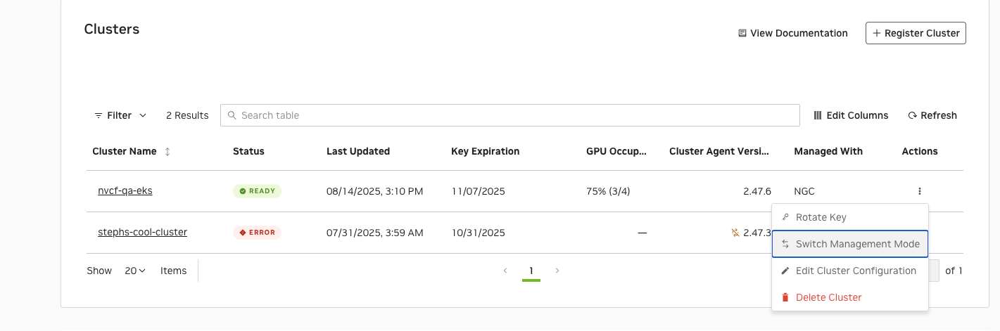
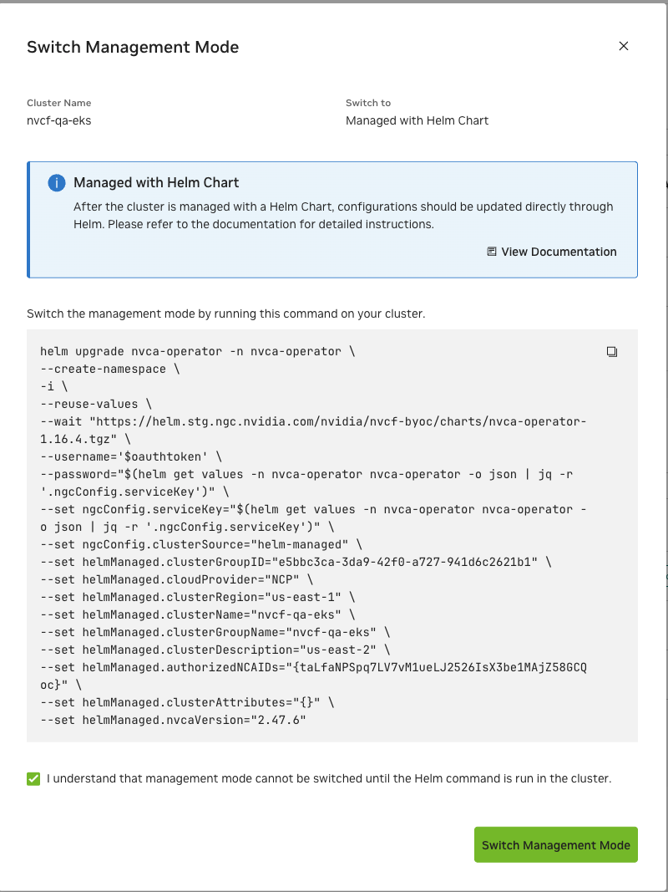
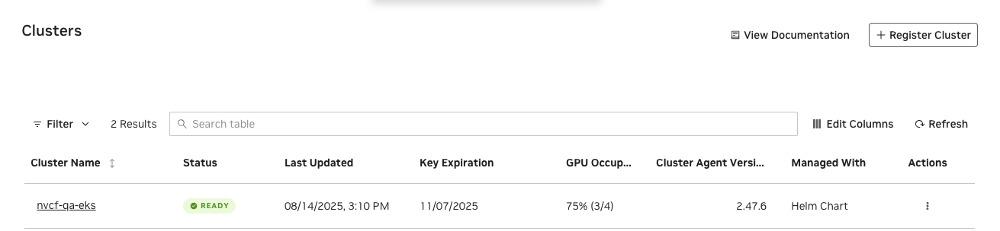
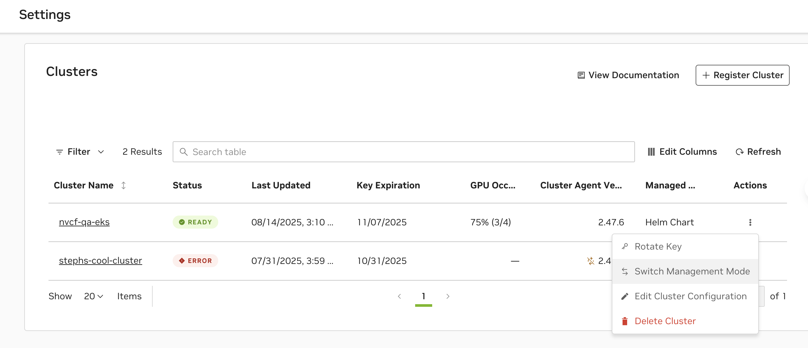
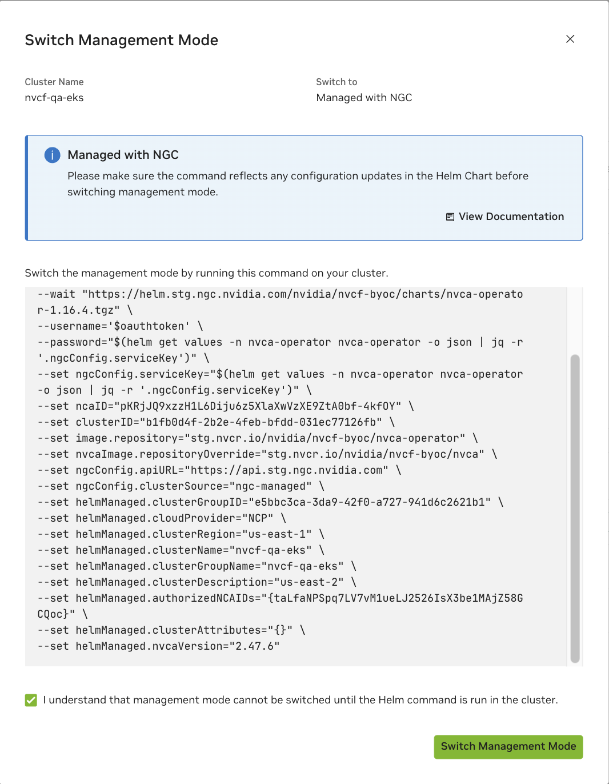
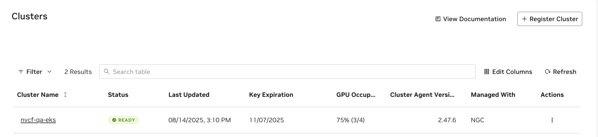

# Helm-Managed Clusters

By default, NVCA clusters are managed through the NGC UI (NGC-managed mode), where configuration changes are applied directly through the web interface. However, advanced users can switch to Helm-managed mode to control the NVCA backend configuration through Helm charts and GitOps practices.

By default, NVCA clusters are managed through the NGC UI (NGC-managed mode), where configuration changes are applied directly through the web interface. However, advanced users can switch to Helm-managed mode to control the NVCA backend configuration through Helm charts and GitOps practices.

<Warning>
When using Helm-managed mode, you must save the cluster key provided during cluster registration. This key is only shown once during the registration process and is not auto-filled in UI-generated commands. You will need to manually replace `<API-KEY>` placeholders with your saved key in all Helm commands.
</Warning>

In Helm-managed mode:

- All cluster configuration is defined in Helm values
- Changes are applied through `helm upgrade` commands
- The NGC UI becomes read-only for cluster configuration

## Switching to Helm-Managed Mode

To switch from NGC-managed to Helm-managed mode, follow these steps:

1. Navigate to the *Settings* page in the NGC UI and click the *Actions* menu (⋮) for your cluster, then select *"Switch Management Mode"* from the dropdown menu.


2. Check the confirmation box: "I understand that management mode cannot be switched until the Helm command is run in the cluster" and copy the provided helm command.


3. Run the helm command on your cluster's command line.

<Note>
The following command is an example template. Always use the actual command provided in the NGC UI, which will have your cluster-specific values (cluster IDs, versions) automatically filled in. You must manually replace `<API-KEY>` with the cluster key that was provided during cluster registration - this key is only shown once and must be saved by the user.

The `ngcConfig.clusterSource` parameter decides the cluster management mode.
</Note>

```bash

  helm upgrade nvca-operator -n nvca-operator \
    --create-namespace \
    -i \
    --reset-values \
    --wait \
    "https://helm.ngc.nvidia.com/nvidia/nvcf-byoc/charts/nvca-operator-1.15.4.tgz" \
    --username='$oauthtoken' \
    --password="<API-KEY>" \
    --set ngcConfig.serviceKey="<API-KEY>" \
    --set ncaID="<NCA-ID>" \
    --set clusterID="<CLUSTER-ID>" \
    --set ngcConfig.clusterSource="helm-managed" \
    --set helmManaged.cloudProvider="<CLOUD-PROVIDER>" \
    --set helmManaged.clusterRegion="<REGION>" \
    --set helmManaged.clusterGroupID="<CLUSTER-GROUP-ID>" \
    --set helmManaged.clusterGroupName="<CLUSTER-GROUP-NAME>" \
    --set helmManaged.nvcaVersion="<NVCA-VERSION>"
```

4. Click *"Switch Management Mode"* and see the management mode switched to *"Helm Chart"* successfully.


## Configuration Parameters

When operating in Helm-managed mode, the following parameters control the NVCF backend configuration:

| Parameter | Description | Required | Immutable |
| --- | --- | --- | --- |
| `helmManaged.cloudProvider` | Cloud provider for the cluster (e.g., `aws`, `gcp`, `azure`, `ON-PREM`, `NCP`) | Yes | Yes |
| `helmManaged.clusterRegion` | Region where the cluster is deployed (e.g., `us-west-1`, `us-east-1`) | Yes | Yes |
| `helmManaged.clusterGroupID` | Unique identifier for the cluster group | Yes | Yes |
| `helmManaged.clusterGroupName` | Human-readable name for the cluster group | Yes | Yes |
| `helmManaged.nvcaVersion` | Version of NVCA to deploy (e.g., `2.46.0`) | Yes | No |
| `helmManaged.clusterDescription` | Optional description of the cluster, defaults to cluster name if not provided | No | No |
| `helmManaged.authorizedNCAIDs` | Array of NCA IDs authorized to access this cluster (e.g., `["nca-id-1", "nca-id-2"]`) | No | No |
| `helmManaged.featureGateValues` | Array of feature gates to enable (e.g., `["LogPosting", "CachingSupport"]`) | No | No |
| `helmManaged.clusterAttributes` | Array of cluster attributes (e.g., `["CacheOptimized", "KataRuntimeIsolation"]`) | No | No |

<Note>

For the full list of available feature flags and detailed examples for all deployment
modes, see the Managing Feature Flags section in the Configuration page.
</Note>

## Updating Configuration

When in Helm-managed mode, configuration changes must be applied through Helm commands. To update the cluster configuration:

<Note>
The command below is a template example. Always refer to the NGC UI for the correct NVCA operator chart URL and version for your environment. The service key can be retrieved from your current Helm values as shown in the command.
</Note>

```bash

  helm upgrade nvca-operator -n nvca-operator \
    --reuse-values \
    "https://helm.ngc.nvidia.com/nvidia/nvcf-byoc/charts/nvca-operator-1.15.4.tgz" \
    --username='$oauthtoken' \
    --password="$(helm get values -n nvca-operator nvca-operator -o json | jq -r '.ngcConfig.serviceKey')" \
    --set helmManaged.featureGateValues='["LogPosting","CachingSupport","NewFeature"]'
```

## Upgrading NVCA Version

To upgrade the NVCA version in Helm-managed mode:

<Note>
This command is an example template. Use the upgrade command provided in the NGC UI, which will specify the correct NVCA operator version and chart URL. The service key can be retrieved from your current Helm values as shown in the command.
</Note>

```bash

  helm upgrade nvca-operator -n nvca-operator \
    --reuse-values \
    "https://helm.ngc.nvidia.com/nvidia/nvcf-byoc/charts/nvca-operator-1.15.4.tgz" \
    --username='$oauthtoken' \
    --password="$(helm get values -n nvca-operator nvca-operator -o json | jq -r '.ngcConfig.serviceKey')" \
    --set helmManaged.nvcaVersion="2.47.0"
```

## Switching Back to NGC-Managed Mode

<Warning>
Before switching from Helm-managed to NGC-managed mode, ensure that your Helm configuration reflects the desired final state. When switching back, the NGC UI will take over cluster management, and any Helm-specific configuration may need to be replicated through the UI.
</Warning>

To switch back to NGC-managed mode:

1. Navigate to the *Settings* page in the NGC UI and click the *Actions* menu (⋮) for your cluster, then select *"Switch Management Mode"* from the dropdown menu.


2. Check the confirmation box: "I understand that management mode cannot be switched until the Helm command is run in the cluster" and copy the provided helm command.


3. Run the helm command on your cluster's command line.

<Note>
The following is an example command. Always use the command generated in the NGC UI, which will contain your specific cluster details and the appropriate NVCA operator version. You must manually replace `<API-KEY>` with your saved cluster key from the original registration.
</Note>

```bash

  helm upgrade nvca-operator -n nvca-operator \
    --reset-values \
    --wait \
    "https://helm.ngc.nvidia.com/nvidia/nvcf-byoc/charts/nvca-operator-1.15.4.tgz" \
    --username='$oauthtoken' \
    --password="<API-KEY>" \
    --set ngcConfig.serviceKey="<API-KEY>" \
    --set ncaID="<NCA-ID>" \
    --set clusterID="<CLUSTER-ID>" \
    --set ngcConfig.clusterSource="ngc-managed"
```

4. Click *"Switch Management Mode"* and see the management mode switched to *"NGC"* successfully.


<Note>
After switching back to NGC-managed mode, verify your cluster configuration in the NGC UI to ensure all settings are correct. You may need to manually adjust settings that were previously managed through Helm.
</Note>

## Limitations

When operating in Helm-managed mode:

- The NGC UI becomes read-only for cluster configuration
- All configuration changes must be applied through Helm commands
- Feature flag and attribute changes require careful attention to preserve existing configuration
- Switching between modes requires `--reset-values` which will reset all Helm values to defaults

## Tips

1. **Save Your API Key**: During cluster registration, immediately save the cluster key in a secure location. This key is only shown once and cannot be retrieved later from the UI.
2. **Version Control**: Store your Helm commands or values files in version control
3. **Validation**: Always verify cluster status after configuration changes using `kubectl get nvcfbackend -n nvca-operator`
4. **Backup**: Before making major changes, record your current configuration using `helm get values -n nvca-operator nvca-operator`
5. **Documentation**: Document any custom configuration parameters or overrides for your team

## Helm Values Reference

For the full list of all `nvca-operator` Helm chart parameters (shared, helm-managed, and
self-managed), see the [Helm Values Reference](./reference.md).
