# NGC-Managed Clusters

NGC-managed clusters are registered and configured through the NGC UI. In this mode, configuration changes are applied through the web interface, and the NGC Cluster Key is used for authentication.

## Register the Cluster

Reach the cluster registration page by navigating to Cloud Functions in the NGC product dropdown, and choosing "Clusters" on the left-hand menu. You must be a Cloud Functions Admin to see this page. Choose "Register Cluster" to begin the registration process.

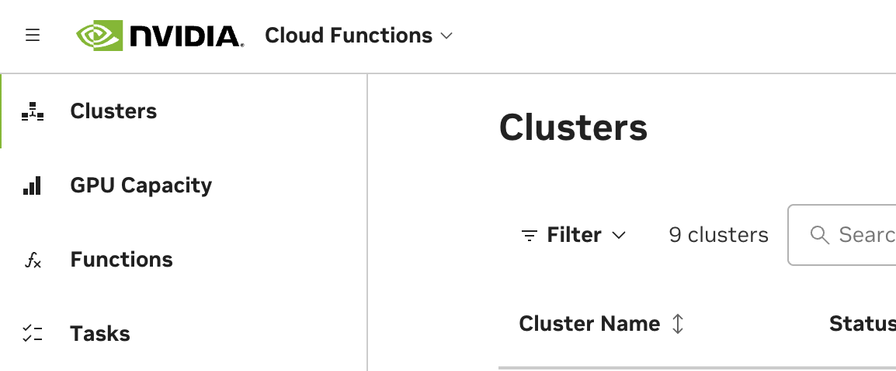

### Configuration

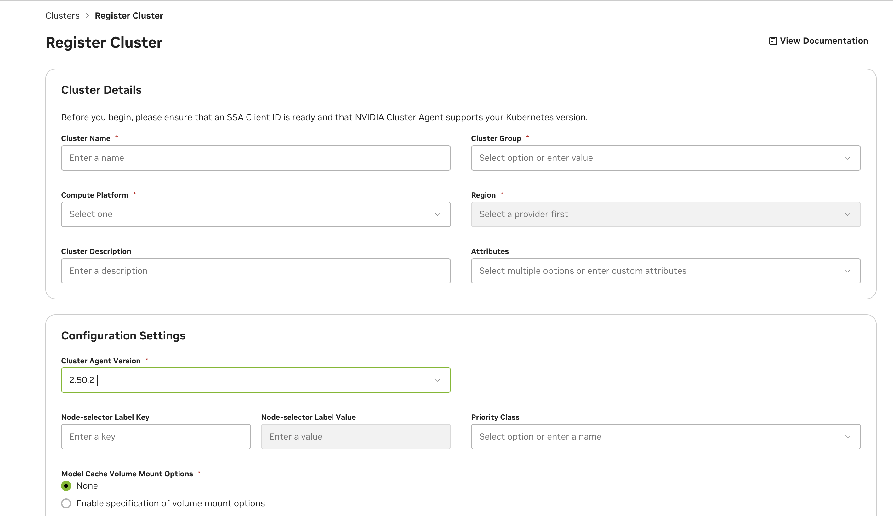

See below for descriptions of all cluster configuration options.

| Field | Description |
| --- | --- |
| Cluster Name | The name for the cluster. This field is not changeable once configured. |
| Cluster Group | The name of the cluster group. This is usually identical to the cluster name, except in cases when there are multiple clusters you'd like to group. This would be done to enable a function to deploy on any of the clusters when the group is selected (for example, due to identical hardware support). |
| Compute Platform | The cloud platform the cluster is deployed on. This field is a standard part of the node name label format that the cluster agent uses: `<Platform>`.GPU.`<GPUName>` |
| Region | The region the cluster is deployed in. This field is required for enabling future optimization and configuration when deploying functions. |
| Cluster Description | Optional description for the cluster, this provides additional context about the cluster and will be returned in the cluster list under the Settings page, and the  `/listClusters` API response. |
| Cluster Management Mode | NGC (Managed through UI) or Helm-Managed (Managed through Gitops workflow. See [Helm-Managed Mode](helm-managed.md) for details) |
| Other Attributes | Tag your cluster with additional properties (see below). |

**Cluster Attributes:**

- **CacheOptimized** - Enables rapid instance spin-up. Requires extra storage configuration and caching support in the Advanced Cluster Setup.
- **KataRuntimeIsolation** - Cluster is equipped with enhanced setup to ensure superior workload isolation using [Kata Containers](https://katacontainers.io/).
- **NVLinkOptimized** - Workloads targeting NVIDIA Multi-Node NVLink GPUs in the cluster (such as GB200) will have improved inter-node performance.
- **AccountIsolation** - Cluster needs dedicated account isolation of workloads.

By default, the cluster will be authorized to the NCA ID of the current NGC organization being used during cluster configuration. If you choose to share the cluster with other NGC organizations, you will need to retrieve their corresponding NCA IDs. Sharing the cluster will allow other NVCF accounts to deploy cloud functions on it, with no limitations on how many GPUs within the cluster they deploy on.

<Note>

NVCF "accounts" are directly tied to, and defined by, NCA IDs ("NVIDIA Cloud Account"). Each NGC organization, with access to the Cloud Functions UI, has a corresponding NGC Organization Name and NCA ID. Please see the [NGC Organization Profile Page](https://org.ngc.nvidia.com/profile) to find these details.
</Note>

<Warning>

Once functions from other NGC organizations have been deployed on the cluster, removing them from the authorized NCA IDs list, or removing sharing completely from the cluster, can cause disruption of service. Ideally, any functions tied to other NCA IDs should be undeployed before the NCA ID is removed from the authorized NCA IDs list.
</Warning>

<Note>

For cluster configuration options that apply to all management modes (NGC-managed,
Helm-managed, and Self-hosted), see [NVCA Configuration](configuration.md). This includes:

- Advanced settings (node selector, priority class, mount options, CIDR range)
- Cluster features and feature flags (Dynamic GPU Discovery, Caching, etc.)
- Caching and StorageClass setup
- NVLink-optimized clusters
- Kata container isolation
</Note>

### Cluster Maintenance Mode

<Note>
Supported in Cluster Agent Versions 2.47.7 or higher
</Note>

Cluster Agent can be optionally configured to run in maintenance mode if needed using the following capabilities from the Advanced Settings. Clusters configured in maintenance will not be listed as targets for workload deployments.

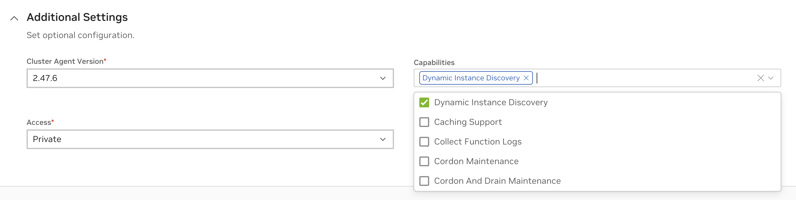

#### Cordon Maintenance

In this mode existing workloads will continue to run uninterrupted on the cluster.

#### Cordon And Drain Maintenance

In this mode all existing workloads in the cluster will be terminated. No update to the state of the workload will be effective at this time.

<Warning>
If using feature flags overrides on the cluster, the configuration for maintenance mode needs to be via feature flags **CordonMaintenance** or **CordonAndDrainMaintenance** respectively.
</Warning>

Once the maintenance mode is configured, it can take up to 10 minutes for the agent reconfiguration. Cluster that has successfully applied the maintenance mode capability will be shown with a `MAINTENANCE` mode label on cluster listing and on cluster overview page as below.

**Cluster Listing**

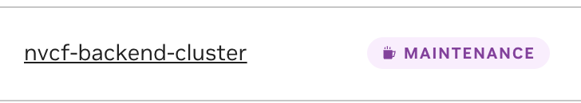

**Cluster Overview**

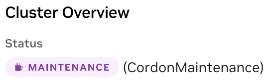

### Install the Cluster Agent

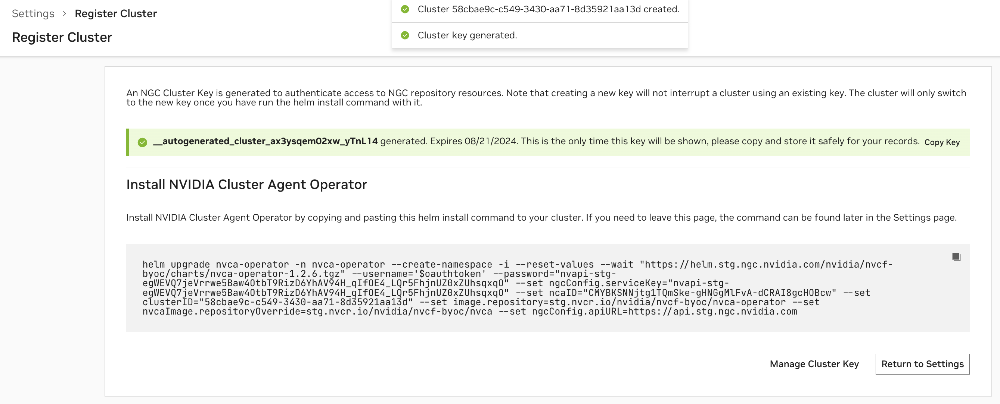

After configuring the cluster, an NGC Cluster Key will be generated for authenticating to NGC, and you will be presented with a command snippet for installing the NVIDIA Cluster Agent Operator. Please refer to this command snippet for the most up-to-date installation instructions.

<Note>

The NGC Cluster Key has a default expiration of 90 days. Either on a regular cadence or when nearing expiration, you must rotate your NGC Cluster Key.
</Note>

Once the Cluster Agent Operator installation is complete, the operator will automatically install the desired NVIDIA Cluster Agent version and the Status of the cluster in the Cluster Page will become "Ready".

Afterward, you will be able to modify the configuration at any time. The cluster name is not reconfigurable. Please refer to any additional installation instructions for reconfiguration in the UI. Once the configuration is updated, the Cluster Agent Operator, which polls for changes every 15 minutes, will apply the new configuration.

## View & Validate Cluster Setup

### Verify Cluster Agent Installation via UI

At any time, you can view the clusters you have begun registering, or registered, along with their status, on the Settings page.

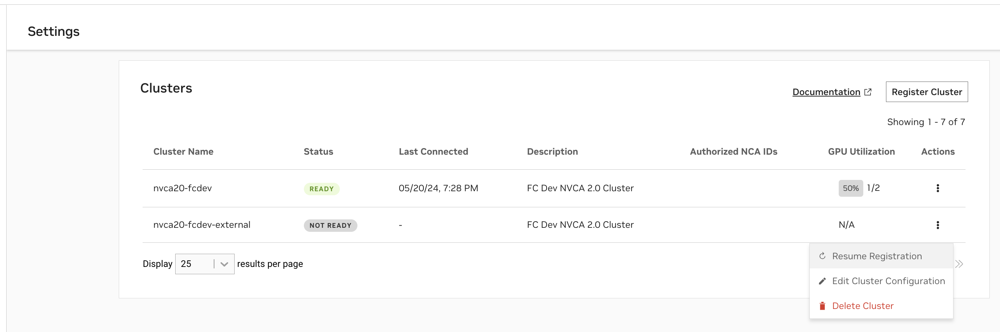

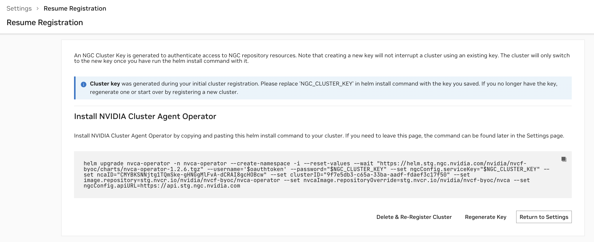

- A status of `Ready` indicates the Cluster Agent has registered the cluster with NVCF successfully.
- A status of `Not Ready` indicates the registration command has either just been applied and is in progress, or that registration is failing.

<Note>

While your cluster status may show as `Ready`, there may be a delay of up to 5 minutes before the "Cluster Agent Version" column updates from "Update in Progress". You can verify the actual cluster health and version immediately using the terminal commands described in the next section.
</Note>

In cases when registration is failing, please use the following command to retrieve additional details:

```bash
  kubectl get nvcfbackend -n nvca-operator
```

When a cluster is `Not Ready`, you can resume registration at any time to finish the installation.

The "GPU Utilization" column is based on the number of GPUs occupied over the number of GPUs available within the cluster. The "Last Connected" column indicates when the last status update was received from the Cluster Agent to the NVCF control plane.

### Verify Cluster Agent Installation via Terminal

Verify the installation was successful via the following command, you should see a "healthy" response, as in this example:

```bash
  > kubectl get nvcfbackend -n nvca-operator
  NAME AGE VERSION HEALTH
  nvcf-trt-mgpu-cluster 3d16h 2.30.4 healthy
```

## Upgrade the Cluster Agent

NVCA upgrades available are indicated in the UI by status icons next to the cluster's NVCA version.

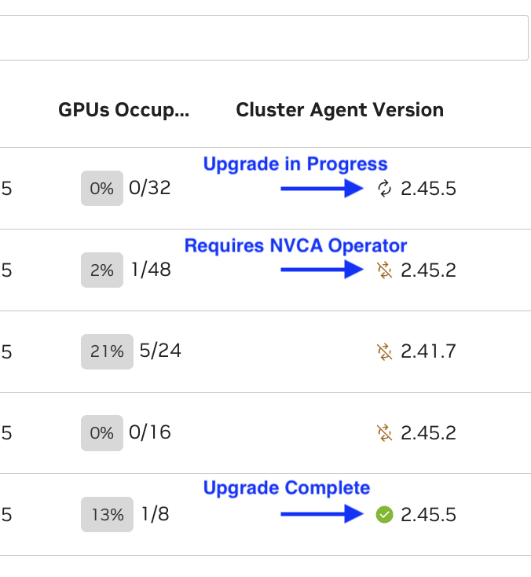

<Note>

When triggering the update through the UI, it may take up to 1 minute for the status icon to change to the "updating" status. This delay is expected.
</Note>

### Operator Upgrade Required

When an Operator upgrade is required, a helm install instruction will be generated in the UI. **You must run this first in order to enable the NVCA upgrade.**

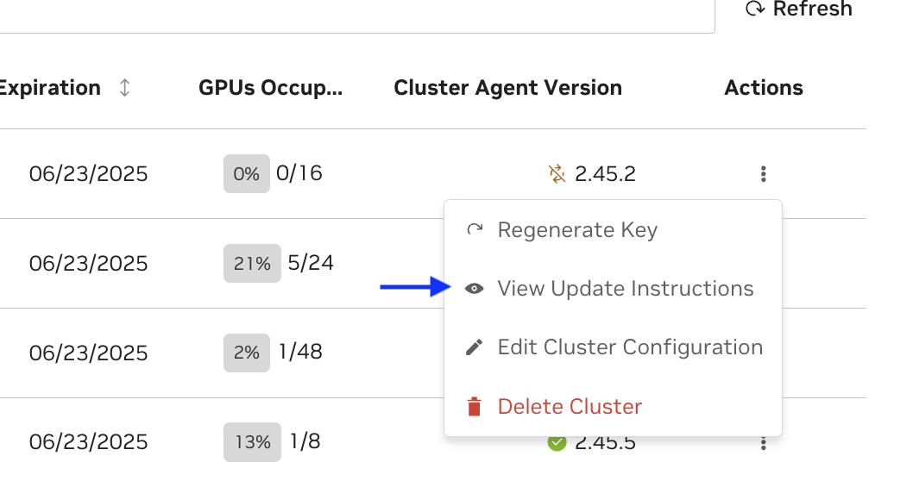

Example:

```bash
  helm upgrade nvca-operator -n nvca-operator --create-namespace -i --reuse-values --wait \
      "https://helm.ngc.nvidia.com/nvidia/nvcf-byoc/charts/nvca-operator-1.13.2.tgz" \
      --username='$oauthtoken' \
      --password=$(helm get values -n nvca-operator nvca-operator -o json | jq -r '.ngcConfig.serviceKey')
```

You can verify that the upgrade is successful by running the following command and noting the "Image" field:

```bash
  kubectl get pods -n nvca-operator -o yaml | grep -i image
```

After the NVCA operator upgrade succeeds:

1. Press "Update" in the UI to proceed with the NVCA upgrade
2. The NVCA operator will periodically check for the new version of NVCA and apply it when available
3. This may take up to 10 minutes to fully complete

### NVCA-Only Upgrade

When an upgrade to the NVCA Operator is not required:

1. Simply trigger the update of NVCA through the UI
2. The operator will check for the new desired version of NVCA and apply it

Verify that the operator has rolled out a successful upgrade by running the below command and looking for the spec version and status version to confirm the version of the CRD:

```bash
  kubectl get nvcfbackends -n nvca-operator -o yaml
```

Verify NVCA is healthy and version matches the desired version:

```bash
  kubectl get nvcfbackend -n nvca-operator
```

### Force NVCA Rollout

In some cases, you may need to force NVCA to rollout immediately rather than waiting for the operator's periodic reconciliation. This can be useful after configuration changes or when troubleshooting upgrade issues.

To force an immediate rollout:

```bash
  kubectl annotate -n nvca-operator --overwrite --all nvcfbackends nvca.nvcf.nvidia.io/forcedRolloutAt="$(date)"
```

This command updates the `forcedRolloutAt` annotation on all NVCFBackend resources, triggering the operator to immediately reconcile and apply any pending changes.

After forcing the rollout, you can monitor the progress:

```bash
  # Watch NVCA pods restart
  kubectl get pods -n nvca-system -w

  # Check operator logs
  kubectl logs -l app.kubernetes.io/instance=nvca-operator -n nvca-operator --tail 50 -f
```

Once the rollout is complete, verify the NVCA version has been updated:

```bash
  # Check the current NVCA version
  kubectl get nvcfbackend -n nvca-operator
```

The output should show the updated version in the `VERSION` column, and the `HEALTH` status should be `healthy`.

## Cluster Key Rotation

<Note>
Cluster Keys are migrating to a organization-scoped service-key resource. If your cluster is using a personal key, it is recommended to follow the UI instructions for business continuity.
</Note>

To regenerate or rotate a cluster's key, choose the "Rotate Key" option from the Clusters listing on the Settings page. Please refer to this command snippet for the most up-to-date upgrade instructions.

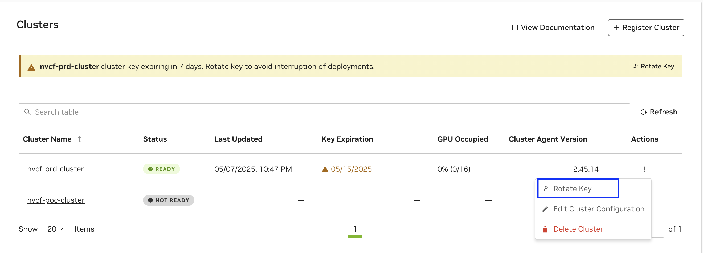

<Warning>

Updating your Service Key may interrupt any in-progress updates or deployments to existing functions, therefore it's important to pause deployments before upgrading.
</Warning>

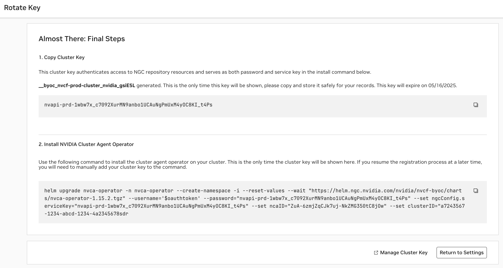

A cluster key expiring soon will have an appropriate warning displayed as below and follow the UI instructions to `Rotate Key` as above.

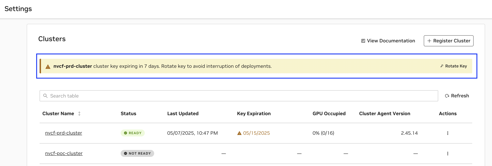

### Frequently Asked Questions

1. My Cluster Key is a personal key, but it is valid for long time, should I still rotate ?

   `While the Cluster Key may still be valid, if you observe a directive it is recommended to rotate the key for business continuity`

2. How many clusters can be registered in the Org ?

   `Number of cluster keys are capped at 50 per org and this includes any other service keys in use in the Org. If you observe error while registering cluster, contact the Org Admin using the Contact Admin option.`

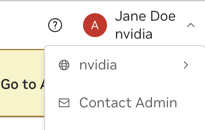

## Deregister the Cluster

Removing a configured cluster as a deployment target for NVCF functions is a two step process. It involves deleting the cluster from NGC followed by executing a series of commands on the cluster that remove the installed Cluster Agent and the NVCA operator.

### Prerequisites

First, ensure all functions have been undeployed from the cluster. This can be done via the UI, API or CLI.

To delete all function pods in a namespace by force, use the following command. This is not a graceful operation.

```bash
  kubectl delete pods -l FUNCTION_ID -n nvcf-backend
```

Verify all pods have been terminated with the following command:

```bash
  kubectl get pods -n nvcf-backend
```

This should return no pods if deletion was successful. Additionally, check the logs of the Cluster Agent pod in the nvca-system namespace to ensure there are no more "Pod is being terminated" messages:

```bash
  kubectl logs -n nvca-system $(kubectl get pods -n nvca-system | grep nvca | awk '{print $1}')
```

If pods are still hanging during termination, you can force the deletion of the namespace with the following command. This command removes the finalizers from the namespace metadata, which are hooks that prevent namespace deletion until certain cleanup tasks are complete. By removing these finalizers, you bypass the normal cleanup process and force the namespace to be deleted immediately.:

```bash
  kubectl get namespace nvcf-backend -o json | jq '.spec.finalizers=[]' | kubectl replace --raw /api/v1/namespaces/nvcf-backend/finalize -f -
```

### Delete the Cluster via UI

<Warning>
Deleting the Cluster will also delete the Cluster Key used by the cluster and is irreversible.
</Warning>

Next, reach the cluster registration page by navigating to Cloud Functions in the NGC product dropdown, and choosing "Settings" on the left-hand menu. You must be a Cloud Functions Admin to see this page.

Select "Delete Cluster" from the "Actions" dropdown for the cluster that you want to remove.

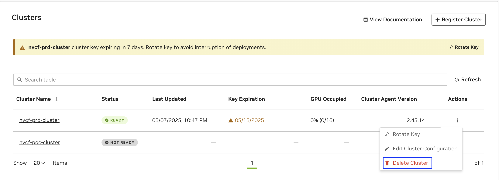

Following this, a dialog box will appear that asks to you confirm the deletion of the cluster. Click on "Delete" to remove the cluster as a deployment target.

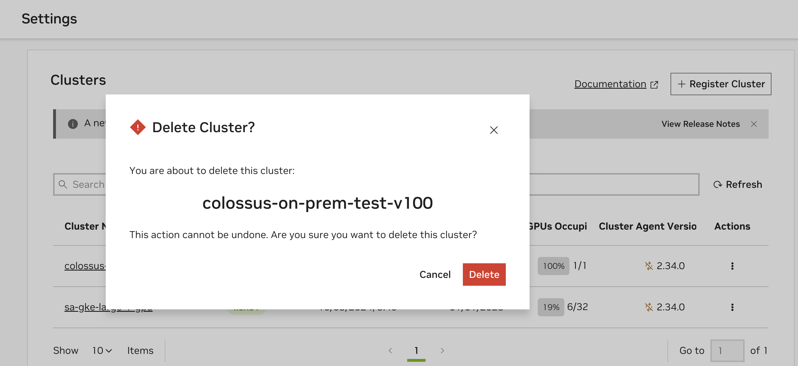

### Delete the Cluster Agent and the NVCA Operator

Finally, on the registered cluster, execute the following commands to complete the deregistration process.

```bash
  kubectl delete nvcfbackends -A --all
  kubectl delete ns nvca-system
  helm uninstall -n nvca-operator nvca-operator
  kubectl delete ns nvca-operator
```

<Note>

If the deletion of the Kubernetes CRD `nvcfbackend` blocks, then the finalizer (`nvca-operator.finalizers.nvidia.io`) needs to be manually deleted, for example using the following command:

```bash
kubectl get nvcfbackend -n nvca-operator -o json | jq '.items[].metadata.finalizers = []' | kubectl replace -f -
```

</Note>
