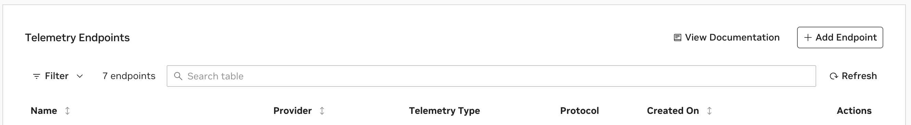
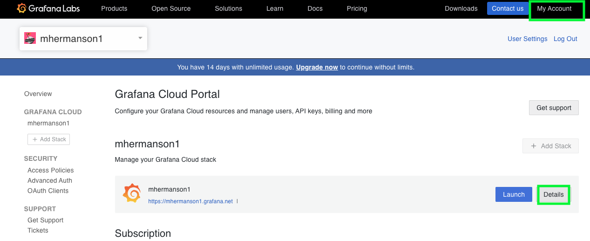
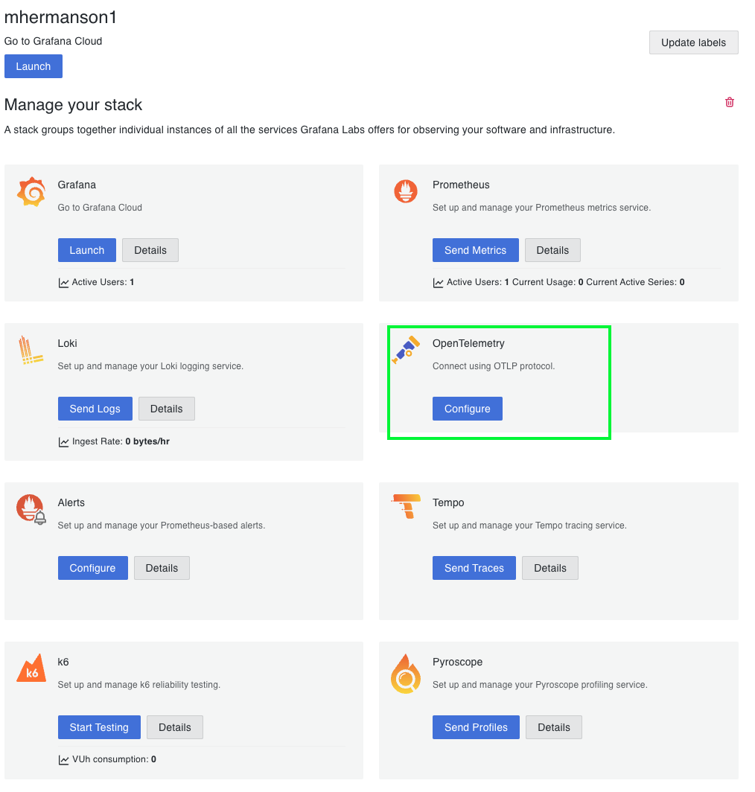
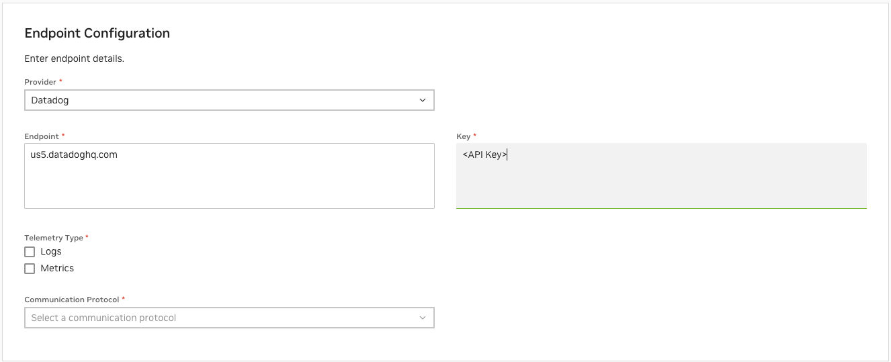
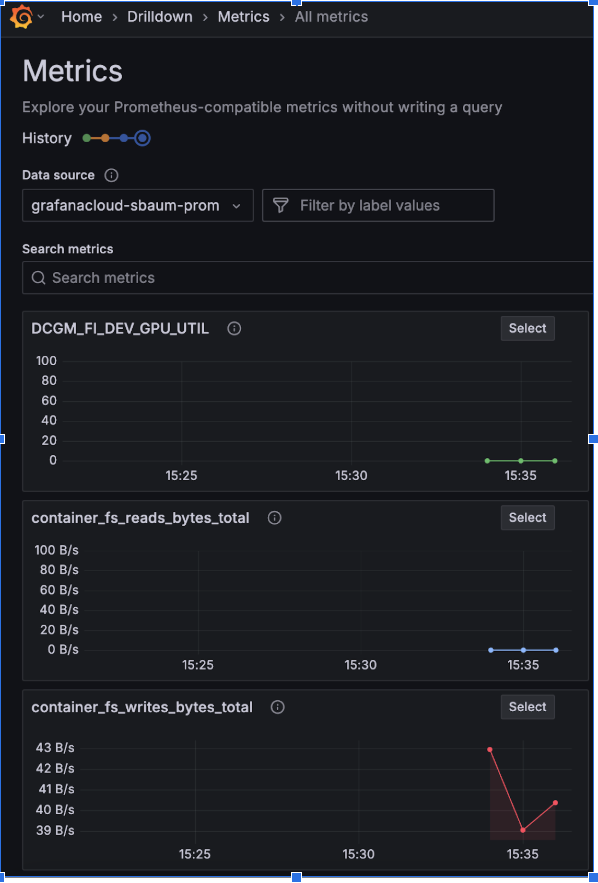
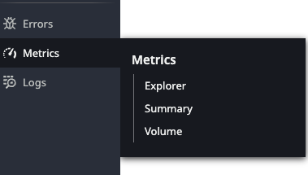
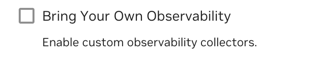

# Observability (Legacy Managed)

## Overview

NVIDIA Cloud Functions provides a comprehensive observability solution through two main approaches:

1. **NGC UI/CLI Observability**

   1. Basic metrics in the Overview tab
   1. Log data with time ranges in the Logs tab
   1. Limited to NGC account holders
   1. Enabled by default for all functions or tasks

   See details on using the built-in observability features below.

1. **External Observability Integration**

   1. Send telemetry data to your organization's observability platforms
   1. Support for logs, metrics, and traces
   1. Requires explicit configuration of telemetry endpoints

   See external-observability for detailed instructions.

## NGC UI Observability

The NGC UI provides basic observability through three main tabs:

1. **Overview Tab**

   1. Provides real-time status and performance metrics
   1. Shows instance counts and request statistics
   1. Displays basic function or task information

1. **Logs Tab**

   1. Access to container and event logs
   1. Real-time log streaming capabilities
   1. Search and filtering functionality

1. **Metrics Tab**

   1. Detailed performance indicators
   1. Time-series data visualization
   1. Resource utilization trends

You can access these tabs by navigating to your function in the NGC UI. Each tab offers specific insights into your function's operation and performance.

### Overview

The Overview tab provides access to your function's current status and performance metrics, offering real-time insights into your function's operation and health.

1. **Basic Function or Task Metrics**
   
   1. Current function or task status (Running, Stopped, Error)
   1. Last updated timestamp
   1. Function or task version
   1. Runtime environment details

1. **Instance Counts**
   
   1. Active instances
   1. Pending instances
   1. Failed instances
   1. Historical instance trends

1. **Request Statistics**
   
   1. Total requests processed
   1. Current request rate
   1. Success/failure ratios
   1. Average response times

#### How to Access

1. Navigate to the Functions list page
1. Click on your function
1. The Overview tab is displayed by default
1. Use the refresh button to update the data

<Note>
* Overview data updates every 30 seconds
* Historical data is available for the last 24 hours
* Some metrics may have a slight delay in reporting
</Note>

### Logs

The Logs tab enables monitoring through detailed log access.

NVCF displays logs related to:

* Deployment stages

  * Function or Task Creation
  * Function or Task Deployment

* Function or task invocation logs

* Real-time logs (listed in the UI under the Live Tail tab)
  * For detailed information about real-time logging capabilities, see the NGC UI Logs tab described above.

### Viewing Metrics

1. Navigate to the Functions list page
1. Click on your function
1. Select the Metrics tab

The Metrics view displays:

**Summary Statistics**

* Total Invocations - Number of function calls in the selected time period
* Average Inference Time - Mean processing time for function calls
* Total Instance Count - Current number of running instances
* Failures - Count of failed executions

**Time Series Graphs**

* Invocation Activity and Queue Depth - Shows request patterns and queued requests
* Average Inference Time - Processing duration trends
* Instances Over Time - Shows scaling behavior
* Success Rate - Function reliability metrics

Use the time range selector (e.g., Past 1 Hour) in the top right to adjust the view period.

<Note>
* Minor discrepancies may occur in aggregated invocations due to rounding, especially with smaller values
* Most recent metrics may be delayed
* Metrics have a 5-minute ingestion delay
</Note>

<Note>
NGC UI access is limited to NGC account holders. For broader observability access, work with your account administrator to configure external observability endpoints.
</Note>

## External Observability

Configure external observability endpoints to monitor your NVIDIA Cloud Functions. By setting up telemetry endpoints, you can stream metrics (see appendix-b), logs, and traces to popular observability platforms like Grafana Cloud and Datadog. This extends beyond the basic metrics in NGC UI, giving you deeper insights into your functions' performance.

<Note>
To export function or task telemetry through external observability platforms, your source code must be instrumented using OpenTelemetry. Without proper OpenTelemetry instrumentation, only system-level metrics will be available.
</Note>

### Ports

The OpenTelemetry collector uses the following ports:

* OTLP (OpenTelemetry Protocol)

  * OTLP gRPC: Port 14357
  * OTLP HTTP: Port 14358

* Metrics

  * Port 18888 - Used for collector metrics

* Health Check

  * Port 13133 - Used for health check endpoint

<Note>
These ports are reserved for the OpenTelemetry collector and should not be used by your functions or tasks.
</Note>

### Configuration

Telemetry endpoints can only be configured when creating a new function or deploying a new version. You cannot add a telemetry endpoint to an existing function deployment.

A Telemetry Endpoint is a configuration that specifies where telemetry data is sent. This is allowed for all functions or tasks to be configured to send telemetry data to an external observability platform.

1. **Configure External Telemetry Endpoints**

<Note>
Remember that to collect custom metrics, logs, and traces from your function's or task's code, you must instrument your application using OpenTelemetry. System-level metrics (CPU, memory, GPU) are collected automatically.
</Note>

   You can configure telemetry endpoints using either the web UI or the NGC CLI:

   Web UI Method:
   
   - Navigate to your NGC organization settings
   - Select "Settings" in your Cloud Functions NGC organization
   - Scroll to the bottom of the page
   - Click "Add Telemetry Endpoint"



   - Select your desired endpoint type (Grafana Cloud or Datadog)
   - Configure the endpoint with the required credentials

<details>
<summary>Grafana Cloud</summary>

Follow these steps to set up Grafana Cloud integration with NVCF:

Web UI Method:

1. **Access Grafana Cloud**

1. For new users:

1. Visit https://grafana.com/auth/sign-up/create-user
1. Complete the free Grafana Cloud registration process

1. For existing users:

1. Visit https://grafana.com/auth/sign-in
1. Log in with your credentials

1. **Configure OpenTelemetry**

1. In the top menu bar, locate "My Account"
1. Expand the Details section by clicking the icon




1. **Access OpenTelemetry Settings**

1. In your Grafana Cloud stack, locate the OpenTelemetry card
1. Click "Configure" to access the OpenTelemetry configuration
1. You will see options for configuring:

1. Metrics
1. Logs
1. Traces




1. **Locate OTLP Configuration Details**

1. The OTLP endpoint section will display:

1. OTLP Endpoint URL (e.g., https://otlp-gateway-prod-us-west-0.grafana.net/otlp)
1. Instance ID (a numeric identifier for your instance)
1. API Token section with option to "Generate now"

1. Use the "Copy to Clipboard" buttons to easily copy these values into the NVCF Telemetry Endpoint configuration.

**Alternative: Create Grafana Telemetry Endpoint via CLI**

As an alternative to the web UI, you can create the Grafana Cloud telemetry endpoint using the NGC CLI:

```bash
ngc cloud-function telemetry-endpoint create --name grafana-cloud-metrics \
--type METRICS \
--provider GRAFANA_CLOUD \
--protocol HTTP \
--endpoint https://otlp-gateway-prod-us-west-0.grafana.net/otlp \
--key your-grafana-api-token
```


<Warning>
Keep your API Token secure and never share it publicly. If your token is compromised, you can generate a new one and update your configuration.
</Warning>

</details>

<details>
<summary>Datadog</summary>

Follow these steps to set up Datadog integration with NVCF:

Web UI Method:

1. **Sign Up for Datadog**

1. Visit the [Datadog Getting Started page](https://docs.datadoghq.com/getting_started/site/)
1. Complete the registration process for a new Datadog account

1. **Configure API Key**

1. Log in to your Datadog account
1. Navigate to Organization Settings (found in the bottom left corner of the page)
1. Select API Keys from the left menu
1. Either click "+New Key" to create a new API key or copy an existing one from the list

1. **Get Telemetry Endpoint**

1. Your endpoint URL will be displayed in the browser address bar
1. Available endpoints based on your instance location:

1. datadoghq.com (US1)
1. us3.datadoghq.com (US3)
1. us5.datadoghq.com (US5)
1. datadoghq.eu (EU1)
1. ddog-gov.com (US1-FED)

1. For more details on Datadog sites and endpoints, see the [Datadog site documentation](https://docs.datadoghq.com/getting_started/site/)

1. **Configure in NVCF Web UI**

1. Input the configuration details:

1. API Key (copied from step 2)
1. Endpoint URL (selected from step 3)
1. Select telemetry type(s):

1. Choose "Logs" to send log data
1. Choose "Metrics" to send metrics data
1. You can select both to send both types of telemetry

1. Save the configuration




**Alternative: Create Datadog Telemetry Endpoint via CLI**

As an alternative to the web UI, you can create the Datadog telemetry endpoint using the NGC CLI:

```bash
# Example
ngc cloud-function telemetry-endpoint create --name datadog-metrics \
--type METRICS \
--provider DATADOG \
--protocol HTTP \
--endpoint datadoghq.com \
--key your-datadog-api-key
```


<Note>
Make sure to keep your API key secure and never share it publicly. If your key is compromised, you can generate a new one and update your configuration.
</Note>

</details>

   CLI Method:

   As an alternative to the web UI, you can use the NGC CLI to manage telemetry endpoints. Here are the basic CLI commands:

```bash
    # List existing telemetry endpoints
    ngc cloud-function telemetry-endpoint list

    # Create a new telemetry endpoint
    ngc cloud-function telemetry-endpoint create --name <endpoint-name> \
      --type <LOGS|METRICS> \
      --provider <GRAFANA_CLOUD|DATADOG> \
      --protocol <GRPC|HTTP> \
      --endpoint <endpoint-url> \
      --key <api-key>

    # Remove a telemetry endpoint
    ngc cloud-function telemetry-endpoint remove <endpoint-name>
```

<Note>
- Endpoint names must be unique within your NGC organization
- API tokens and keys are stored securely in NGC Encrypted Secrets Store and can be updated if needed
- Endpoint configurations cannot be updated - delete and recreate to change settings
</Note>

1. **Add Telemetry Endpoint to Function or Task**

   Telemetry endpoints can only be configured when creating a new function or deploying a new version. You cannot add a telemetry endpoint to an existing function deployment.

   Web UI Method:

   When creating a new function or deploying a new version:

   - In the function creation/deployment form
   - Look for the Telemetry Endpoints section
   - Select the desired telemetry endpoint from the dropdown
   - Complete the rest of the function creation/deployment process

<Note>
If you need to change the telemetry endpoint for an existing function, you must deploy a new version of that function with the updated telemetry configuration.
</Note>

1. **Verify Deployment**

   After deploying the function with the telemetry endpoint, verify that the telemetry data is flowing correctly to your observability platform.

<Note>
If you don't see your custom metrics, logs, or traces in your observability platform, verify that:

1. Your function's or task's code is properly instrumented with OpenTelemetry
1. The telemetry endpoint is correctly configured
1. The function or task deployment is active and running
</Note>

<details>
<summary>Grafana Cloud</summary>

1. Log in to your Grafana Cloud account
1. Navigate to the Metrics Explorer
1. Search for the following metrics to verify data flow:

1. DCGM_FI_DEV_GPU_UTIL - Shows GPU utilization percentage
1. container_fs_reads_bytes_total - Shows container filesystem read metrics
1. container_fs_writes_bytes_total - Shows container filesystem write metrics




</details>

<details>
<summary>Datadog</summary>

1. Log in to your Datadog account
1. Navigate to the Metrics Explorer
1. Search for "nvidia.cloud.function" to find your function's metrics
1. You can view metrics such as:

1. GPU utilization
1. Function or task invocations
1. Request latency
1. Resource usage




<Note>
The OpenTelemetry collector version, image and configuration are managed entirely by NVCF and cannot be modified by users.
</Note>

</details>

1. **Delete a Function or Task and Remove Telemetry Endpoint**

   To remove a telemetry endpoint, you must first cancel all deployments and remove all functions that use that endpoint. The endpoint cannot be removed while any functions are still using it, even if those functions are not currently deployed.

   Web UI method:

   1. Navigate to the Functions list page
   1. Click on the function you want to delete
   1. Navigate to the Deployments tab
   1. For each deployment:

      1. Click "Cancel Deployment" and confirm
      1. Wait for all deployments to be fully cancelled

   1. Navigate to the Settings tab
   1. Click "Delete Function" and confirm
   1. Verify the function is completely removed
   1. After all functions using the telemetry endpoint have been removed:
  
      1. Navigate to your NGC organization settings
      1. Select "Settings" in your Cloud Functions NGC organization
      1. Scroll to the Telemetry Endpoints section
      1. Find the endpoint you want to remove
      1. Click the delete icon next to the endpoint
      1. Confirm the deletion

   CLI method:

```bash
  # First, cancel all deployments for a function version
  ngc cloud-function function deploy remove <function-id>:<function-version-id>

  # Wait for deployments to be fully cancelled, then remove the function
  ngc cloud-function function remove <function-id>

  # After all functions using the telemetry endpoint have been removed, delete the endpoint
  ngc cloud-function telemetry-endpoint remove <endpoint-name>
```

<Warning>
All deployments must be fully cancelled before function removal.
The function must be completely removed before the endpoint can be removed.
Removing a telemetry endpoint will permanently delete the endpoint configuration.
Make sure to export any necessary telemetry data before removing endpoints.
</Warning>

When you select a telemetry endpoint, NVCF:
   
* Deploys a dedicated OpenTelemetry collector with your function or task
* Automatically configures authentication and endpoint connections
* Enables collection of metrics, logs, and traces from your function or task
* Directs telemetry data to your organization's observability platform

### Resource Management

In the pod for each function or task, an OpenTelemetry collector is deployed. This collector has automatic memory management and built-in resource protection to ensure reliable telemetry collection without impacting function or task performance. NVCF manages all resource allocation for the collector, so you don't need to worry about resource configuration.

### Security

NVCF ensures secure telemetry handling by storing credentials securely in the NGC Encrypted Secrets Store, Each collector only accesses its own function's or task's data, and authentication is handled automatically. Credentials are rotated securely to maintain security and integrity.

## How to Set Up External Observability on a BYOC Cluster

### BYOC Steps

- BYOC cluster registered with NVCA on `2.46.10+` version

  - See the NGC-Managed Clusters page for upgrade instructions.

- Ensure the `Bring Your Own Observability` cluster feature is enabled. If you are running a cluster agent version older than `2.50.0`, refer to the Configuration page for managing feature flags.



## Error Handling

If issues occur with telemetry collection:

* Your function or task continues to run normally
* Error messages are logged for troubleshooting
* Health status is monitored and reported
* Automatic retry logic handles temporary failures

The collector's health can be monitored through:

* Status checks in the NGC UI
* Metrics in your observability platform
* Built-in health endpoints

## Appendix A: Terminology

| Term | Definition |
| --- | --- |
| NGC | NVIDIA GPU Cloud which provides a way for users to set up and manage access to NVIDIA cloud services |
| NVCF | NVIDIA Cloud Functions and Tasks |
| OpenTelemetry | An open source standard for telemetry data collection and transmission |
| OTLP | OpenTelemetry Protocol - the data transfer protocol used by OpenTelemetry for sending telemetry data |
| OTel Collector | The OpenTelemetry Collector component that receives, processes, and exports telemetry data |
| Telemetry Endpoint | A configuration that specifies where telemetry data (metrics, logs, and traces) is sent for external observability platforms |

## Appendix B: Available Metrics

The following metrics are collected through the OpenTelemetry collector deployed with your function when using External Observability and exported through your configured Telemetry Endpoints. The metrics exported depend on the Kubernetes deployment used by the function or task.

Key metrics include:

* Function or task invocation metrics
* Resource utilization metrics
* Platform metrics related to the function or task

<Note>
Metrics are filtered based on deployment type and configuration. Not all metrics may be available for all deployment scenarios.
</Note>

### CPU Metrics

| Metric | Description |
| --- | --- |
| container_cpu_cfs_throttled_periods_total | Number of periods the container was throttled (only present if container was throttled) |
| container_cpu_cfs_throttled_seconds_total | Total time the container was throttled in seconds (only present if container was throttled) |
| container_cpu_usage_seconds_total | Total CPU time used by the container in seconds |

#### Memory Metrics

| Metric | Description |
| --- | --- |
| container_memory_cache | Memory used by the page cache in bytes |
| container_memory_rss | Resident Set Size: total memory allocated for the container |
| container_memory_swap | Swap memory used by the container in bytes |
| container_memory_usage_bytes | Total memory usage of the container in bytes |
| container_memory_working_set_bytes | Memory working set: memory actively used by the container |

#### Filesystem Metrics

Only present if the container is performing IO operations:

| Metric | Description |
| --- | --- |
| container_fs_limit_bytes | Total filesystem limit in bytes |
| container_fs_usage_bytes | Total filesystem usage in bytes |
| container_fs_reads_total | Total number of filesystem read operations |
| container_fs_writes_total | Total number of filesystem write operations |
| container_fs_writes_bytes_total | Total bytes written to the filesystem |
| container_fs_reads_bytes_total | Total bytes read from the filesystem |

#### Network Metrics

Only present if the container is performing network operations:

| Metric | Description |
| --- | --- |
| container_network_receive_bytes_total | Total bytes received over the network |
| container_network_receive_errors_total | Total number of network receive errors |
| container_network_receive_packets_dropped_total | Total number of received packets dropped |
| container_network_receive_packets_total | Total number of packets received |
| container_network_transmit_bytes_total | Total bytes transmitted over the network |
| container_network_transmit_errors_total | Total number of network transmit errors |
| container_network_transmit_packets_dropped_total | Total number of transmitted packets dropped |
| container_network_transmit_packets_total | Total number of packets transmitted |

#### Kubernetes State Metrics

Only present if helm-based function has a deployment k8s object:

| Metric | Description |
| --- | --- |
| kube_deployment_status_replicas | Total number of replicas in the deployment |
| kube_deployment_status_replicas_available | Number of available replicas in the deployment |
| kube_deployment_status_replicas_unavailable | Number of unavailable replicas in the deployment |
| kube_deployment_status_replicas_updated | Number of updated replicas in the deployment |
| kube_deployment_status_replicas_ready | Number of ready replicas in the deployment |
| kube_service_created | Timestamp when the service was created |

Only present if helm-based function has a replicaset k8s object:

| Metric | Description |
| --- | --- |
| kube_replicaset_status_replicas | Total number of replicas in the replicaset |
| kube_replicaset_status_ready_replicas | Number of ready replicas in the replicaset |

Only present if helm-based function has a stateful k8s object:

| Metric | Description |
| --- | --- |
| kube_statefulset_status_replicas | Total number of replicas in the statefulset |
| kube_statefulset_status_replicas_ready | Number of ready replicas in the statefulset |

Only present if the helm-based function has a job/cronjob k8s object:

| Metric | Description |
| --- | --- |
| kube_job_status_active | Number of active jobs |
| kube_job_status_failed | Number of failed jobs |
| kube_job_status_succeeded | Number of succeeded jobs |
| kube_cronjob_status_active | Number of active cronjobs |

Only present if function has a configmap k8s object:

| Metric | Description |
| --- | --- |
| kube_configmap_created | Timestamp when the configmap was created |

Only present if function has a secret k8s object:

| Metric | Description |
| --- | --- |
| kube_secret_created | Timestamp when the secret was created |

Only present if function has a pod k8s object:

| Metric | Description |
| --- | --- |
| kube_pod_container_info | Information about the container in the pod |
| kube_pod_container_resource_limits | Resource limits for the container |
| kube_pod_container_resource_requests | Resource requests for the container (only present if resources were requested) |
| kube_pod_container_status_last_terminated_exitcode | Exit code of the last terminated container (only present if an error happened) |
| kube_pod_container_status_last_terminated_reason | Reason for the last container termination (only present if an error happened) |
| kube_pod_container_status_restarts_total | Total number of container restarts |
| kube_pod_container_status_running | Whether the container is running |
| kube_pod_container_status_terminated | Whether the container has terminated (only present if terminated) |
| kube_pod_container_status_terminated_reason | Reason for container termination (only present if terminated) |
| kube_pod_container_status_waiting | Whether the container is waiting (only present if pod is waiting) |
| kube_pod_container_status_waiting_reason | Reason for container waiting (only present if pod is waiting) |

Only present if function/task helm deployments:

| Metric | Description |
| --- | --- |
| kube_pod_info | Information about the pod |
| kube_pod_status_reason | Reason for the pod status |

Only present if function/task helm defined an init container:

| Metric | Description |
| --- | --- |
| kube_pod_init_container_info | Information about the init container |
| kube_pod_init_container_status_ready | Whether the init container is ready |
| kube_pod_init_container_status_restarts_total | Total number of init container restarts |
| kube_pod_init_container_status_running | Whether the init container is running |
| kube_pod_init_container_last_status_terminated_reason | Reason for the last init container termination |
| kube_pod_init_container_status_waiting_reason | Reason for init container waiting |

#### GPU Metrics

Always present for container and helm:

| Metric | Description |
| --- | --- |
| DCGM_FI_DEV_GPU_UTIL | GPU utilization percentage |
| DCGM_FI_PROF_PIPE_TENSOR_ACTIVE | Tensor core active percentage - time over the past sample period during which tensor cores were active |
| DCGM_FI_PROF_DRAM_ACTIVE | DRAM active percentage - time over the past sample period during which device memory was being read or written |
| DCGM_FI_PROF_SM_ACTIVE | Streaming multiprocessor (SM) active percentage - time over the past sample period during which SMs were active |
| DCGM_FI_PROF_SM_OCCUPANCY | SM occupancy - average percentage of active warps per scheduler over the past sample period |
| DCGM_FI_PROF_PCIE_TX_BYTES | PCIe transmit bytes - number of bytes transmitted over PCIe from GPU to host during the past sample period |
| DCGM_FI_PROF_PCIE_RX_BYTES | PCIe receive bytes - number of bytes received over PCIe by GPU from host during the past sample period |
| DCGM_FI_PROF_NVLINK_TX_BYTES | NVLink transmit bytes - number of bytes transmitted over NVLink from GPU to peer during the past sample period |
| DCGM_FI_PROF_NVLINK_RX_BYTES | NVLink receive bytes - number of bytes received over NVLink by GPU from peer during the past sample period |
| DCGM_FI_DEV_POWER_USAGE | Power usage - current power consumption of the GPU in watts |
| DCGM_FI_DEV_VGPU_MEMORY_USAGE | vGPU memory usage - amount of framebuffer memory used by the virtual GPU instance |

For detailed information about all available DCGM field IDs and GPU metrics, see the [NVIDIA DCGM API Field IDs documentation](https://docs.nvidia.com/datacenter/dcgm/latest/dcgm-api/dcgm-api-field-ids.html).

#### NVCF Worker Service Metrics

Streaming metrics are only present for streaming functions.

| Metric | Description |
| --- | --- |
| nvcf_worker_service_request_total | Total number of service requests processed |
| nvcf_worker_service_response_total | Total number of service responses processed including error code as a label |
| nvcf_worker_service_stream_latency_seconds_bucket | Histogram buckets for stream request latency in seconds |
| nvcf_worker_service_stream_latency_seconds_count | Total count of stream latency measurements |
| nvcf_worker_service_stream_latency_seconds_sum | Total sum of stream latency measurements in seconds |
| nvcf_worker_service_stream_session_duration_seconds_bucket | Histogram buckets for streaming session duration in seconds |
| nvcf_worker_service_stream_session_duration_seconds_count | Total count of streaming session duration measurements |
| nvcf_worker_service_stream_session_duration_seconds_sum | Total sum of streaming session duration measurements in seconds |
| nvcf_worker_service_stream_streaming_app_ready | Indicates whether the streaming application is ready (1) or not (0) |

<Note>
All NVCF metrics include the label `origin: nvcf-byoo`.
</Note>

#### NVCA Instance Type Metrics

Present for cluster management:

| Metric | Description |
| --- | --- |
| nvca_instance_type_capacity | Count of instances that could be deployed on schedulable node resources by instance type |
| nvca_instance_type_allocatable | Count of instances that can be deployed on available schedulable node resources by instance type |
| nvca_instance_type_unschedulable | Count of instances that could be deployed on unschedulable node resources by instance type |

#### OpenTelemetry Collector Metrics

Always present for container and helm. The final list of metrics depends on telemetries received & exported by function/task:

| Metric | Description |
| --- | --- |
| otelcol_receiver_refused_metric_points_total | Total number of metric points refused by the receiver |
| otelcol_receiver_refused_log_records_total | Total number of log records refused by the receiver |
| otelcol_receiver_refused_spans_total | Total number of spans refused by the receiver |
| otelcol_receiver_accepted_metric_points_total | Total number of metric points accepted by the receiver |
| otelcol_receiver_accepted_log_records_total | Total number of log records accepted by the receiver |
| otelcol_receiver_accepted_spans_total | Total number of spans accepted by the receiver |
| otelcol_exporter_sent_metric_points_total | Total number of metric points sent by the exporter |
| otelcol_exporter_sent_spans_total | Total number of spans sent by the exporter |
| otelcol_exporter_sent_log_records_total | Total number of log records sent by the exporter |
| otelcol_exporter_send_failed_metric_points_total | Total number of metric points that failed to send |
| otelcol_exporter_send_failed_spans_total | Total number of spans that failed to send |
| otelcol_exporter_send_failed_log_records_total | Total number of log records that failed to send |
| otelcol_processor_outgoing_items_total | Total number of items processed and sent out |
| otelcol_processor_incoming_items_total | Total number of items received for processing |

#### Resource Attributes

All logs and metrics have the following attributes added to their metadata:

| Attribute | Description |
| --- | --- |
| function_id | Unique identifier for the function or task |
| function_version_id | Version identifier for the function or task |
| instance_id | Unique identifier for the function or task instance |
| nca_id | NVIDIA Cloud Account identifier |
| cloud_region | Cloud region where the function or task is deployed (non-GFN) |
| zone_name | Zone name where the function or task is deployed (GFN) |
| cloud_provider | Cloud provider where the function or task is deployed |

The platform metrics have the following attributes when available:

| Source | Attributes |
| --- | --- |
| cadvisor | container, cpu, device, image, job, service, interface, pod |
| kube state metrics | container, job, service, pod, reason, condition, configmap, created_by_kind, created_by_name, deployment, host_network, image, phase, qos_class, replicaset, resource, secret, statefulset, status and unit |
| DCGM | container, DCGM_FI_DRIVER_VERSION, device, job, service, modelName, pci_bus_id and pod |

<Note>
* `job` attribute is available in Grafana Cloud
* `service` is used in Datadog instead of attribute `job`
</Note>

## Appendix C: Adding Custom Application Metrics/Logs/Traces

You can export custom metrics/logs/traces to your external observability platform by sending them to the OpenTelemetry collector.
Refer to the following table for the available environment variables that you can specify:

| Variable | Definition | Example |
| --- | --- | --- |
| OTEL_EXPORTER_OTLP_LOGS_ENDPOINT | OpenTelemetry Protocol (OTLP) endpoint for exporting log data | http://127.0.0.1:14358/v1/logs |
| OTEL_EXPORTER_OTLP_TRACES_ENDPOINT | OpenTelemetry Protocol (OTLP) endpoint for exporting trace data | http://127.0.0.1:14358/v1/traces |
| OTEL_EXPORTER_OTLP_METRICS_ENDPOINT | OpenTelemetry Protocol (OTLP) endpoint for exporting metrics data | http://127.0.0.1:14358/v1/metrics |
| OTEL_EXPORTER_OTLP_LOGS_PROTOCOL | Protocol used for exporting logs to OTLP endpoints | http |
| OTEL_EXPORTER_OTLP_TRACES_PROTOCOL | Protocol used for exporting traces to OTLP endpoints | http |
| OTEL_EXPORTER_OTLP_METRICS_PROTOCOL | Protocol used for exporting metrics to OTLP endpoints | http |
| OTEL_HEALTH_CHECK_ENDPOINT | Health check endpoint for OpenTelemetry collector | http://127.0.0.1:13133/health |
