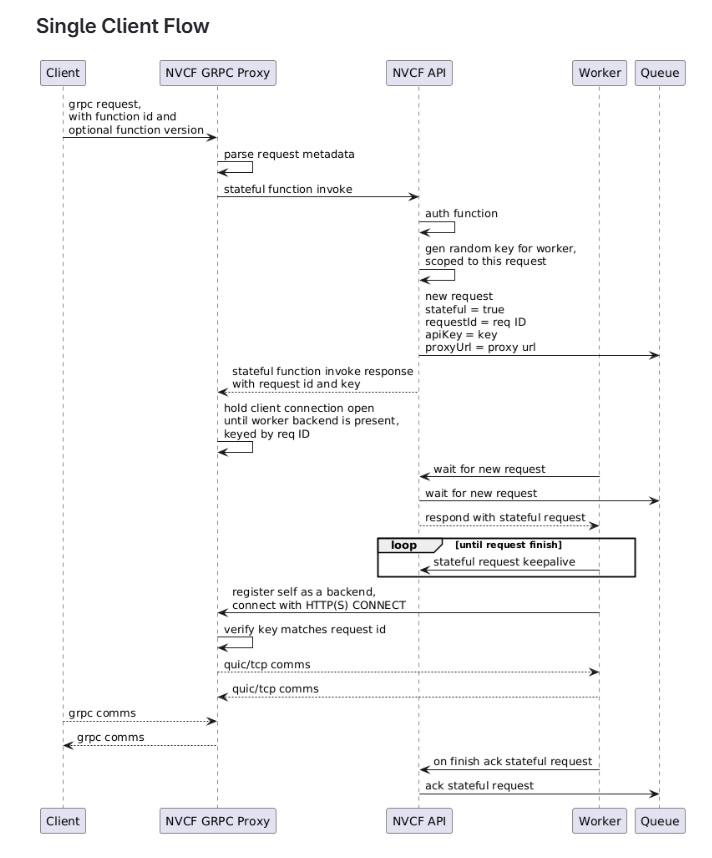
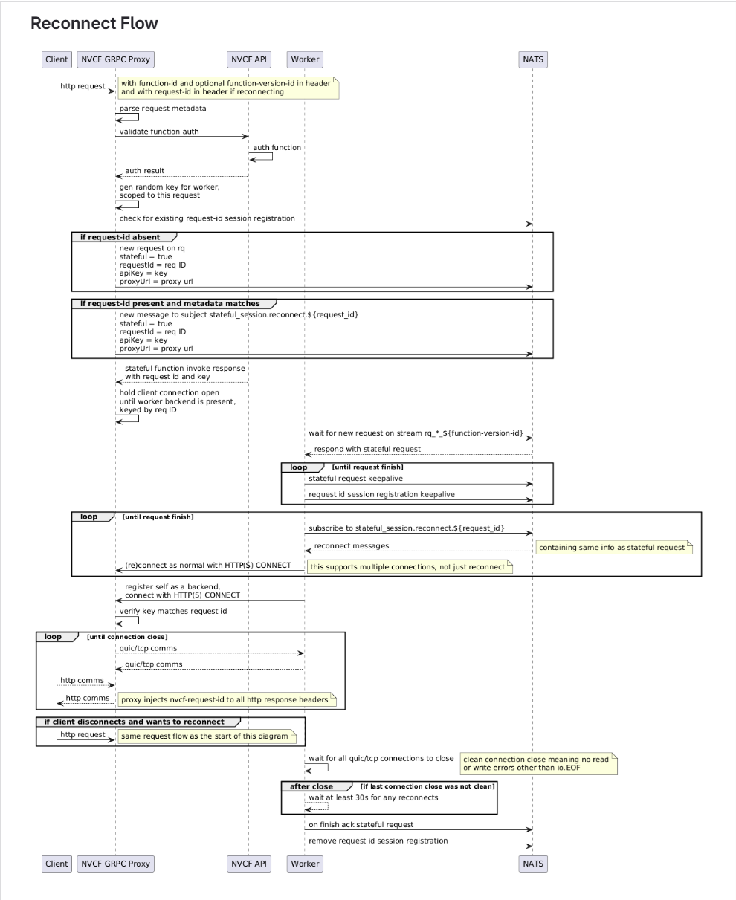

# gRPC Function Invocation

gRPC invocation executes requests against Cloud Functions functions that expose a
gRPC service. gRPC functions use the gRPC proxy instead of the HTTP invocation
route.

In self-hosted deployments, the gRPC route is exposed on the Gateway TCP
listener. See [Gateway Routing](./gateway-routing.md) for listener and DNS
configuration.

Self-hosted split or multi-cluster deployments require additional enablement
before workers can reach the grpc-proxy callback endpoint. See
[gRPC Invocation Enablement](./grpc-invocation-enablement.md).

## Invocation Path


```bash
export GRPC_GATEWAY_ADDR=<grpc-gateway-address>
export FUNCTION_ID=<function-id>
export FUNCTION_VERSION_ID=<function-version-id>
export API_KEY=<api-key>
```

### Multi-Cluster View

In a global deployment, DNS selects a regional public gRPC endpoint. Each region
keeps its own gRPC Proxy, NVCF API and NATS stateful request path, worker CONNECT
registration, and customer gRPC service placement. The cross-cluster line shows
NATS chatter for regional stateful request-path coordination when configured.


## Metadata

Set these gRPC metadata values when invoking a function:

| Metadata key | Required | Description |
| --- | --- | --- |
| `authorization` | Yes | API key, formatted as `Bearer <api-key>`. You can also use gRPC call credentials. |
| `function-id` | Yes | Function ID to invoke. |
| `function-version-id` | No | Function version ID to target. |
| `nvcf-reqid` | No | Request ID (UUID) from a previous session. Send this to resume an existing session instead of starting a new one. See [Session Resumption](#session-resumption). |

The data sent to your gRPC function is defined by the Protobuf messages your
function implements. gRPC functions do not have an input request size limit.

gRPC connections stay alive for 30 seconds when idle. Close the gRPC client
connection after your client is finished so function workers are not held longer
than needed.

## Python Example

This example uses a plaintext local or test gateway on port `10081`. For a
production TLS endpoint, use `grpc.secure_channel("grpc.<domain>:443",
grpc.ssl_channel_credentials())`.

```python
import os
import grpc

import grpc_service_pb2_grpc


def call_grpc(model_infer_request) -> None:
    channel = grpc.insecure_channel(f"{os.environ['GRPC_GATEWAY_ADDR']}:10081")
    grpc_client = grpc_service_pb2_grpc.GRPCInferenceServiceStub(channel)

    metadata = [
        ("function-id", os.environ["FUNCTION_ID"]),
        ("function-version-id", os.environ["FUNCTION_VERSION_ID"]),
        ("authorization", f"Bearer {os.environ['API_KEY']}"),
    ]

    infer = grpc_client.ModelInfer(model_infer_request, metadata=metadata)
    _ = infer

    channel.close()
```

<Note>
The official gRPC term for authorization handling is
[call credentials](https://grpc.io/docs/guides/auth/#credential-types). The
example above sets the `authorization` metadata directly for clarity.

</Note>

## Connection Reuse and Streaming

The gRPC proxy pins sessions to the TCP connection to support unmodified gRPC
clients that ignore cookie headers. This matters when an intermediary proxy for
streaming, such as Kit streaming or Low Latency Streaming (LLS), uses HTTP/2 and
reuses connections.





<Warning>
Do not pre-allocate streaming sessions with `POST` plus `X-NVCF-ABSORB` when a
shared HTTP/2 client can reuse one TCP connection across multiple users or
flows. Two separate requests sent over the same connection can receive the same
request ID from the proxy, which can bind different users or flows to the same
Kit pod.

Use on-demand binding through the WebSocket instead: establish the WebSocket,
obtain the request ID from the proxy, and use that ID for subsequent requests.

</Warning>

For requirements and a sample intermediary proxy implementation, see
[Intermediary Proxy](./streaming-functions.md#intermediary-proxy).

## Session Resumption

Streaming applications such as Omniverse Kit need to reconnect a client to the
same worker after a brief network interruption or a deliberate pause. The gRPC
proxy supports this through a request ID that identifies the stateful session
bound to a specific worker.

### How it works

1. On the first request to a function, the proxy allocates a new session and
   assigns it a UUID request ID.
2. The proxy returns the request ID to the client in two forms:
   - An `nvcf-reqid` response header.
   - A `Set-Cookie` header with the cookie name `nvcf-request-id`.
3. On subsequent requests, the client sends the request ID back to the proxy.
   The proxy checks for the ID in this order:
   - The `nvcf-reqid` metadata header (or `Sec-WebSocket-Protocol` for browser
     WebSocket clients).
   - The `nvcf-request-id` cookie.
4. When the proxy finds a valid request ID, it routes the request to the
   existing worker session instead of creating a new one.

### Sending the request ID

For gRPC clients, set `nvcf-reqid` as a metadata header. For HTTP or WebSocket
clients that cannot set custom headers, the `nvcf-request-id` cookie works as
a fallback.

```python
# gRPC session resumption example.
# First call: no request ID. The proxy creates a session.
response, call = grpc_client.ModelInfer.with_call(request, metadata=metadata)
request_id = dict(call.initial_metadata()).get("nvcf-reqid")

# Subsequent calls: pass the request ID to resume the session.
metadata.append(("nvcf-reqid", request_id))
grpc_client.ModelInfer.with_call(next_request, metadata=metadata)
```

### What happens when resumption fails

If the session has expired or the worker is no longer available, the proxy
returns gRPC NotFound (`grpc-status: 5`) with the message "no existing session
found" and clears the `nvcf-request-id` cookie. The HTTP status remains 200 for
gRPC responses. This error does not indicate a control-plane problem. The
client should discard the stale request ID and reconnect without it to start a
new session.

See [Troubleshooting](./troubleshooting.md#grpc-session-resumption-fails)
for diagnosis steps.
