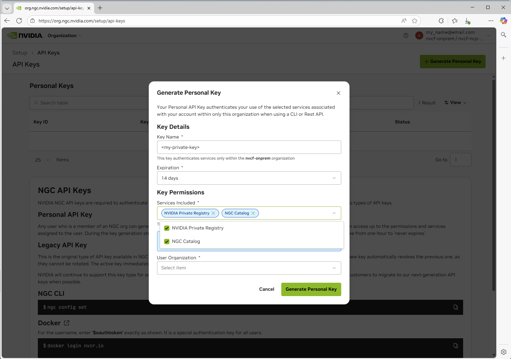

# Image Mirroring

All required self-hosted NVCF artifacts (see [self-hosted-artifact-manifest](./manifest.md)) must be available to be pulled by pods in your Kubernetes cluster for a successful installation using the split stack bundles (`nvcf-self-managed-stack` for control plane and `nvcf-compute-plane-stack` for compute plane). This page provides examples on how to pull artifacts from NGC and push them to your desired registry.

<Note>
**Mirroring images is not the same as configuring image pull secrets.** This page covers how to copy NVCF artifacts into your registry. If your registry is private, Kubernetes also needs credentials to pull those images at runtime. For instructions on configuring image pull secrets for the NVCF control plane pods, see [control-plane-image-pull-secrets](./helmfile-installation.md) in the installation guide.

</Note>

## Mirroring Workflow

Use this page to mirror NVCF artifacts into the registry your cluster can access. The examples below show the commands for pulling from NGC and pushing to a private registry such as ECR, Harbor, or another OCI-compatible registry.

<Info>
For ECR mirroring, make sure your AWS credentials have permission to create repositories and push images. Verify access with `aws sts get-caller-identity`.

</Info>

## Prerequisites

You must have access to the NGC `nvcf-onprem` organization to begin.

1. Navigate to [https://org.ngc.nvidia.com/setup/api-keys](https://org.ngc.nvidia.com/setup/api-keys) and ensure you have selected the `nvcf-onprem` organization in the upper right.
2. Create a Personal API key with the required scopes to pull entities.

<Frame caption="The User Organization in the drop-down will be whichever NCA Organization your account is registered against. It will not be nvcf-onprem.">
  
</Frame>

3. Set the NGC API key as an environment variable for use in any subsequent commands:

```bash
export NGC_API_KEY="nvapi-xxxxxxxxxxxxx"  # Replace with your NGC API key
```

## LLS-Specific Artifacts

If you plan to deploy **Low Latency Streaming (LLS)**, you must mirror the following additional artifacts beyond the core NVCF control plane:

**Container Images:**

- `streaming-proxy` - Streaming Proxy container for streaming

**Helm Charts:**

- `gdn-streaming` - GDN Streaming Proxy Helm chart

**Optional (for streaming workloads):**

- Streaming application images (e.g., `usd-composer`)

See [self-hosted-lls-installation](./lls-installation.md) for LLS deployment instructions.

## Pulling Artifacts from NGC

<Warning>
**Important:** The examples below show how to pull individual artifacts. You must pull **each image, chart, and resource** listed in the [self-hosted-artifact-manifest](./manifest.md) individually. These examples demonstrate the process for one artifact of each type - you will need to repeat these steps for every artifact required for your deployment.

**Complete the following for each artifact:**

- Pull each container image from NGC
- Pull each Helm chart from NGC
- Pull each required resource bundle from NGC
- Push each artifact to your target registry (ECR, Harbor, etc.)

See the [self-hosted-artifact-manifest](./manifest.md) for the complete list of all required artifacts.

</Warning>

### Pulling Images

<Warning>
**Platform Architecture Mismatch**

When pulling images, Docker pulls the architecture matching your local machine by default. If you're running on an Apple Silicon Mac (arm64) but deploying to an amd64 cluster (most EKS/GKE clusters), you **must** specify the target platform:

```bash
# Pull for amd64 clusters (most common)
docker pull --platform linux/amd64 <image>

# Pull for arm64 clusters
docker pull --platform linux/arm64 <image>
```

Failing to specify the correct platform will result in `exec format error` when pods attempt to start. See [image-mirroring-troubleshooting](./image-mirroring.md) for more details.

</Warning>

1. Login using the Personal API key you have generated in the previous step:

   ```bash
   docker login nvcr.io -u '$oauthtoken' -p <NGC_API_KEY>
   ```

2. Pull the image (specify platform matching your target cluster):

   ```bash
   # For amd64 clusters (most EKS, GKE, AKS clusters)
   docker pull --platform linux/amd64 nvcr.io/0833294136851237/nvcf-ncp-staging/nvcf-openbao:2.5.1-nv-1.1.0

   # For arm64 clusters (Graviton-based EKS, etc.)
   docker pull --platform linux/arm64 nvcr.io/0833294136851237/nvcf-ncp-staging/nvcf-openbao:2.5.1-nv-1.1.0
   ```

### Pulling Helm Charts

**OCI-compliant Helm Charts**

```bash
# Set your API key
export NGC_API_KEY=<api key generated from the Personal API key steps above>

# Login to the registry
echo "${NGC_API_KEY}" | helm registry login nvcr.io/0833294136851237/nvcf-ncp-staging \
  --username '$oauthtoken' --password-stdin

# Pull the chart
helm pull oci://nvcr.io/0833294136851237/nvcf-ncp-staging/helm-nvca-operator --version 1.12.0
```

**Repository-based Helm Charts (Non-OCI)**

Some charts like the GPU Operator and the Omniverse DDCS, UCC, storage-service, and discovery-service charts are available from traditional Helm repositories rather than OCI registries. These can be pulled directly from the public NVIDIA NGC Catalog.

```bash
# Add the NVIDIA Helm repository
helm repo add nvidia https://helm.ngc.nvidia.com/nvidia --force-update
helm repo add omniverse https://helm.ngc.nvidia.com/nvidia/omniverse --force-update

# Update repositories
helm repo update

# Pull charts (downloads as .tgz files)
helm pull nvidia/gpu-operator --version 25.3.1
helm pull omniverse/ddcs --version 5.0.0
helm pull omniverse/usd-content-cache --version 3.0.3
helm pull omniverse/storage-service --version 1.0.2
helm pull omniverse/discovery-service --version 2.3.8
```

<Note>
The GPU Operator and related components (gpu-operator-validator, k8s-device-plugin), plus the Omniverse DDCS/UCC/storage charts, are available from public NVIDIA Helm repositories. You can either:

- Pull directly from the public repository at runtime (simplest approach)
- Mirror to your private registry for air-gapped environments (see below)

</Note>

**Converting Non-OCI Charts for ECR**

To push repository-based Helm charts to Amazon ECR (which requires OCI format), you must convert them:

```bash
# Pull the chart from the traditional repository
helm repo add omniverse https://helm.ngc.nvidia.com/nvidia/omniverse --force-update
helm repo update
helm pull omniverse/ddcs --version 5.0.0

# Login to ECR
aws ecr get-login-password --region us-east-1 | \
  helm registry login --username AWS --password-stdin <aws-account-id>.dkr.ecr.us-east-1.amazonaws.com

# Create ECR repository for the chart (include your repository prefix)
aws ecr create-repository --repository-name nvcf-self-hosted/ddcs --region us-east-1

# Push the .tgz file as an OCI artifact (include repository prefix)
helm push ddcs-5.0.0.tgz oci://<aws-account-id>.dkr.ecr.us-east-1.amazonaws.com/nvcf-self-hosted
```

<Tip>
ECR will properly track both container images and Helm charts under the same repository name and version, so you can use consistent naming for both. The repository prefix (e.g., `nvcf-self-hosted`) must match your `global.image.repository` environment configuration.

</Tip>

### Pulling Resources from NGC

**Using NGC CLI**

First, ensure you have the [NGC CLI installed and configured](https://org.ngc.nvidia.com/setup/installers/cli) using the Personal API key you created.

{/* docs-version-sync:BEGIN image-mirroring-resource-examples */}

```bash
# Set stack versions
export STACK_VERSION="0.6.0-rc.56"
export COMPUTE_STACK_VERSION="0.6.0-rc.56"

# Download a specific control-plane stack version
ngc registry resource download-version \
  "0833294136851237/nvcf-ncp-staging/nvcf-self-managed-stack:${STACK_VERSION}"

# List all control-plane stack versions
ngc registry resource list \
  "0833294136851237/nvcf-ncp-staging/nvcf-self-managed-stack:*"

# Download latest control-plane stack version (omit version)
ngc registry resource download-version \
  "0833294136851237/nvcf-ncp-staging/nvcf-self-managed-stack"

# Download a specific compute-plane stack version
ngc registry resource download-version \
  "0833294136851237/nvcf-ncp-staging/nvcf-compute-plane-stack:${COMPUTE_STACK_VERSION}"

# List all compute-plane stack versions
ngc registry resource list \
  "0833294136851237/nvcf-ncp-staging/nvcf-compute-plane-stack:*"

# Download latest compute-plane stack version (omit version)
ngc registry resource download-version \
  "0833294136851237/nvcf-ncp-staging/nvcf-compute-plane-stack"
```

{/* docs-version-sync:END image-mirroring-resource-examples */}

### Downloading `nvcf-self-managed-stack` (control plane)

The `nvcf-self-managed-stack` repository contains Helmfile configurations for deploying the NVCF control plane components.

<Warning>
**Check for the latest version before downloading.** The version shown below is an example only.

```bash
# List available versions to find the latest
ngc registry resource list "0833294136851237/nvcf-ncp-staging/nvcf-self-managed-stack:*"
```

</Warning>

**Download and extract:**

{/* docs-version-sync:BEGIN image-mirroring-stack-snippet */}

```bash
# Set the version
export VERSION="0.6.0-rc.56"

ngc registry resource download-version "0833294136851237/nvcf-ncp-staging/nvcf-self-managed-stack:${VERSION}" && \
   mkdir -p nvcf-self-managed-stack && \
   tar -xzf nvcf-self-managed-stack_v${VERSION}/nvcf-self-managed-stack-${VERSION}.tar.gz -C nvcf-self-managed-stack && \
   rm -rf nvcf-self-managed-stack_v${VERSION}
```

{/* docs-version-sync:END image-mirroring-stack-snippet */}

<Note>
If you don't have access to this repository, contact your NVIDIA representative.

</Note>

### Downloading `nvcf-compute-plane-stack`

The `nvcf-compute-plane-stack` repository contains Helmfile configurations for deploying compute-plane components.

<Warning>
Check for the latest version before downloading. The version shown below is an example only.

```bash
# List available versions to find the latest
ngc registry resource list "0833294136851237/nvcf-ncp-staging/nvcf-compute-plane-stack:*"
```

</Warning>

Download and extract:

{/* docs-version-sync:BEGIN image-mirroring-compute-stack-snippet */}

```bash
# Set the version
export COMPUTE_VERSION="0.6.0-rc.56"

ngc registry resource download-version "0833294136851237/nvcf-ncp-staging/nvcf-compute-plane-stack:${COMPUTE_VERSION}" && \
   mkdir -p nvcf-compute-plane-stack && \
   tar -xzf nvcf-compute-plane-stack_v${COMPUTE_VERSION}/nvcf-compute-plane-stack-${COMPUTE_VERSION}.tar.gz -C nvcf-compute-plane-stack && \
   rm -rf nvcf-compute-plane-stack_v${COMPUTE_VERSION}
```

{/* docs-version-sync:END image-mirroring-compute-stack-snippet */}

<Note>
Use both stack bundles for split-stack local and self-managed installs:
`nvcf-self-managed-stack` for the control plane and
`nvcf-compute-plane-stack` for compute-plane components.

</Note>

### Downloading `nvcf-cli`

The `nvcf-cli` is a command-line interface for managing NVIDIA Cloud Functions in self-hosted deployments.

<Warning>
**Check for the latest version before downloading.** The version shown below is an example only.

```bash
# List available versions to find the latest
ngc registry resource list "0833294136851237/nvcf-ncp-staging/nvcf-cli:*"
```

</Warning>

**Download and extract:**

{/* docs-version-sync:BEGIN image-mirroring-cli-snippet */}

```bash
# Set the version
export VERSION="0.0.30"

# Set your platform (linux-amd64, linux-arm64, darwin-amd64, darwin-arm64, windows-amd64)
export PLATFORM="linux-amd64"

ngc registry resource download-version "0833294136851237/nvcf-ncp-staging/nvcf-cli:${VERSION}"

tar -xzf nvcf-cli_v${VERSION}/${PLATFORM}/nvcf-cli-${PLATFORM}-${VERSION}.tar.gz
mv nvcf-cli-${PLATFORM}-${VERSION} nvcf-cli
chmod +x nvcf-cli/nvcf-cli
```

{/* docs-version-sync:END image-mirroring-cli-snippet */}

The extracted directory contains:

- `nvcf-cli` - The CLI binary
- `.nvcf-cli.yaml.template` - Configuration template
- `examples/` - Sample configuration files for different environments
- `USAGE-GUIDE.md` - Detailed usage documentation

See [self-hosted-cli](./cli.md) for detailed configuration instructions

<Note>
If you don't have access to this repository, contact your NVIDIA representative.

</Note>

## Pushing to Your Registry

<Info>
Ensure all artifacts listed in the [self-hosted-artifact-manifest](./manifest.md) are mirrored to your registry before beginning the installation process.

</Info>

### Example: Pushing to Amazon ECR

This example assumes you're configured and authenticated using the AWS CLI.

<Note>
**Identify Your AWS Account ID**

The examples below use `<aws-account-id>` as a placeholder. To get your AWS account ID, run:

```bash
aws sts get-caller-identity --query Account --output text
```

</Note>

<Info>
**ECR Repository Naming Convention**

The Helm templates expect images at: `{{ registry }}/{{ repository }}/image-name:tag`

For example, with environment configuration:

```yaml
global:
  image:
    registry: <aws-account-id>.dkr.ecr.us-east-1.amazonaws.com
    repository: nvcf-self-hosted
```

The resulting image path would be: `<aws-account-id>.dkr.ecr.us-east-1.amazonaws.com/nvcf-self-hosted/nvcf-openbao:2.5.1-nv-1.1.0`

In ECR, you must create repositories with the **full path** including the prefix, e.g., `nvcf-self-hosted/bitnami-cassandra`, `nvcf-self-hosted/nvcf-openbao`, etc.

</Info>

**Initial Setup**

```bash
# Set your repository prefix (must match global.image.repository in your environment config)
REPO_PREFIX="nvcf-self-hosted"

# Login to AWS ECR
aws ecr get-login-password --region us-east-1 | \
  docker login --username AWS --password-stdin <aws-account-id>.dkr.ecr.us-east-1.amazonaws.com
```

**Push an Image to ECR**

```bash
# Create ECR repository with the full path (including prefix)
aws ecr create-repository --repository-name ${REPO_PREFIX}/nvcf-openbao --region us-east-1

# Tag the image for ECR (include repository prefix in path)
docker tag nvcr.io/0833294136851237/nvcf-ncp-staging/nvcf-openbao:2.5.1-nv-1.1.0 \
  <aws-account-id>.dkr.ecr.us-east-1.amazonaws.com/${REPO_PREFIX}/nvcf-openbao:2.5.1-nv-1.1.0

# Push to ECR
docker push <aws-account-id>.dkr.ecr.us-east-1.amazonaws.com/${REPO_PREFIX}/nvcf-openbao:2.5.1-nv-1.1.0
```

**Push a Helm Chart to ECR**

```bash
# 1. Login to NGC with Helm
export NGC_API_KEY="your-api-key"
echo "${NGC_API_KEY}" | helm registry login nvcr.io/0833294136851237/nvcf-ncp-staging \
  --username '$oauthtoken' --password-stdin

# 2. Pull the Helm chart from NGC
helm pull oci://nvcr.io/0833294136851237/nvcf-ncp-staging/helm-nvca-operator --version 1.12.0
# This creates: helm-nvca-operator-1.12.0.tgz

# 3. Login to AWS ECR with Helm
aws ecr get-login-password --region us-east-1 | \
  helm registry login --username AWS --password-stdin <aws-account-id>.dkr.ecr.us-east-1.amazonaws.com

# 4. Create ECR repository with prefix (must match your environment config)
aws ecr create-repository --repository-name ${REPO_PREFIX}/helm-nvca-operator --region us-east-1

# 5. Push to ECR as OCI artifact (include repository prefix)
helm push helm-nvca-operator-1.12.0.tgz oci://<aws-account-id>.dkr.ecr.us-east-1.amazonaws.com/${REPO_PREFIX}
```

<Note>
Replace `<aws-account-id>` with your AWS account ID (run `aws sts get-caller-identity --query Account --output text`). The `REPO_PREFIX` value must match your `global.image.repository` setting in your environment config. Adjust the region as needed.

</Note>

### Example: Pushing to Volcano Engine Container Registry

This example shows how to push images and Helm charts to Volcano Engine Container Registry (CR) using the web console, Docker commands and Helm commands.

<Info>
**Volcano Engine CR Repository Naming Convention**

The Helm templates expect images at: `{{ registry }}/{{ repository }}/image-name:tag`

For example, with environment configuration:

```yaml
global:
  image:
    registry: cr-example-cn-beijing.cr.volces.com
    repository: nvcf-self-hosted
```

The resulting image path would be: `cr-example-cn-beijing.cr.volces.com/nvcf-self-hosted/nvcf-openbao:2.5.1-nv-1.1.0`

</Info>

**Docker Authentication**

```bash
# Set your Volcano Engine CR endpoint
CR_ENDPOINT="cr-example-cn-beijing.cr.volces.com"
CR_USERNAME="your-username"
CR_PASSWORD="your-password"

# Login to Volcano Engine CR
echo "${CR_PASSWORD}" | docker login "${CR_ENDPOINT}" \
  --username "${CR_USERNAME}" --password-stdin
```

<Note>
Replace `cr-example-cn-beijing.cr.volces.com` with your Volcano Engine CR endpoint, `your-username` with your username, and `your-password` with your password.
Navigate to your Volcano Engine Container Registry instance web console to get the username and password. If you haven't set the password, you can set it by clicking "Set Repository Instance Password".

</Note>

**Push an Image to Volcano Engine CR**

```bash
# Set your registry endpoint and namespace
CR_ENDPOINT="cr-example-cn-beijing.cr.volces.com"
NAMESPACE="nvcf-self-hosted"

# Tag the image for Volcano Engine CR
docker tag nvcr.io/0833294136851237/nvcf-ncp-staging/nvcf-openbao:2.5.1-nv-1.1.0 \
  ${CR_ENDPOINT}/${NAMESPACE}/nvcf-openbao:2.5.1-nv-1.1.0

# Push to Volcano Engine CR
docker push ${CR_ENDPOINT}/${NAMESPACE}/nvcf-openbao:2.5.1-nv-1.1.0
```

**Push a Helm Chart to Volcano Engine CR**

```bash
# Set your registry endpoint and namespace
CR_ENDPOINT="cr-example-cn-beijing.cr.volces.com"
NAMESPACE="nvcf-self-hosted"
CR_USERNAME="your-username"
CR_PASSWORD="your-password"

# 1. Login to NGC with Helm
export NGC_API_KEY="your-api-key"
echo "${NGC_API_KEY}" | helm registry login nvcr.io/0833294136851237/nvcf-ncp-staging \
  --username '$oauthtoken' --password-stdin

# 2. Pull the Helm chart from NGC
helm pull oci://nvcr.io/0833294136851237/nvcf-ncp-staging/helm-nvca-operator --version 1.12.0
# This creates: helm-nvca-operator-1.12.0.tgz

# 3. Login to Volcano Engine CR with Helm
helm registry login ${CR_ENDPOINT} \
  --username "${CR_USERNAME}" \
  --password "${CR_PASSWORD}"

# 4. Push to Volcano Engine CR as OCI artifact
helm push helm-nvca-operator-1.12.0.tgz oci://${CR_ENDPOINT}/${NAMESPACE}
```

## Troubleshooting

### exec format error

**Symptom:** Pods fail to start with `Init:CrashLoopBackOff` or `CrashLoopBackOff` status. Checking the logs shows:

```text
exec /bin/sh: exec format error
```

or

```text
exec /usr/local/bin/docker-entrypoint.sh: exec format error
```

**Cause:** This error occurs when container images were pulled/pushed with an architecture that doesn't match your cluster's node architecture. This commonly happens when:

- Mirroring from an Apple Silicon Mac (arm64) to an amd64 EKS/GKE cluster
- Mirroring from an Intel/AMD machine (amd64) to an arm64 cluster (e.g., AWS Graviton)

**Solution:**

1. **Delete the incorrectly mirrored images from your registry** (e.g., ECR):

   ```bash
   # Delete all repositories with your prefix
   aws ecr describe-repositories --region us-west-2 \
     --query "repositories[?starts_with(repositoryName, 'nvcf-self-hosted')].repositoryName" \
     --output text | tr '\t' '\n' | while read repo; do
     aws ecr delete-repository --repository-name "$repo" --region us-west-2 --force
   done
   ```

2. **Clean local Docker cache** to ensure fresh pulls:

   ```bash
   # Remove all NGC and ECR images from local cache
   docker images --format "{{.Repository}}:{{.Tag}}" | \
     grep -E "(nvcr.io|\.ecr\.)" | \
     xargs -r docker rmi -f

   # Prune dangling images
   docker image prune -f
   ```

3. **Re-mirror images with the correct platform**:

   When pulling images, explicitly specify the target platform:

   ```bash
   # For amd64 clusters (most common)
   docker pull --platform linux/amd64 <image>

   # For arm64 clusters
   docker pull --platform linux/arm64 <image>
   ```

   Then re-tag and push to your registry.

4. **Force Kubernetes to re-pull images** by either:

   - Setting `imagePullPolicy: Always` temporarily in your Helm values
   - Deleting and redeploying the affected StatefulSets/Deployments

   ```bash
   # Delete StatefulSets to force recreation
   kubectl -n cassandra-system delete statefulset cassandra
   kubectl -n nats-system delete statefulset nats

   # Redeploy using helmfile
   HELMFILE_ENV=<environment-name> helmfile sync
   ```
