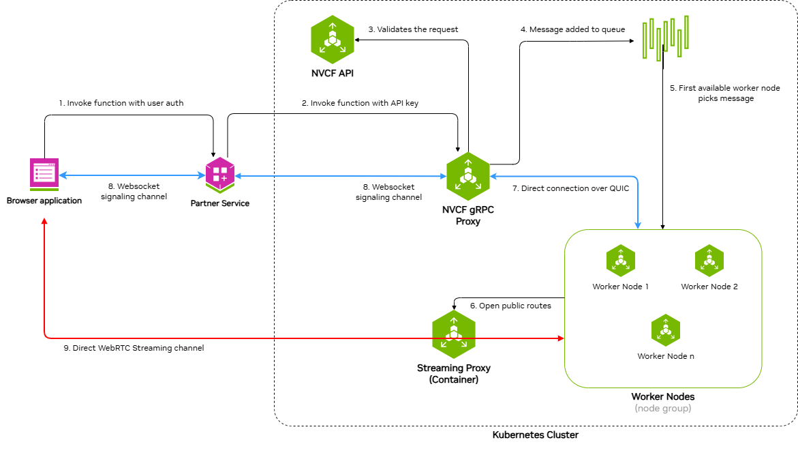
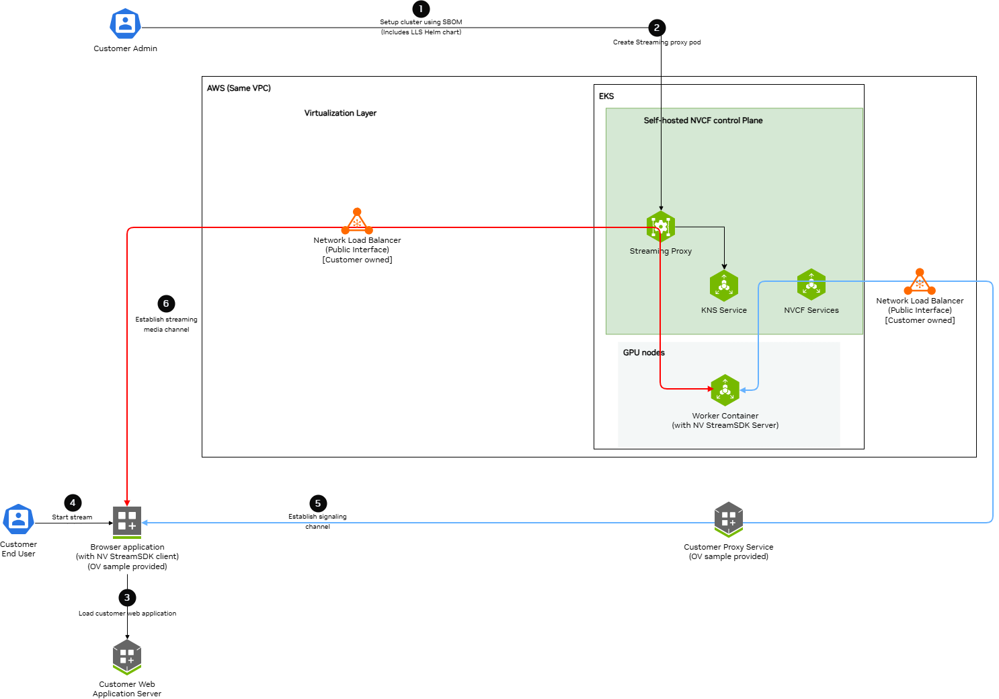

# LLS Installation

This guide provides instructions for installing Low Latency Streaming (LLS) components for self-hosted NVCF deployments. LLS enables real-time streaming capabilities for simulation workloads.

<Note>
LLS supports self-hosted Kubernetes deployments on AWS and Azure. AWS-specific
commands and resources in this guide are illustrative examples.

This guide covers manual installation of LLS resources, image mirroring, and
load balancer resources.

</Note>

## Overview

Low Latency Streaming (LLS) provides real-time streaming capabilities for self-hosted NVCF deployments. LLS consists of:

- **Streaming Proxy (RP Container)** - Handle WebRTC UDP streaming connections

Self-hosted mode uses your container registry for container images and customer-managed infrastructure.

## Architecture

### Request and Streaming Flow

The following diagram illustrates the request and streaming flow for self-hosted NVCF LLS, showing how a browser application invokes a function and establishes direct streaming channels to worker nodes:



The architecture demonstrates a nine-step process:

1. **Invoke function with user auth** - Browser application sends function invocation request with user authentication to the Partner Service
2. **Invoke function with API key** - Partner Service forwards the request to NVCF gRPC Proxy using an API key
3. **Validates the request** - NVCF gRPC Proxy validates the request with NVCF API
4. **Message added to queue** - Validated request is added to the message queue
5. **First available worker node picks message** - An available worker node retrieves the message from the queue
6. **WebSocket signaling channel** - Bidirectional WebSocket channel between Partner Service and NVCF gRPC Proxy for signaling
7. **Direct connection over QUIC** - Direct QUIC connection between NVCF gRPC Proxy and Worker Nodes
8. **WebSocket signaling channel** - Bidirectional WebSocket channel between Browser application and Partner Service
9. **Direct WebRTC Streaming channel** - Direct WebRTC streaming channel between Browser application and Streaming Proxy Container(STUN), which opens public routes to Worker Nodes

### Self-Hosted Deployment Architecture

The following diagram shows the detailed architecture of a self-hosted NVCF LLS deployment in AWS VPC with EKS:



Key components and data flows:

**Control Plane Components (EKS):**

- **Streaming Proxy Container** - Handles WebRTC streaming connections and opens routes to Worker Nodes
- **K8s Services** - Creates ClusterIP and NodePort services
- **KNS Service** - Fetches JWKs for authentication
- **NVCF Services** - Connects to customer-owned load balancers via signaling channels

**GPU Nodes (EKS):**

- **Worker Container** - Runs streaming applications (StreamSDK packaged) and receives streaming data

**AWS VPC:**

- **Network Load Balancer (Public Interface)** - Customer-owned, receives streaming and signaling data from browser applications

**Data Flow Channels:**

- **Red Lines (Streaming Channel)** - WebRTC streaming data path from Browser application through load balancers and Streaming Proxy to Worker Containers
- **Blue Lines (Signaling Channel)** - WebSocket signaling data path connecting Browser application, Customer services, Load Balancers, NVCF Services, and Worker Containers

## Prerequisites

Before installing LLS, ensure:

- Self-hosted NVCF control plane installed and running on a Kubernetes cluster (see [helmfile-installation](./helmfile-installation.md))
- **kubectl** configured with access to your cluster
- **Helm v3.x** installed
- **NGC API Key** with access to the `nvcf-onprem` organization
- For AWS examples, AWS CLI configured with credentials that have permissions for EKS, ECR, EC2, ELBv2, and IAM operations

**Configure AWS Credentials**

For AWS examples, LLS installation requires AWS CLI access to create NLB resources, security groups, and manage EC2 instances. Verify your AWS credentials are configured:

```bash
aws sts get-caller-identity
```

If this command fails, configure your AWS credentials before running the AWS examples using your organization's standard AWS authentication flow.

**Set NGC API Key**

Before proceeding, set your NGC API key as an environment variable:

```bash
export NGC_API_KEY="nvapi-xxxxxxxxxxxxx"  # Replace with your NGC API key
```

<Note>
**Configurable UDP Streaming Port**

The UDP port for WebRTC streaming traffic defaults to 5004 and is exported as
`LLS_UDP_PORT` in [Step 2.1](./lls-installation.md). This variable is used throughout
the guide for the NLB security group rule, NLB listener, and Helm values configuration.

To use a different port, change the `export LLS_UDP_PORT=` value in Step 2.1 and set
`env.lbPort` in your Helm values file (Step 3) to the same value.

</Note>

## Step 1: Mirror LLS Artifacts

LLS requires specific container images and Helm charts to be available in your registry.

### Required LLS Artifacts

The following artifacts must be mirrored for LLS deployment:

**Container Images:**

- `streaming-proxy` - Streaming Proxy Container(RP Container)

**Helm Charts:**

- `gdn-streaming` - GDN Streaming Proxy Helm chart

**Optional (for streaming workloads):**

- Streaming application images (e.g., `usd-composer`)

For detailed instructions on pulling these artifacts from NGC and pushing to your registry, see [self-hosted-image-mirroring](./image-mirroring.md). The [LLS-specific artifacts](./image-mirroring.md) section lists exactly what you need.

<Info>
When mirroring to ECR, the repository path must match your Helm values configuration. Ensure your `registryName` in Step 4 includes the same repository path you used when mirroring the chart.

</Info>

## Step 2: Create Network Load Balancer

LLS requires a Network Load Balancer (NLB) for streaming traffic.

### Requirements

- **Type**: Network Load Balancer
- **Scheme**: Internet-facing
- **Subnet**: Public subnet in the same availability zone as your GPU nodes

### Security Group

Create a security group with the following rules:

**Inbound:**

- Protocol: UDP, Port: 5004, Source: 0.0.0.0/0 (streaming traffic)

**Outbound:**

- Protocol: All, Destination: 0.0.0.0/0

### Target Group

- **Target type**: Instance
- **Protocol**: UDP
- **Port**: 30504
- **Health check protocol**: HTTP
- **Health check port**: 30800
- **Health check path**: /v1/health

### Listener

- **Protocol**: UDP
- **Port**: 5004
- **Default action**: Forward to target group

<Note>
You must create the NLB in the same region **and availability zone** as your GPU node pool.

</Note>

### CLI Example

The following commands create all required NLB resources. Copy and paste each section, replacing the placeholder values at the start.

**2.1 Set Environment Variables**

```bash
# Required: Set your cluster name and region
export CLUSTER_NAME="<your-cluster-name>"
export REGION="<your-region>"

# UDP port for WebRTC streaming traffic (configurable — update if needed)
export LLS_UDP_PORT=5004

# Define resource names (based on cluster name)
export NLB_NAME="rp-public-${CLUSTER_NAME}"
export SG_NAME="${CLUSTER_NAME}-rp-sg"
export TG_NAME="${CLUSTER_NAME}-rp-tg"
```

**2.2 Get VPC and Public Subnet**

```bash
# Get VPC ID from your EKS cluster
export VPC_ID=$(aws eks describe-cluster \
  --name "$CLUSTER_NAME" \
  --region "$REGION" \
  --query 'cluster.resourcesVpcConfig.vpcId' \
  --output text)
echo "VPC ID: $VPC_ID"

# Set the availability zone where your GPU nodes are deployed
# This must match the availability zone used by the GPU node pool
export LLS_AZ="us-west-2a"  # <-- Update to match your GPU node AZ

# Get the public subnet in the LLS availability zone
export SUBNET=$(aws ec2 describe-subnets \
  --region "$REGION" \
  --filters \
    "Name=vpc-id,Values=${VPC_ID}" \
    "Name=map-public-ip-on-launch,Values=true" \
    "Name=availability-zone,Values=${LLS_AZ}" \
  --query 'Subnets[0].SubnetId' \
  --output text)
echo "Public Subnet ($LLS_AZ): $SUBNET"
```

**2.3 Create Security Group**

```bash
# Create security group for NLB
export SG_ID=$(aws ec2 create-security-group \
  --group-name "$SG_NAME" \
  --description "Security group for LLS streaming NLB (UDP ${LLS_UDP_PORT})" \
  --vpc-id "$VPC_ID" \
  --region "$REGION" \
  --tag-specifications "ResourceType=security-group,Tags=[{Key=Name,Value=$SG_NAME},{Key=lls:cluster,Value=$CLUSTER_NAME},{Key=lls:managed-by,Value=customer},{Key=lls:purpose,Value=streaming-nlb},{Key=Project,Value=nvcf}]" \
  --query 'GroupId' \
  --output text)
echo "Security Group ID: $SG_ID"
```

**2.4 Configure Security Group Rules**

```bash
# Add inbound rule: UDP ${LLS_UDP_PORT} from anywhere (streaming traffic)
aws ec2 authorize-security-group-ingress \
  --group-id "$SG_ID" \
  --ip-permissions "IpProtocol=udp,FromPort=${LLS_UDP_PORT},ToPort=${LLS_UDP_PORT},IpRanges=[{CidrIp=0.0.0.0/0,Description='LLS streaming traffic'}]" \
  --region "$REGION"

# Remove default egress rule and add explicit outbound rule
aws ec2 revoke-security-group-egress \
  --group-id "$SG_ID" \
  --ip-permissions 'IpProtocol=-1,IpRanges=[{CidrIp=0.0.0.0/0}]' \
  --region "$REGION" 2>/dev/null || true

aws ec2 authorize-security-group-egress \
  --group-id "$SG_ID" \
  --ip-permissions 'IpProtocol=-1,IpRanges=[{CidrIp=0.0.0.0/0}]' \
  --region "$REGION"
```

**2.5 Create Network Load Balancer**

Choose one of the following options:

**Option A: Dynamic IP (simpler)**

```bash
# Create NLB with AWS-assigned public IP (single AZ)
export NLB_ARN=$(aws elbv2 create-load-balancer \
  --name "$NLB_NAME" \
  --type network \
  --scheme internet-facing \
  --subnets "$SUBNET" \
  --security-groups "$SG_ID" \
  --region "$REGION" \
  --tags \
    Key=Name,Value="$NLB_NAME" \
    Key=lls:cluster,Value="$CLUSTER_NAME" \
    Key=lls:managed-by,Value="customer" \
    Key=lls:purpose,Value="streaming-traffic" \
    Key=Project,Value="nvcf" \
  --query 'LoadBalancers[0].LoadBalancerArn' \
  --output text)
echo "NLB ARN: $NLB_ARN"
```

**Option B: Static EIP (predictable IP)**

Use this if you need a predictable ingress IP for firewall rules:

```bash
# Allocate a static EIP
export EIP_ALLOC=$(aws ec2 allocate-address \
  --domain vpc \
  --region "$REGION" \
  --tag-specifications "ResourceType=elastic-ip,Tags=[{Key=Name,Value=${CLUSTER_NAME}-lls-eip},{Key=lls:cluster,Value=$CLUSTER_NAME}]" \
  --query 'AllocationId' \
  --output text)
echo "EIP Allocation ID: $EIP_ALLOC"

# Create NLB with static EIP (single AZ)
export NLB_ARN=$(aws elbv2 create-load-balancer \
  --name "$NLB_NAME" \
  --type network \
  --scheme internet-facing \
  --subnet-mappings SubnetId="$SUBNET",AllocationId="$EIP_ALLOC" \
  --security-groups "$SG_ID" \
  --region "$REGION" \
  --tags \
    Key=Name,Value="$NLB_NAME" \
    Key=lls:cluster,Value="$CLUSTER_NAME" \
    Key=lls:managed-by,Value="customer" \
    Key=lls:purpose,Value="streaming-traffic" \
    Key=Project,Value="nvcf" \
  --query 'LoadBalancers[0].LoadBalancerArn' \
  --output text)
echo "NLB ARN: $NLB_ARN"
```

**2.6 Wait for NLB to Become Active**

```bash
echo "Waiting for NLB to become active..."
aws elbv2 wait load-balancer-available \
  --load-balancer-arns "$NLB_ARN" \
  --region "$REGION"
echo "NLB is active"
```

**2.7 Create Target Group**

```bash
export TG_ARN=$(aws elbv2 create-target-group \
  --name "$TG_NAME" \
  --protocol UDP \
  --port 30504 \
  --vpc-id "$VPC_ID" \
  --target-type ip \
  --health-check-enabled \
  --health-check-protocol HTTP \
  --health-check-port 30800 \
  --health-check-path /v1/health \
  --health-check-interval-seconds 30 \
  --health-check-timeout-seconds 6 \
  --healthy-threshold-count 5 \
  --unhealthy-threshold-count 2 \
  --matcher HttpCode=200-399 \
  --region "$REGION" \
  --tags \
    Key=Name,Value="$TG_NAME" \
    Key=lls:cluster,Value="$CLUSTER_NAME" \
    Key=lls:managed-by,Value="customer" \
    Key=lls:purpose,Value="streaming-targets" \
    Key=Project,Value="nvcf" \
  --query 'TargetGroups[0].TargetGroupArn' \
  --output text)
echo "Target Group ARN: $TG_ARN"
```

**2.8 Create Listener**

```bash
export LISTENER_ARN=$(aws elbv2 create-listener \
  --load-balancer-arn "$NLB_ARN" \
  --protocol UDP \
  --port ${LLS_UDP_PORT} \
  --default-actions Type=forward,TargetGroupArn="$TG_ARN" \
  --region "$REGION" \
  --query 'Listeners[0].ListenerArn' \
  --output text)
echo "Listener ARN: $LISTENER_ARN"
```

**2.9 Verify and Save Outputs**

```bash
# Get NLB DNS name
export NLB_DNS=$(aws elbv2 describe-load-balancers \
  --load-balancer-arns "$NLB_ARN" \
  --region "$REGION" \
  --query 'LoadBalancers[0].DNSName' \
  --output text)

# Display summary
echo ""
echo "============================================"
echo "NLB Creation Complete"
echo "============================================"
echo "NLB Name:         $NLB_NAME"
echo "NLB ARN:          $NLB_ARN"
echo "NLB DNS:          $NLB_DNS"
echo "Target Group ARN: $TG_ARN"
echo "Security Group:   $SG_ID"
echo "============================================"
echo ""
echo "Save the Target Group ARN for Step 3 (Helm values):"
echo "  $TG_ARN"
```

<Info>
**Save the Target Group ARN** — you will need it for the adding streaming proxy container nodes as targets to the target group [lls-step3-helm-values](./lls-installation.md).

</Info>

## Step 3: Create Helm Values File

Create a `custom-values.yaml` file with your configuration.

Use the load balancer DNS name and availability zone from Step 2:

```yaml
env:
  # UDP port for streaming traffic
  lbPort: "5004"  # UDP streaming port — must match LLS_UDP_PORT set in Step 2.1
  lbDns: "<nlb-dns-name>.elb.<region>.amazonaws.com" # load balancer dns name

# Replica count
replicaCount: 1

# Availability Zone for streaming proxy container
availabilityZones:
  enabled: true
  zones:
    - us-west-2a # Change to the actual availability zone of Load Balancer

# Node Selection
nodeSelector:
  node-type: compute

# Image Configuration
image:
  repository: <registry-name>/streaming-proxy
  tag: 2.0.1
  pullPolicy: Always

# Resource Limits
resources:
  requests:
    cpu: "5000m"
    memory: "24Gi"
  limits:
    cpu: "5000m"
    memory: "24Gi"
```

<Note>
- Replace all `<placeholder>` values with your actual configuration
- `env.lbPort` is the public UDP port for streaming traffic
- `env.lbDns` is the public load balancer dns name
- `availabilityZones.zones` is the availability zone for streaming proxy container which must be the same as the availability zone of the Load Balancer
- `nodeSelector.node-type` is the node type where streaming proxy container will be deployed
- `image.repository` is the streaming proxy container image repository
- `image.tag` is the streaming proxy container image tag
- `resources.requests.cpu` is the streaming proxy pod cpu request
- `resources.requests.memory` is the streaming proxy pod memory request
- `resources.limits.cpu` is the streaming proxy pod cpu limit
- `resources.limits.memory` is the streaming proxy pod memory limit

</Note>

## Step 4: Deploy LLS Operator

**4.1 Deploy the LLS operator using Helm:**

```bash
# Authenticate with ECR
aws ecr get-login-password --region $AWS_REGION | helm registry login --username AWS --password-stdin $AWS_ACCOUNT_ID.dkr.ecr.$AWS_REGION.amazonaws.com

# Set this to the repository prefix used when mirroring the gdn-streaming chart.
# Examples: nvcf, nvcf-self-hosted, or your cluster-specific prefix.
export LLS_HELM_REPOSITORY="<your-repository-prefix>"

# Install, update to use latest artifact version and registry location
helm upgrade --install gdn-streaming \
  oci://$AWS_ACCOUNT_ID.dkr.ecr.$AWS_REGION.amazonaws.com/$LLS_HELM_REPOSITORY/gdn-streaming \
  --version 2.0.1 \
  --namespace gdn-streaming \
  --create-namespace \
  -f custom-values.yaml
```

**4.2 Add RP Container Node IP and Port to Load Balancer's Target Group:**

```bash
# Get the target group ARN from the Load balancer step and export as TG_ARN
for IP in $(kubectl get nodes -l node-type=compute -o jsonpath='{.items[*].status.addresses[?(@.type=="InternalIP")].address}'); do
 aws elbv2 register-targets --target-group-arn "$TG_ARN" --targets Id="$IP",Port=30504
done
```

**4.3 Add security rule to cluster node to accept streaming traffic on nodeport:**

```bash
 # # Get the security group from the Load balancer step and export as SG_ID
 NODE_SG_ID=$(aws ec2 describe-security-groups \
  --filters "Name=group-name,Values=$CLUSTER_NAME-node-*" \
  --query 'SecurityGroups[0].GroupId' --output text)

 echo "Node Security Group ID: $NODE_SG_ID"

# Add security rule to cluster node to accept streaming traffic on nodeport
aws ec2 authorize-security-group-ingress \
--group-id "$NODE_SG_ID" \
--protocol udp \
--port 30504 \
--source-group "$SG_ID" \
--tag-specifications 'ResourceType=security-group-rule,Tags=[{Key=Name,Value=streaming-proxy-udp-30504}]'
```

## Step 6: Verify Deployment

Verify the LLS components are running:

1. **Check Streaming proxy pods** (should show `1/1 Running`):

   ```bash
   kubectl get pods -n gdn-streaming
   ```

   Expected output:

   ```text
   NAME                                                 READY   STATUS    RESTARTS   AGE
   streaming-proxy-xxxxx-xxxxx        1/1     Running   0          5m
   ```

2. **Check container logs** (filter out verbose stack traces):

   ```bash
   # show recent logs
   kubectl logs -n gdn-streaming -l app=streaming-proxy --tail=50
   ```

## LLS Resource Summary

The following table summarizes all AWS and Kubernetes resources created for LLS, who creates them, and how they are cleaned up:

| Resource | Created By | Cleaned Up By | Notes |
| --- | --- | --- | --- |
| **Kubernetes Resources** - - - |  |  |  |
| Namespace `gdn-streaming` | Helm install | Manual / Script | Contains all LLS K8s resources |
| Streaming Proxy Pods | Helm install | Manual / Script | Tagged `lls:managed-by=gdn-streaming` |
| **AWS Resources (Manual - Step 2)** - - - |  |  |  |
| Network Load Balancer | Customer (CLI) | Cleanup script | Must delete before Target Group |
| NLB Target Group | Customer (CLI) | Cleanup script | Must delete after NLB |
| NLB Security Group | Customer (CLI) | Cleanup script | Must delete after NLB and node SG rule |
| Elastic IP (if static) | Customer (CLI) | Customer (CLI) | Optional, delete if created |
| **AWS Resources (Manual - Step 4)** - - - |  |  |  |
| Node SG ingress rule (UDP 30504) | Customer (CLI) | Cleanup script | Must remove before NLB Security Group |

### Step 1: Uninstall

```bash
helm uninstall gdn-streaming -n gdn-streaming

kubectl delete ns gdn-streaming
```

### Step 2: Delete Manual NLB Resources

The NLB and its associated resources created in [lls-step2-nlb](./lls-installation.md) must be manually deleted.

Save your NLB cleanup script as `lls-nlb-cleanup.sh`, then run:

```bash
chmod +x lls-nlb-cleanup.sh
./lls-nlb-cleanup.sh <your-cluster-name> <your-region>

# Example:
./lls-nlb-cleanup.sh my-cluster us-west-2
```

The script performs the following steps in dependency order:

1. Finds the NLB security group by tag
2. Removes the UDP 30504 ingress rule from the cluster node security group (added in Step 4.3 — must be removed before the NLB security group can be deleted)
3. Deletes the NLB and waits for deletion to complete
4. Deletes the target group (requires NLB to be fully deleted first)
5. Deletes the NLB security group (with retry logic)
6. Lists any Elastic IPs that may need manual release

<Note>
**Safety:** The script identifies resources using the tags that were set during [lls-step2-nlb](./lls-installation.md). It will only delete resources with both `lls:cluster=<your-cluster-name>` and `lls:managed-by=customer` tags, ensuring it won't accidentally delete other NLBs in your account.

If the NLB security group deletion still fails with `DependencyViolation` after the script removes the node SG rule, the NLB may not have fully deleted yet. The script will automatically retry. If it still fails after several attempts, wait a few more minutes and run the script again.

</Note>

### Step 3: Final Verification

Verify all LLS resources have been removed:

```bash
export CLUSTER_NAME="<your-cluster-name>"
export REGION="<your-region>"

echo "=== Kubernetes Resources ==="
kubectl get namespace gdn-streaming 2>/dev/null || echo "Namespace: deleted"
kubectl get pods -n gdn-streaming -o name 2>/dev/null | grep -q . && echo "Pods exist" || echo "Pods: deleted"

echo ""
echo "=== AWS Resources (Manual NLB) ==="
aws elbv2 describe-load-balancers --region "$REGION" \
  --query "LoadBalancers[?contains(LoadBalancerName, '${CLUSTER_NAME}')].[LoadBalancerName]" \
  --output text | grep -q . && echo "NLB exists" || echo "NLB: deleted"
aws elbv2 describe-target-groups --region "$REGION" \
  --query "TargetGroups[?contains(TargetGroupName, '${CLUSTER_NAME}')].[TargetGroupName]" \
  --output text | grep -q . && echo "Target Groups exist" || echo "Target Groups: deleted"
aws ec2 describe-security-groups --region "$REGION" \
  --filters "Name=tag:lls:cluster,Values=${CLUSTER_NAME}" \
  --query 'SecurityGroups[*].GroupId' \
  --output text | grep -q . && echo "LLS Security Groups exist" || echo "LLS Security Groups: deleted"

echo ""
echo "=== Cleanup verification complete ==="
```

## Resource Requirements

### Streaming Proxy

- **CPU**: 5000m (limit), 5000m (request)
- **Memory**: 24Gi (limit), 24Gi (request)
- Runs as a single pod

### Network Load Balancer

- **Type**: Network
- **Scheme**: Internet-facing
- **Protocol**: UDP
- **Port**: 5004

### Security Groups

**NLB Security Group:**

| Direction | Protocol | Port | Source/Destination |
| --- | --- | --- | --- |
| Inbound | UDP | 5004 | 0.0.0.0/0 (streaming clients) |
| Outbound | All | All | 0.0.0.0/0 |

**Streaming Proxy Security Group:**

| Direction | Protocol | Port | Source/Destination |
| --- | --- | --- | --- |
| Inbound | TCP | 30800 (NodePort) | NLB security group (health checks) |
| Inbound | UDP | 30504 (NodePort) | NLB security group (streaming traffic) |
| Inbound | UDP | 6004 | EKS Internal Node (streaming traffic) |
| Inbound | UDP | 3478 | EKS Internal Node (Stun request) |
| Inbound | TCP | 8000 | EKS Internal Node (API Request) |
| Outbound | All | All | 0.0.0.0/0 |

## Liveness and Readiness Probes

The streaming proxy pod has liveness and readiness probes configured to the /v1/health endpoint at port 8000.

```json
{"failureThreshold":3,"httpGet":{"path":"/v1/health","port":8000,"scheme":"HTTP"},"initialDelaySeconds":15,"periodSeconds":10,"successThreshold":1,"timeoutSeconds":5}
```

## Troubleshooting

### Health check

The health check is used to determine if the streaming proxy pod is healthy. The health check is configured to check the /v1/health endpoint at port 8000 of the streaming proxy pod.

```bash
curl -X GET http://<streaming-proxy-pod-ip>:8000/v1/health

Expected output:

   {
     "status": "OK"
   }
```
