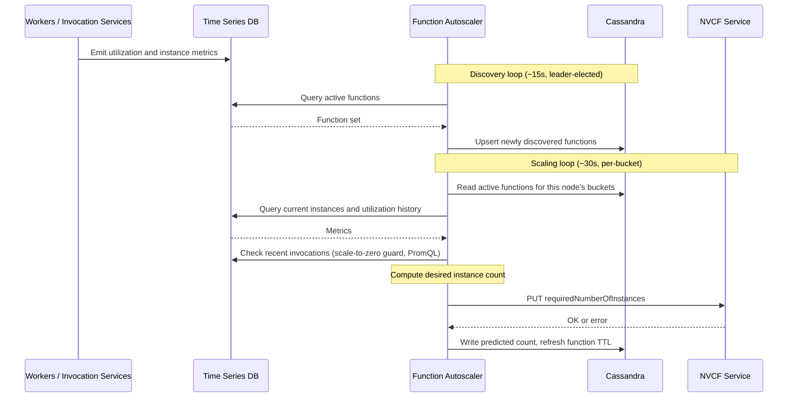

# Function Autoscaler Architecture

The function autoscaler is a Rust service deployed as a horizontally scaled Kubernetes Deployment. It reads utilization and request metrics from a Prometheus-compatible timeseries database, stores discovered functions and coordination state in Cassandra, and writes desired instance counts to the NVCF API. Cassandra lightweight transactions handle leader election and short-lived per-function locks.

The work is split into two loops. A leader-elected discovery loop scans the timeseries database for active function versions and upserts them into Cassandra. A scaling loop runs on every replica, but each replica only handles the functions whose IDs hash into its assigned buckets, so the active set is sharded across replicas.

## Sequence Diagram

The discovery loop runs on one leader-elected replica. The scaling loop runs on every replica, but each replica only processes the function buckets assigned to it.

## Timeseries Database

The function autoscaler is a read-only client of a Prometheus-compatible timeseries store. It calls the `/api/v1/query_range` HTTP endpoint and uses PromQL for every metric query, so any backend that implements that interface works: upstream Prometheus, Thanos, Grafana Mimir, or VictoriaMetrics. The reference NVCF deployments point at VictoriaMetrics via the `timeseries_db_url` setting.

The function autoscaler does not run a scrape config of its own and does not write samples. Before it can do anything useful, the rest of the data plane has to be feeding the same store:

- Worker pods export utilization and instance count metrics (`nvcf_worker_service_worker_thread_busy_seconds_total`, `nvcf_worker_service_worker_thread_count_total`, instance gauges).
- Invocation services and the gRPC proxy export request counters (`function_request`, `function_request_total`) labeled by `function_id`, `function_version_id`, and `nca_id`. These labels are how the discovery loop finds active function versions.

For a self-hosted control plane, you need three things in place before bringing the function autoscaler online:

1. A Prometheus-compatible store reachable from the function autoscaler pod.
2. A scrape configuration (or remote-write feed) covering the worker pods and the invocation-plane services.
3. The resulting query endpoint passed in as `timeseries_db_url`. The function autoscaler reports `not ready` on its readiness probe until that endpoint responds.

## Coordination and Self-Healing

Coordination relies on Cassandra TTLs to recover from failures without operator intervention:

- The discovery lock self-expires if the leader replica crashes or is partitioned, so a new leader takes over on the next loop iteration.
- Bucket ownership is recomputed when replicas join or leave. During a reshuffle a function may be skipped for a single scaling cycle or briefly picked up by a different replica, and a short-lived per-function lock prevents two replicas from racing on the same function in that window.
- Each active function row carries a TTL refreshed by every scaling cycle, so functions that stop emitting metrics age out of the active set automatically.

## See Also

- [Configure Autoscaling](../configure-autoscaling.md) for setting per-function scaling bounds, factors, thresholds, and stickiness via the NVCF API.
- [Function Autoscaler Operations](./operations.md) for health endpoints and common issues.
- [Function Autoscaler Observability](./observability.md) for emitted metrics, traces, and logs.
