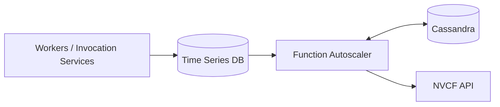

# Function Autoscaling

The NVCF Function Autoscaler is a distributed Rust service that monitors function utilization and uses it to determine the ideal instance count per function on the NVCF control plane. It runs as a horizontally scaled deployment on the same Kubernetes cluster as the rest of the control plane.

On an interval, the function autoscaler reads metrics from the timeseries database, decides how many instances each function should have, and calls the NVCF API to apply that decision.

The function autoscaler depends on a Prometheus-compatible timeseries database fed by the worker pods and invocation-plane services. Without it, the service reports `not ready` and makes no scaling decisions. See [Timeseries database](./architecture.md#timeseries-database) for the required metrics and endpoints.

## Function Autoscaler vs Horizontal Pod Autoscaler

Function autoscaling is distinct from Kubernetes horizontal pod autoscaling (HPA). HPA scales pods within a single cluster, so it cannot reach NVCF worker pods that are spread across multiple clusters. Function autoscaling orchestrates scaling across clusters using global load patterns.

## Key Functionality

- Discovers active functions from invocation and worker metrics in the timeseries database and persists the active set in Cassandra.
- Periodically computes a desired instance count per function from recent utilization and the function's scaling policy.
- Applies the desired count by calling the NVCF API's predictions endpoint.
- Coordinates work across replicas using hash-based bucket assignment and Cassandra Lightweight Transaction (LWT) distributed locks.

## Architecture Overview

See [Architecture](./architecture.md#sequence-diagram) for the end-to-end sequence diagram and the bucket model.

## See Also

- [Architecture](./architecture.md) for components, data flow, and the Cassandra LWT lock behavior that elects the discovery leader.
- [Configure Autoscaling](../configure-autoscaling.md) for setting per-function scaling bounds, factors, thresholds, and stickiness via the NVCF API.
- [Function Autoscaler Operations](./operations.md) for health endpoints and operational guidance.
- [Function Autoscaler Observability](./observability.md) for the metrics, traces, and logs emitted by the service.
