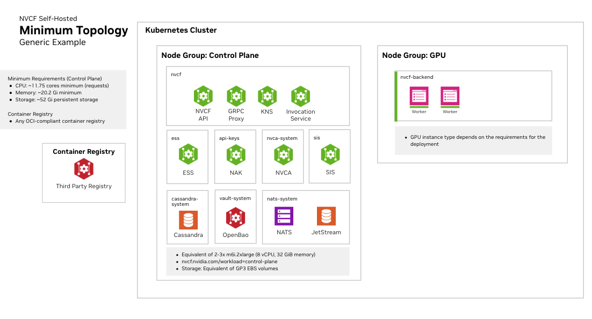

# Deployment

Self-hosted NVCF installation includes the core components required for NVCF inference. Optional components such as caching and low latency streaming support are also available. Vanity Gateway routing is available only in stack packages that include the Vanity Gateway addon.

For a local k3d fresh install, start with the [Quickstart](./quickstart.md). The quickstart uses `nvcf-cli self-hosted up` to install the control plane, register the local k3d cluster, install NVCA, and run basic health checks.

For a full list of required artifacts, see [self-hosted-artifact-manifest](./manifest.md).

<Tip>
Want to try NVCF locally first? See [Local Development](./local-development.md) to create a k3d cluster, then use the [Quickstart](./quickstart.md) local k3d flow.

</Tip>

## Choose an installation path

| Path | Use when | Starting point |
| --- | --- | --- |
| Local one-click CLI installation | You want the fastest local k3d install and cluster registration path. | [Quickstart](./quickstart.md) |
| Helmfile installation | You need manual release control, partial recovery, upgrades, or detailed Helmfile operations. | [Helmfile Installation](./helmfile-installation.md) |
| Standalone chart installation | You need GitOps integration or chart-by-chart ownership. | [Standalone Deployment](./standalone-deployment.md) |

The control plane and GPU cluster can be the same Kubernetes cluster or separate clusters when you use Helmfile, standalone charts, or the explicit CLI install primitives. The quickstart supports only a single local k3d cluster.

For remote installs, prepare the Gateway API ingress path and CLI endpoint
configuration before registering GPU clusters or running post-install CLI
checks. See [Helmfile Installation](./helmfile-installation.md),
[Self-Managed Clusters](./cluster-management/self-managed.md), and
[Gateway Routing](./gateway-routing.md).

## Overview

Every installation path follows the same high-level sequence:

1. Mirror NVCF artifacts to your registry. Follow the [image mirroring instructions](./image-mirroring.md) to pull artifacts from NGC and push them to your registry.

2. Create or select Kubernetes cluster targets. You need a cluster for the control plane and a GPU cluster for function workloads. These can be the same cluster or separate clusters.

3. Install the self-hosted control plane. Use the [Quickstart](./quickstart.md) for a local k3d install, [Helmfile Installation](./helmfile-installation.md) for manual Helmfile operations, or [Standalone Deployment](./standalone-deployment.md) for chart-by-chart installation.

4. Register a GPU cluster and install the NVIDIA Cluster Agent. The local quickstart performs this step for the local k3d cluster. For manual installation paths, see [Self-Managed Clusters](./cluster-management/self-managed.md).

5. Install Low Latency Streaming if needed for streaming workloads. See [LLS Installation](./lls-installation.md).

6. Install optional enhancements, such as caches, low latency streaming, or Vanity Gateway routing when your stack package includes that addon. See [Optional Enhancements](./optional-enhancements.md).

## Kubernetes Cluster Requirements

### Cluster Version

- Any official supported Kubernetes version
- Support for dynamic persistent volume provisioning

### Required Operators and Components

#### NVIDIA GPU Operator

Required for GPU workload scheduling. The GPU Operator automates the management of all NVIDIA software components needed to provision GPUs in Kubernetes, including:

- NVIDIA device drivers
- Kubernetes device plugin for GPU discovery
- GPU feature discovery for node labeling
- Container runtime integration (containerd, CRI-O, or Docker)
- Monitoring and telemetry tools

See [NVIDIA GPU Operator documentation](https://docs.nvidia.com/datacenter/cloud-native/gpu-operator/latest/) for installation instructions.

<Note>
Fake GPU Operator for development and testing:

For environments without actual GPU hardware, install the fake GPU operator to simulate
GPU resources. See [fake-gpu-operator](./fake-gpu-operator.md) for full instructions.
</Note>

#### Network Policies

Your cluster must support Kubernetes Network Policies if network isolation is required.

#### Persistent Storage

A StorageClass must be configured for persistent volumes. Common options:

- Amazon EKS: `gp3` (default)
- Local development: `local-path`
- Other platforms: Any CSI-compatible storage class

<Note>
Some cloud providers have minimum PVC size requirements. For example, AWS EBS gp3 volumes have a 1Gi minimum.

</Note>

### Cluster Sizing and Storage

See [infrastructure-sizing](./infrastructure-sizing.md) for node pool specifications, storage
recommendations, and three recommended sizing tiers (Development, Minimal HA,
and Production).

