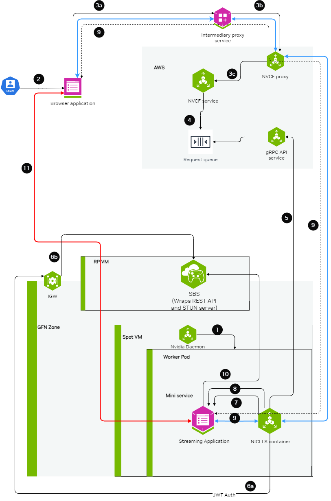

# Low Latency Streaming (LLS/WebRTC) Functions

Cloud Functions supports the ability to stream video, audio, and other data using WebRTC.



For complete examples of LLS streaming functions, contact your NVIDIA representative for access to sample function containers.

## Cloud Provider Network Requirements

WebRTC streaming uses UDP NodePort services to carry media traffic between
the browser client and the streaming application. Cloud providers apply
network security rules at multiple layers. If any layer blocks UDP inbound
traffic on the NodePort range (30000-32767), streaming sessions fail even
though the function shows ACTIVE.

### Azure (AKS)

AKS attaches two Network Security Groups (NSGs) to every node: one on the
subnet and one on the NIC in the managed resource group
(`MC_<resource-group>_<cluster>_<region>`). Both NSGs must allow inbound UDP
traffic on the NodePort range. The subnet NSG alone is not sufficient.

After `helmfile sync` completes, add the NIC NSG rule:

```bash
# Identify the managed resource group
MC_RG="MC_${RESOURCE_GROUP}_${CLUSTER_NAME}_${LOCATION}"

# Add the UDP rule to every NIC NSG in the managed resource group.
# Multi-pool clusters have one NSG per pool; streaming pods may
# schedule on any pool, so all NSGs need the rule.
for NIC_NSG in $(az network nsg list -g "$MC_RG" --query "[].name" -o tsv); do
  echo "Adding UDP rule to NSG: $NIC_NSG"
  az network nsg rule create -g "$MC_RG" --nsg-name "$NIC_NSG" \
    -n allow-udp-nodeports-webrtc --priority 510 \
    --direction Inbound --access Allow --protocol Udp \
    --source-address-prefix Internet --source-port-range "*" \
    --destination-address-prefix "*" --destination-port-range "30000-32767"
done
```

Verify the rules are present:

```bash
# Subnet NSG (your own, created during cluster setup)
az network nsg rule list -g "$RESOURCE_GROUP" --nsg-name "$SUBNET_NSG" \
  --query "[?protocol=='Udp']" -o table

# NIC NSGs (AKS-managed, one per node pool)
MC_RG="MC_${RESOURCE_GROUP}_${CLUSTER_NAME}_${LOCATION}"
for NIC_NSG in $(az network nsg list -g "$MC_RG" --query "[].name" -o tsv); do
  echo "=== $NIC_NSG ==="
  az network nsg rule list -g "$MC_RG" --nsg-name "$NIC_NSG" \
    --query "[?protocol=='Udp']" -o table
done
```

If the NIC NSG rule is missing, WebRTC clients receive
`NVST_R_GENERIC_ERROR` while the function remains ACTIVE. See
[streaming-troubleshooting](./troubleshooting.md#webrtc-streaming-fails-after-function-shows-active)
for diagnosis steps.

### AWS (EKS)

For LLS streaming on EKS, security group and NLB configuration is covered
in [LLS Installation](./lls-installation.md#security-group).

## Building the Streaming Server Application

The streaming application needs to be packaged inside a container and should be leveraging the StreamSDK. The streaming application needs to follow the below guidelines:

1. Expose an HTTP server at port `CONTROL_SERVER_PORT` with following 2 endpoints:

   1. **Health endpoint:** This endpoint should return 200 HTTP status code only when the streaming application container is ready to start streaming a session. If the streaming application container doesn't want to serve any more streaming sessions of current container deployment this endpoint should return HTTP status code 500.

      ```yaml
      Request:
        Endpoint:
          GET /v1/streaming/ready

      Responses:
        Status code:
          200 OK
          500 Internal Server Error
      ```

   2. **STUN creds endpoint**: This endpoint should accept the access details and credentials for STUN server and keep it cached in the memory of the streaming application. When the streaming requests comes, the streaming application can use these access details and credentials to communicate with STUN server and request for opening of ports for streaming.

      ```yaml
      Request:
        Endpoint:
          POST /v1/streaming/creds
        Headers:
          Content-Type: application/json
        Request Body:
          {
            "stunIp": "<string>",
            "stunPort": <int>,
            "username": "<string>",
            "password": "<string>"
          }
      Responses:
        Status code:
          200 OK
      ```

2. Expose a server at port `STREAMING_SERVER_PORT` to accepting WebSocket connection

   1. An endpoint `STREAMING_START_ENDPOINT` should be exposed by this server

3. Post websocket connection establishment guidelines:

   1. When the browser client requests for opening port for specific protocols (e.g. WebRTC), the streaming application needs to request STUN server to open port. This port should be in the range of 47998 and 48020 which would be referred as `STREAMING_PORT_BINDING_RANGE` in this doc.

4. Containerization guidelines:

   1. The container should make sure that the `CONTROL_SERVER_PORT`, `STREAMING_SERVER_PORT` and `STREAMING_PORT_BINDING_RANGE` are exposed by the container and accessible from outside the container.
   2. If multiple sessions one after another needs to be supported with a fresh start of container, then exit the container after a streaming session ends.

## Creating the LLS Streaming Function

When creating the function, ensure `functionType` is set to `STREAMING`:

```bash
curl -s -X POST "http://${GATEWAY_ADDR}/v2/nvcf/functions" \
    -H "Host: api.${GATEWAY_ADDR}" \
    -H "Authorization: Bearer $NVCF_TOKEN" \
    -H 'accept: application/json' \
    -H 'Content-Type: application/json' \
    -d '{
        "name": "'$STREAMING_FUNCTION_NAME'",
        "inferenceUrl": "/sign_in",
        "inferencePort": '$STREAMING_SERVER_PORT',
        "health": {
            "protocol": "HTTP",
            "uri": "/v1/streaming/ready",
            "port": '$CONTROL_SERVER_PORT',
            "timeout": "PT10S",
            "expectedStatusCode": 200
        },
        "containerImage": "'$STREAMING_CONTAINER_IMAGE'",
        "apiBodyFormat": "CUSTOM",
        "description": "'$STREAMING_FUNCTION_NAME'",
        "functionType": "STREAMING"
        }
    }'
```

## Connecting to a streaming function with a client

### Intermediary Proxy

An intermediary proxy service needs to be deployed in order to facilitate the connection to the streaming function.

The intermediate proxy serves to handle authentication and the headers that are required for NVCF,
and also to align the connection behavior with NVCF that the browser can't handle on its own,
or the browser behavior is unpredictable.

**Proxy Responsibilities**

The intermediary proxy performs the following functionalities:

1. Authenticate the user token coming from the browser to the intermediary proxy
2. Authorize the user to have access to specific streaming function
3. Once the user is authenticated and authorized, modify the websocket connection coming in to append the required NVCF headers (`NVCF_API_KEY` and `STREAMING_FUNCTION_ID`)
4. Forward the websocket connection request to NVCF

**Technical Implementation Guidance**

**nvcf-function-id Header**

NVCF requires this header to be present to identify the function that needs to be reached. Browser does not have the mechanism to set any kind of headers in case of WebSocket connections other than Sec-Websocket-Protocol, so the intermediate proxy can serve to either add the nvcf-function-id header on its own, or to parse Sec-Websocket-Protocol if the browser added it there and get the function id from there.

See [http-request add-header documentation in HAProxy](https://www.haproxy.com/documentation/haproxy-configuration-tutorials/proxying-essentials/http-rewrites/#add-a-header).

**Authentication**

The role of intermediate proxy is to add the required server authentication (e.g. `http-request set-header Authorization "Bearer NVCF_BEARER_TOKEN"`).

**Connection Keepalive**

NVCF controls the session lifetime based on the TCP connection lifetime to the function and the type of disconnection that happens. The intermediate proxy helps to keep the connection with the browser alive.

**Resume Support**

NVCF returns the cookie with nvcf-request-id, but given the browser may reject the cookie since it is not from the same domain, the intermediate proxy helps to align this.

**CORS Headers**

For browsers to allow traffic with NVCF, the intermediate proxy needs to add the relevant CORS headers to responses from NVCF:

- `access-control-expose-headers: *`
- `access-control-allow-headers: *`
- `access-control-allow-origin: *`

For guidance on implementing this in HAProxy, see [http-response set-header documentation](https://www.haproxy.com/documentation/haproxy-configuration-tutorials/proxying-essentials/http-rewrites/#add-a-header-1).

**Example HAProxy Dockerfile**

Below is an all-in-one Dockerfile sample for setting up an HAProxy intermediary proxy with optional TLS/SSL support:

<Note>
This example focuses on NVCF integration. In production, you should also implement user authentication and authorization to control access to your streaming function.

For certain applications, TLS/SSL support is required. The proxy can be configured to use self-signed certificates for development and testing purposes by setting `PROXY_SSL_INSECURE=true`.

Update `NVCF_SERVER` to point to your gateway address. See [gateway-routing](./gateway-routing.md) for details.

</Note>

```dockerfile
FROM haproxy:3.2

# Switch to root user for package installation
USER root

# Install necessary tools
RUN apt-get update && apt-get install -y \
    bash \
    gettext-base \
    lua5.3 \
    openssl \
    && rm -rf /var/lib/apt/lists/*

# Create directory for configuration and certificates
RUN mkdir -p /usr/local/etc/haproxy/lua \
    && mkdir -p /usr/local/etc/haproxy/certs \
    && chown -R haproxy:haproxy /usr/local/etc/haproxy

# Create certificate generation script
COPY <<EOF /usr/local/bin/generate-cert.sh
#!/bin/bash
cd /usr/local/etc/haproxy/certs
openssl req -x509 -newkey rsa:2048 -keyout server.key -out server.crt -days 365 -nodes -subj "/CN=localhost" -quiet
# Combine certificate and key into a single file for HAProxy
cat server.crt server.key > server.pem
chown haproxy:haproxy server.key server.crt server.pem
chmod 600 server.key server.pem
chmod 644 server.crt
EOF

RUN chmod +x /usr/local/bin/generate-cert.sh

# Create the HAProxy configuration template file
COPY --chown=haproxy:haproxy <<EOF /usr/local/etc/haproxy/haproxy.cfg.template
global
        log stdout    local0 info
        stats timeout 30s
        user haproxy

        # Default SSL material locations
        ca-base /etc/ssl/certs
        crt-base /etc/ssl/private

        # SSL server verification enabled for security
        ssl-server-verify required

        # See: https://ssl-config.mozilla.org/#server=haproxy&server-version=3.2&config=intermediate
        ssl-default-bind-ciphers ECDHE-ECDSA-AES128-GCM-SHA256:ECDHE-RSA-AES128-GCM-SHA256:ECDHE-ECDSA-AES256-GCM-SHA384:ECDHE-RSA-AES256-GCM-SHA384:ECDHE-ECDSA-CHACHA20-POLY1305:ECDHE-RSA-CHACHA20-POLY1305:DHE-RSA-AES128-GCM-SHA256:DHE-RSA-AES256-GCM-SHA384
        ssl-default-bind-ciphersuites TLS_AES_128_GCM_SHA256:TLS_AES_256_GCM_SHA384:TLS_CHACHA20_POLY1305_SHA256
        ssl-default-bind-options ssl-min-ver TLSv1.2 no-tls-tickets

defaults
        log     global
        option  httplog
        option  dontlognull
        option  logasap
        timeout connect 5000
        timeout client  50000
        timeout server  50000

frontend test_frontend
        log  global
        bind *:\${PROXY_PORT} \${PROXY_SSL_BIND_OPTIONS}
        mode http
        timeout client       7s
        timeout http-request 30m
        use_backend webrtc_backend

backend webrtc_backend
        log  global
        mode http
        timeout connect 4s
        timeout server  7s
        http-request set-header Host \${NVCF_SERVER}
        http-request set-header Authorization "Bearer \${NVCF_API_KEY}"
        http-request set-header Function-ID \${STREAMING_FUNCTION_ID}
        server s1 \${NVCF_SERVER}:443 ssl ca-file /etc/ssl/certs/ca-certificates.crt verify required
EOF

# Create the entrypoint script
COPY <<EOF /entrypoint.sh
#!/bin/bash

# Check required environment variables
if [ -z "\${NVCF_API_KEY:+x}" ]; then
    echo "NVCF_API_KEY must be set"
    exit 1
fi

if [ -z "\${STREAMING_FUNCTION_ID:+x}" ]; then
    echo "STREAMING_FUNCTION_ID must be set"
    exit 1
fi

# Use default NVCF_SERVER if not set
if [ -z "\${NVCF_SERVER:+x}" ]; then
    export NVCF_SERVER=\${GATEWAY_ADDR}
    echo "NVCF_SERVER not set, using GATEWAY_ADDR: \${NVCF_SERVER}"
fi

# Use default PROXY_PORT if not set
if [ -z "\${PROXY_PORT:+x}" ]; then
    export PROXY_PORT=49100
    echo "PROXY_PORT not set, using default: \${PROXY_PORT}"
fi

# Use default PROXY_SSL_INSECURE if not set
if [ -z "\${PROXY_SSL_INSECURE:+x}" ]; then
    export PROXY_SSL_INSECURE=false
    echo "PROXY_SSL_INSECURE not set, using default: \${PROXY_SSL_INSECURE}"
fi

echo "Launching intermediate proxy:"
echo "  API Key: \${NVCF_API_KEY:0:6}**********\${NVCF_API_KEY: -3}"
echo "  Function ID: \${STREAMING_FUNCTION_ID}"
echo "  Version ID: \${STREAMING_FUNCTION_VERSION_ID}"
echo "  NVCF Server: \${NVCF_SERVER}"
echo "  Proxy Port: \${PROXY_PORT}"
echo "  Proxy SSL (Insecure): \${PROXY_SSL_INSECURE}"

# Generate self-signed certificate if SSL is enabled
if [ "\${PROXY_SSL_INSECURE}" = "true" ]; then
    /usr/local/bin/generate-cert.sh
    export PROXY_SSL_BIND_OPTIONS="ssl crt /usr/local/etc/haproxy/certs/server.pem"
    echo "SSL enabled - self-signed certificate generated"
else
    export PROXY_SSL_BIND_OPTIONS=""
    echo "SSL disabled - running in HTTP mode"
fi

# Process the template and create the final config
envsubst < /usr/local/etc/haproxy/haproxy.cfg.template > /usr/local/etc/haproxy/haproxy.cfg

# Function to handle signals and forward them to HAProxy
handle_signal() {
    echo "Received signal, shutting down HAProxy..."
    if [ -n "\$HAPROXY_PID" ]; then
        kill -TERM "\$HAPROXY_PID" 2>/dev/null
        wait "\$HAPROXY_PID"
    fi
    exit 0
}

# Set up signal handlers
trap handle_signal SIGTERM SIGINT

# Start HAProxy in background and capture PID
echo "Starting HAProxy..."
haproxy -f /usr/local/etc/haproxy/haproxy.cfg &
HAPROXY_PID=\$!

# Wait for HAProxy process
wait "\$HAPROXY_PID"
EOF

RUN chmod +x /entrypoint.sh

# Switch back to haproxy user
USER haproxy

# Set the entrypoint
ENTRYPOINT ["/entrypoint.sh"]
```

**Environment Variables**

The following environment variables control proxy behavior:

| Variable | Required | Default | Description |
| --- | --- | --- | --- |
| `NVCF_API_KEY` | Yes | \- | Your NVCF API Key |
| `STREAMING_FUNCTION_ID` | Yes | \- | Your NVCF streaming function ID |
| `STREAMING_FUNCTION_VERSION_ID` | No | \- | Specific version of your function (optional) |
| `NVCF_SERVER` | No | GATEWAY_ADDR | NVCF server endpoint (your gateway address) |
| `PROXY_PORT` | No | 49100 | Port for the proxy to listen on |
| `PROXY_SSL_INSECURE` | No | false | Enable SSL with self-signed certificate (set to "true" to enable) |

**Usage Examples**

**1. HTTP Mode (Default)**

Standard configuration without SSL:

```bash
export STREAMING_FUNCTION_ID=your-function-id
export NVCF_API_KEY=your-nvcf-api-key
export PROXY_PORT=49100

docker build -t nvcf-haproxy-proxy .

docker run --rm -it \
    -p 127.0.0.1:${PROXY_PORT}:${PROXY_PORT}/tcp \
    -e PROXY_PORT="$PROXY_PORT" \
    -e NVCF_API_KEY="$NVCF_API_KEY" \
    -e STREAMING_FUNCTION_ID="$STREAMING_FUNCTION_ID" \
    nvcf-haproxy-proxy
```

**2. HTTPS Mode with Self-Signed Certificate**

Configuration with SSL enabled using a self-signed certificate:

```bash
export STREAMING_FUNCTION_ID=your-function-id
export NVCF_API_KEY=your-nvcf-api-key
export PROXY_SSL_INSECURE=true
export PROXY_PORT=48322

docker build -t nvcf-haproxy-proxy .

docker run --rm -it \
    -p 127.0.0.1:${PROXY_PORT}:${PROXY_PORT}/tcp \
    -e PROXY_PORT=${PROXY_PORT} \
    -e PROXY_SSL_INSECURE=${PROXY_SSL_INSECURE} \
    -e NVCF_API_KEY="$NVCF_API_KEY" \
    -e STREAMING_FUNCTION_ID="$STREAMING_FUNCTION_ID" \
    nvcf-haproxy-proxy
```

<Note>
Since this configuration uses self-signed certificates for development and testing, you will need to configure your client to accept untrusted certificates. In production environments, you should use proper CA-signed certificates.

</Note>

### Web Browser Client

Using the proxy, a browser client can be used to connect to the stream.
The browser client needs to be developed by the customer leveraging the `raganrok` dev branch 0.0.1503 version. Please ensure that the flags are set:

```javascript
const configData: RagnarokConfigData = {
  overrideData: "disableworkerws=true"
}

ConfigureRagnarokSettings(configData);
```
