# NVSNAP Data Transport Architecture

**Status:** design proposal, partially implemented
**Audience:** engineering, product, customer engineering
**Date:** 2026-05-17

---

## Executive summary

NVSNAP produces checkpoint artifacts (30 GiB to 322 GiB+). Customers want to:

1. **Move them fast within a cluster** — 1 source node → N target nodes for fan-out scenarios
2. **Ship them to S3/GCS** — for archival, cross-region replication, durable storage
3. **Pull them from S3/GCS into another cluster** and fan them out to N nodes

Today we deliver (1) at ~1.4 Gbit/s single-stream on networks that can do 36 Gbit/s and storage that absorbs 10 Gbit/s. We have **no implementation** of (2) or (3) — only a design abstraction that anticipates them.

**This document proposes a 5–7 week program** to close all three gaps with measured throughput targets.

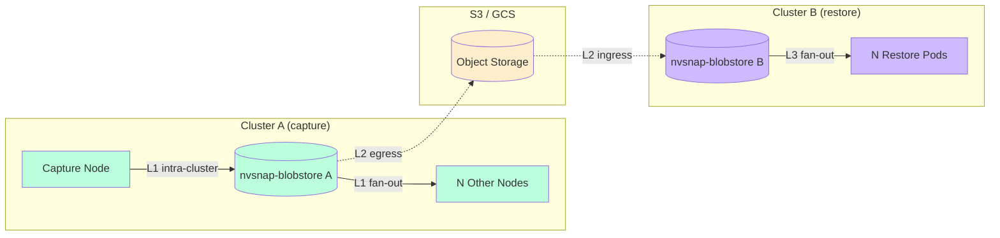

---

## The three transport legs

Each leg has its own bottleneck and its own design.

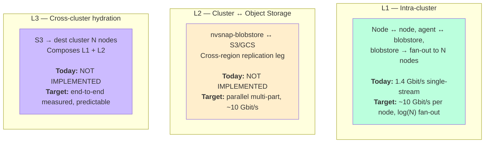

---

## L1: Intra-cluster transport

### What we have today

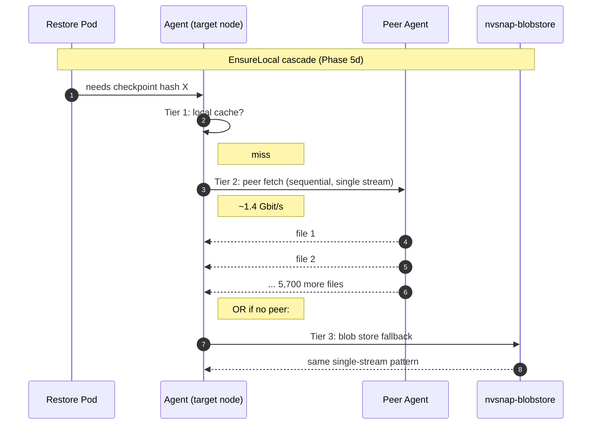

**Measurements (Spike 3, 2026-05-15):**

| metric | value |
|---|---|
| Wire ceiling (iperf3 pod ↔ pod, 1 stream) | 36 Gbit/s |
| Storage ceiling (blobstore aggregate) | ~10 Gbit/s (NVMesh-specific) |
| **Actual single-stream PUT/GET we deliver** | **~1.4 Gbit/s** |
| Utilization of available bandwidth | **~14% of storage / ~4% of wire** |

### What we propose for L1

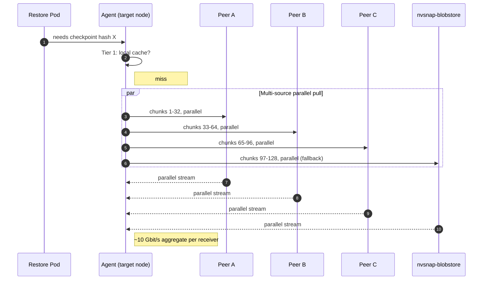

**Expected impact:** Spike 3 measured 7× scaling from single-stream to 8-way PUT (and symmetrically for GET). Receiver-side throughput goes from 1.4 Gbit/s to ~10 Gbit/s — close to storage saturation.

### What fan-out at scale looks like

The big win is when one source must serve N target nodes (200-pod scale-out, blue-green deploy, regional broadcast).

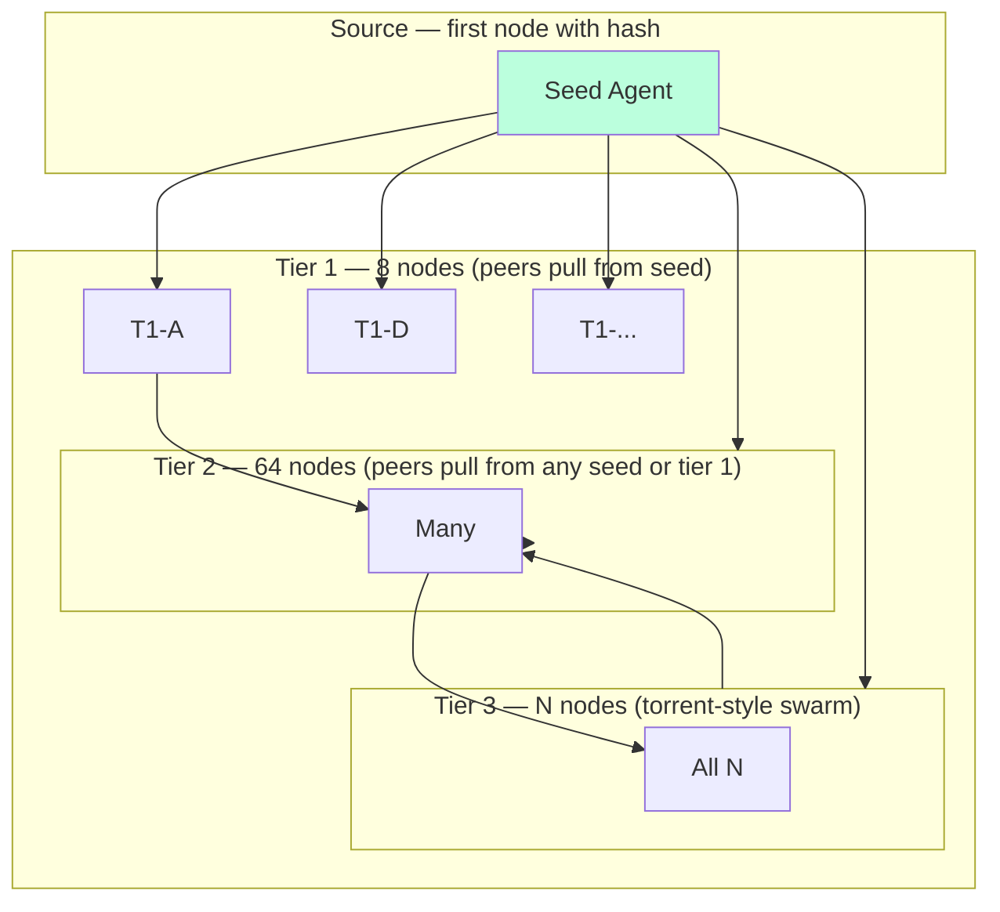

**Math for the 200-pod / 100-node case (vllm-70b at 133 GiB per node):**

| approach | time-to-all-nodes-ready |
|---|---|
| Naive: every node pulls from one blobstore | **~3 hours** (13.3 TiB / 10 Gbit/s) |
| Torrent-style at 36 Gbit/s pod-to-pod | **~110 s** |

The 100× improvement comes from the fan-out, not from any single connection being faster.

---

## L2: Cluster ↔ Object Storage (S3 / GCS)

### What we have today — nothing

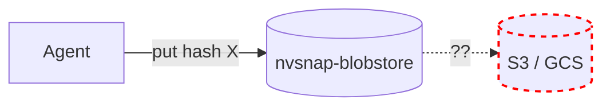

An object-storage replicator now ships (`internal/agent/replication_push.go` / `replication_pull.go`): captures push to a per-cluster bucket and restores pull through it lazily. The cross-cluster design is documented in [design/cross-cluster-replication.md](design/cross-cluster-replication.md). The remaining items below (s3-rdma transport, eager cross-cluster mirroring) are designed but not yet implemented.

### What we propose for L2

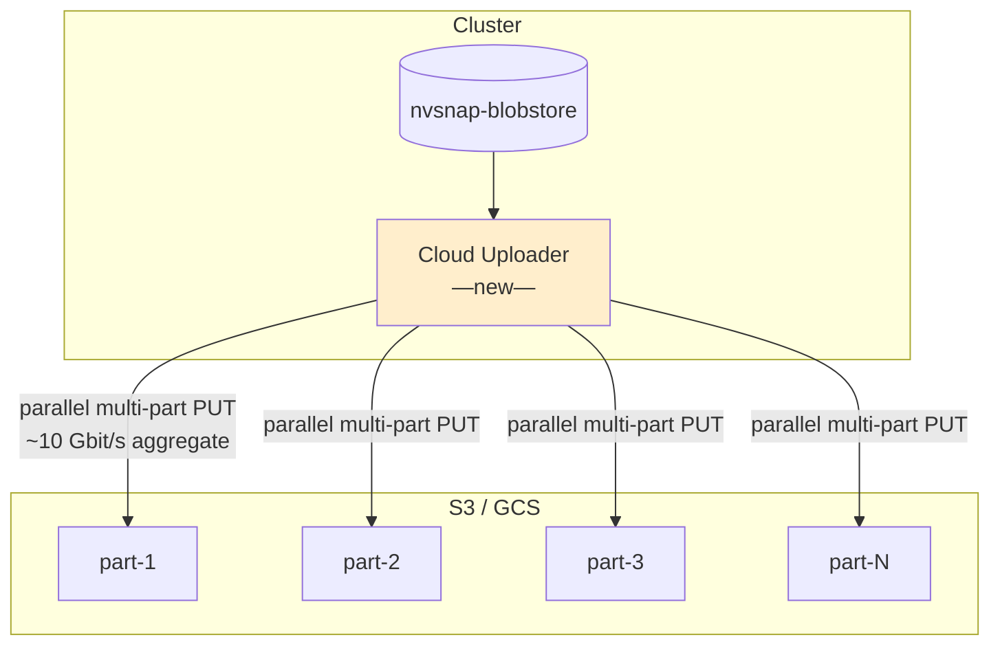

**Components to build:**

| component | what it does | est. effort |
|---|---|---|
| `S3Store` implementing `checkpointstore.Store` | Persists captured blobs to S3 with the existing CAS hash addressing | 1 week |
| Parallel multi-part uploader | Splits artifact into chunks, threaded PUT, retries, hash verification | 1 week |
| Parallel multi-part downloader (mirror) | For the ingress side; reused by L3 | 3 days |
| Auth / IAM plumbing | S3 STS, GCP workload identity, NGC pull secrets | 3 days |
| Bench harness | Measure throughput; compare single-stream to N-way | 2 days |

**Both paths are first-class:** the s3-rdma service is a coordinated workstream (separate team), expected to be available alongside this work. The S3Store ships with both transports wired from day one, selected at runtime by cluster capability:

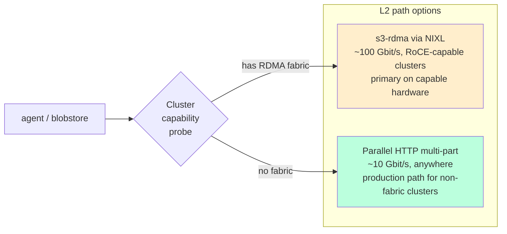

Both target the same `S3Store` interface so the caller doesn't see the difference. See "Design decisions" section at the end.

---

## L3: Cross-cluster hydration

This is L1 + L2 composed. We download from S3 to one (or a few) seed nodes in the destination cluster, then fan out using the L1 parallel cascade.

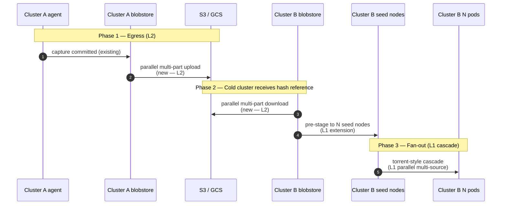

**End-to-end target metric:** "Capture in Cluster A completes → all N pods in Cluster B are Ready." For a 70B model fanning out to 100 nodes:

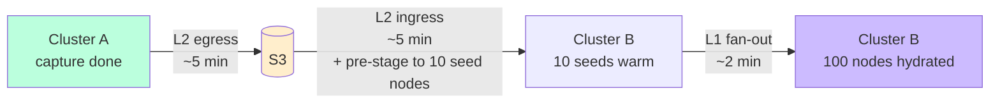

(Times above are projected; not measured. Phase 2c measures them.)

---

## What needs to happen — phased delivery

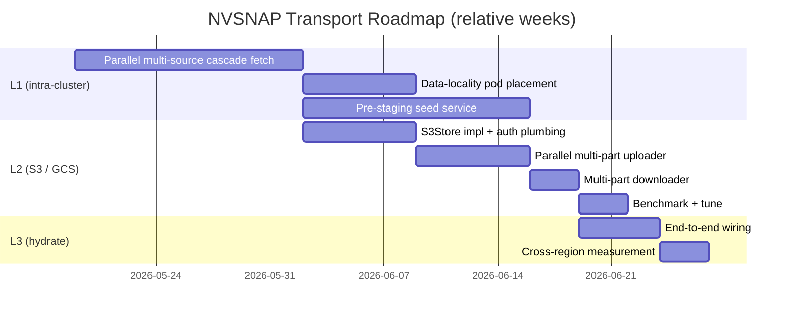

**Cumulative deliverable:**

| at end of week | what's possible |
|---|---|
| W2 | 8× faster intra-cluster fan-out (L1 parallel cascade) |
| W3 | Smart pod placement reduces transfers for multi-pod-per-node cases |
| W5 | Smaller transfers via pre-staged seeds |
| W7 | First S3 upload from nvsnap-blobstore at parallel-line-rate throughput |
| W8 | Bidirectional S3 transport |
| W9 | End-to-end cluster-A → S3 → cluster-B hydration measurement |

---

## Design decisions (confirmed 2026-05-17)

### S3 is the primary target

GCS support comes via the same `S3Store`-shaped abstraction later; not in scope for Phase 2.

### s3-rdma is a first-class path, not optional

> **Status:** s3-rdma is **designed, not implemented.** Today only the
> HTTPS multi-part transport ships. The two-transport design below is the
> target; RDMA is gated on hardware + a separate fabric service.

The S3Store implementation is designed with two transports, selected at runtime by cluster capability:

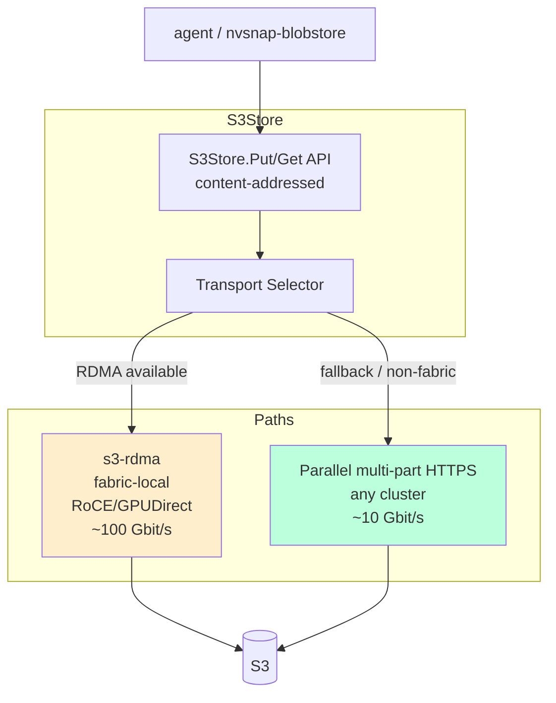

The router picks based on cluster capability probed at startup:
- s3-rdma service reachable AND host has CX-7+ → RDMA path
- Otherwise → HTTPS multi-part

The HTTPS path is **not** the slow fallback to limp along on — it's a real production path for clusters without the fabric, targeting the ~10 Gbit/s we know parallel-multi-part can hit. RDMA is the accelerator on top.

### Cross-cluster use case is dual: DR AND active workload migration

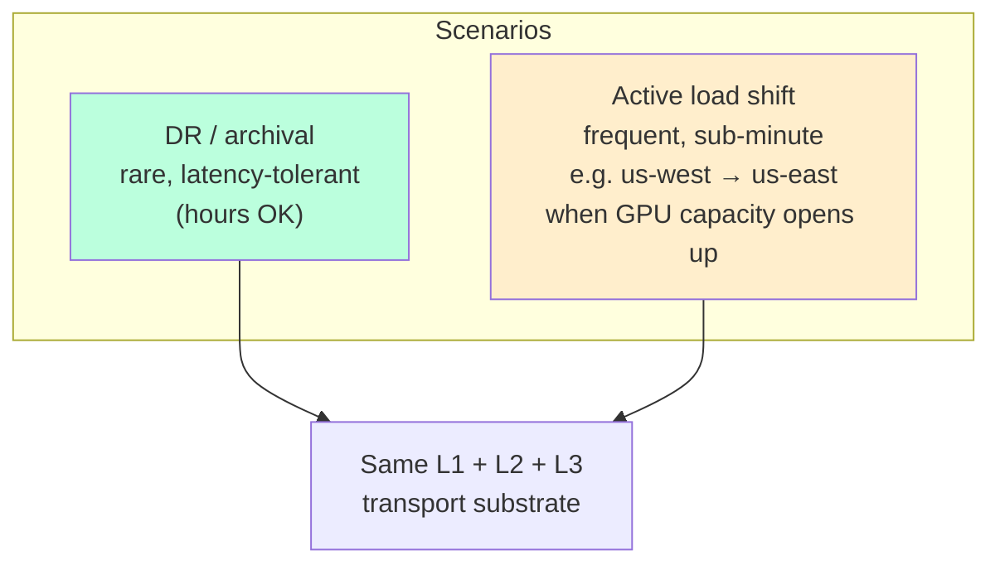

**The active workload migration scenario is the more demanding driver.** Customer pattern:
- Workload running in `us-west` cluster, serving at capacity
- GPU availability opens in `us-east` (or scarce in `us-west`)
- Operator (or autoscaler) decides to shift some/all serving to `us-east`
- Required: ship checkpoint(s) to S3, hydrate dest cluster, bring up pods — **in minutes**

This drives the latency budget for L3 even more tightly than the 200-pod cold-fan-out case in `SCALE-OUT-DESIGN.md`. It also strongly motivates the warm-pool architecture as a follow-on (Phase 3+), because once cross-region migration is fast, the next ask is "make the dest cluster's first inference fast too."

### Durability/consistency

Blobs are content-addressed (SHA-256) so corruption is detectable. Open: ack-on-write or ack-on-replication for S3? For the active migration scenario, ack-on-write to local-region S3 plus async cross-region replication is likely the right call — minimizes capture-side latency, accepts seconds-of-window risk before cross-region durability lands.

---

## Related documents

- `docs/archive/spikes/SPIKE-RESULTS.md` — Spike 1–4 measurements that drive the design
- `docs/archive/spikes/SCALE-OUT-DESIGN.md` — the 200-pod cold-cluster scenario
- `docs/archive/spikes/WORKLOAD-ROADMAP.md` — overall two-track optimization strategy
- `docs/archive/spikes/EROFS-VALIDATION.md` — EROFS as an artifact format; not shipping but revisit triggers captured
- `internal/checkpointstore/mounter.go` — the `Backend` interface that anticipates S3/GCS implementations
- `internal/agent/cascade_fetch.go` — the L1 cascade implementation being upgraded

## Tracking

- Phase 2a — L1 parallel multi-source cascade: branch `feat/parallel-cascade-fetch` (in progress)
- Phase 2b — L2 S3 backend + multi-part: new branch when 2a lands
- Phase 2c — L3 end-to-end: new branch when 2a + 2b land
