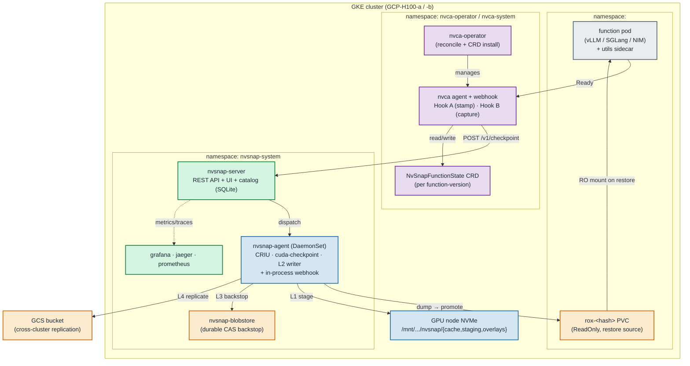
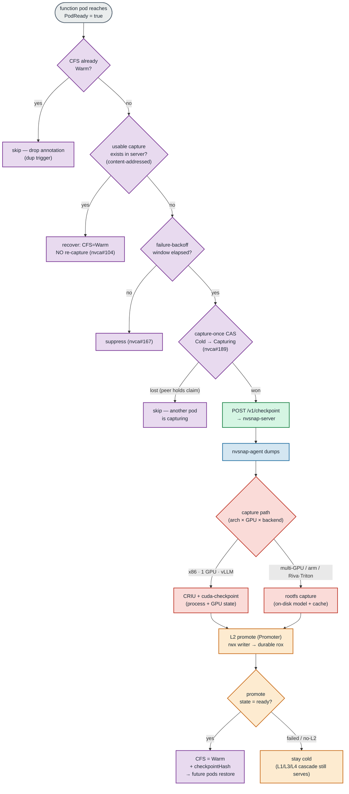
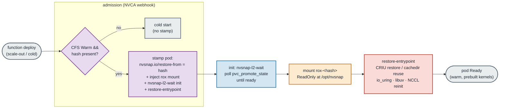
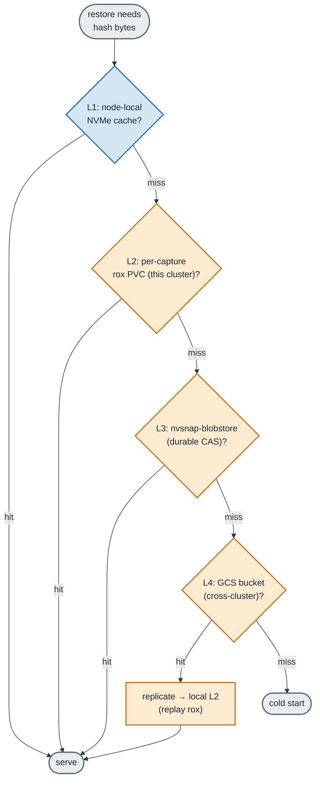
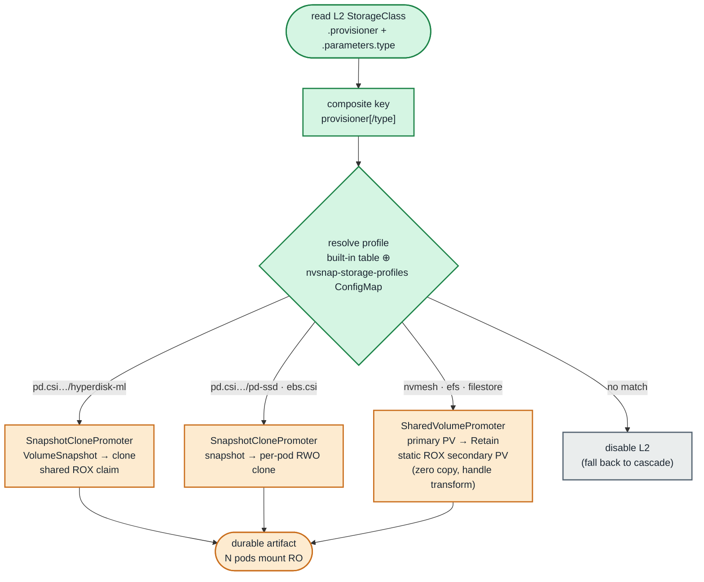

# NvSnap Architecture

Transparent GPU checkpoint/restore for Kubernetes. NvSnap snapshots a
running GPU workload's process + GPU state (or its on-disk rootfs cache),
stores it across a tiered fabric, and restores it onto N pods — turning a
multi-minute cold start into a sub-minute warm restore, with **zero
application changes**.

This document is the current-state architecture: the node agent, the
control-plane server, the L1–L4 data fabric, the storage-agnostic L2
promotion tier (nvsnap#171), and the NVCA integration (Hook A/B + the
CryoFunctionState → **NvSnapFunctionState** controller, capture-once
nvca#189).

> Diagram palette (draw.io-classic): 🟦 agent/node · 🟩 control-plane ·
> 🟧 storage · 🟪 NVCA · 🟥 capture/CRIU · ⬜ external/workload.

---

## 1. System overview

**Components**

- **nvsnap-agent** (DaemonSet, one per GPU node) — process/GPU discovery,
  CRIU + `cuda-checkpoint` dump, rootfs capture, the single-copy L2
  writer, and an in-process mutating webhook the operator points BYOC
  workloads at. Runs privileged-ish with `/host` mount + containerd access.
- **nvsnap-server** — REST API + embedded React UI + the checkpoint
  catalog (SQLite on a PVC). Dispatches captures, tracks
  `pvc_promote_state`, serves the cross-cluster replicate API, reverse-
  proxies the observability stack into one pane.
- **nvsnap-blobstore** — content-addressed durable store (L3 backstop).
- **NVCA** (operator + agent/webhook) — the NGC autoscaler. Hook A stamps
  restore intent on admission; Hook B drives the post-Ready capture. State
  lives in the per-function-version `NvSnapFunctionState` (CFS) CRD.

---

## 2. Capture flow (NVCA Hook B → agent → L2 promote)

The reconciler is a gated state machine: each gate (already-Warm,
recovery, failure-backoff) short-circuits cheaply before the **capture-
once CAS** that guarantees exactly one in-flight capture per function-
version (see §6). Only the CAS winner dumps; everyone else backs off.

---

## 3. Restore flow (NVCA Hook A → webhook → rox mount)

`nvsnap-l2-wait` is the gate that makes WaitForFirstConsumer binding work:
the webhook injects it as an init container so the engine container only
starts once the rox PVC is promote-ready, avoiding the
admission-needs-bound / bound-needs-pod deadlock.

---

## 4. L1–L4 data fabric (restore-side cascade)

Tiers are tried fastest-first. L2 is the fan-out hero — one capture, N
read-only mounts on the same cluster. L4 (GCS) bridges clusters: a miss
that hits L4 replicates into the local L2 so subsequent pods stay warm.

---

## 5. Storage-agnostic L2 promotion (nvsnap#171)

The L2 tier is split into storage-**agnostic** orchestration (lease,
single-copy write, detach barrier, `pvc_promote_state` machine, namespace
scoping) and a pluggable **Promoter** that owns the storage-**specific**
rwx→durable transition + the restore-side mount. The Promoter is selected
at agent startup from the L2 StorageClass.

| Storage | provisioner[/type] | strategy | fan-out |
|---|---|---|---|
| Hyperdisk-ML | `pd.csi.storage.gke.io/hyperdisk-ml` | snapshot-clone | one shared **ROX** |
| Regular PD | `pd.csi.storage.gke.io/pd-ssd` | snapshot-clone | per-pod **RWO** clone |
| AWS EBS | `ebs.csi.aws.com` | snapshot-clone | per-pod **RWO** clone |
| NVMesh | `nvmesh-csi.excelero.com` | shared-volume | **zero-copy** ROX |
| EFS / Filestore | `efs.csi.aws.com` / `filestore.csi…` | shared-volume | **zero-copy** ROX |

A new/3rd-party backend is one `kubectl edit cm nvsnap-storage-profiles`
away — no agent rebuild. No match → L2 is disabled (logged), and restore
falls back to the L3/L4 cascade.

---

## 6. Capture-once: NvSnapFunctionState lifecycle (nvca#189)

When N pods of one function-version deploy cold at once, all N reconciles
would otherwise each fire a capture. The CFS state machine guarantees
exactly one, via a Kubernetes optimistic-concurrency CAS plus a lease.

```mermaid
stateDiagram-v2
    [*] --> Cold
    Cold --> Capturing : Cold→Capturing CAS<br/>(Update w/ live resourceVersion)<br/>exactly one winner; losers get 409
    Capturing --> Warm : capture + L2 promote ok<br/>(claim released)
    Capturing --> Cold : capture failed<br/>(claim released, attemptCount++)
    Capturing --> Capturing : same owner re-reconcile<br/>(lease refresh)
    Warm --> [*] : restore-from stamped<br/>on future pods
    note right of Capturing
        captureOwner + captureLeaseExpiry
        lease TTL = warmupBuffer + checkpointTimeout
                  + promotePollTimeout + margin
        crashed owner ⇒ lease expires ⇒ stealable
    end note
```

The lease TTL provably exceeds the longest legitimate hold, so a valid
in-flight capture is never stolen; only a crashed/hung capturer's claim
expires and becomes stealable. Losers bump
`nvca_nvsnap_checkpoint_attempt_skipped_inflight_total` (≈ N−1 per
capture) — the observable proof the herd was contained.

---

## 7. Capture-path matrix

Which dump path runs depends on arch × GPU count × backend (CLAUDE.md
rule 20):

| Arch | GPUs | Backend | Path |
|---|---|---|---|
| x86 | single | vLLM/SGLang/TRT-LLM/NIM-vLLM | **CRIU + cuda-checkpoint** |
| x86 | multi | any | **rootfs** (no NCCL state in cuda-checkpoint) |
| x86 | single | Riva / Triton | **rootfs** (host-pinned mem unregister aborts) |
| arm | any | any | **rootfs** (cuda-checkpoint unsupported) |

`cachedir` mode (canonical `/opt/nvsnap` cache path, identical at capture
+ restore) lets engines reuse prebuilt JIT/CUDA-graph kernels instead of
recompiling — the bulk of the warm-restore win on compile-heavy models.

---

## 8. Cross-references

- Storage-agnostic L2 design: `docs/design/STORAGE-AGNOSTIC-L2-PROMOTION.md`
- NVCA × NvSnap integration: see the NVCA integration guide (separate, optional component for NVIDIA Cloud Functions deployments)
- Capture-path matrix rationale: `CLAUDE.md` rule 20
