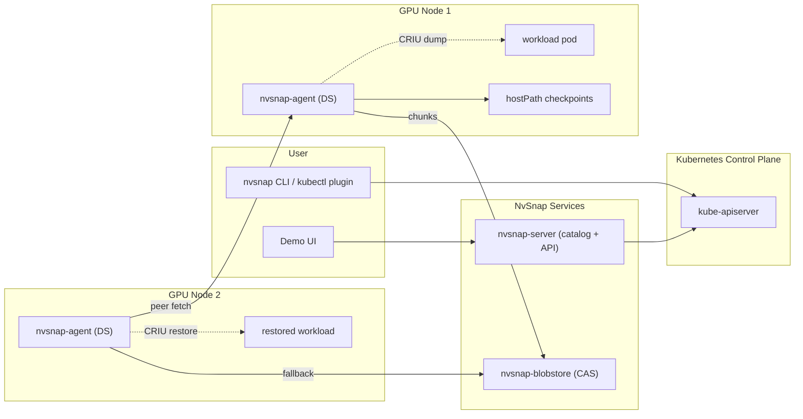
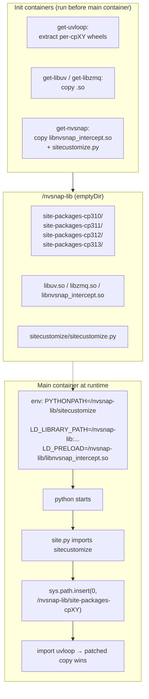
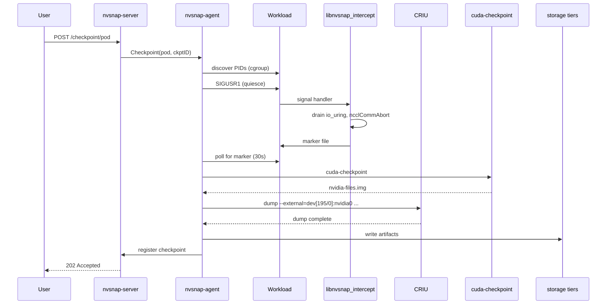
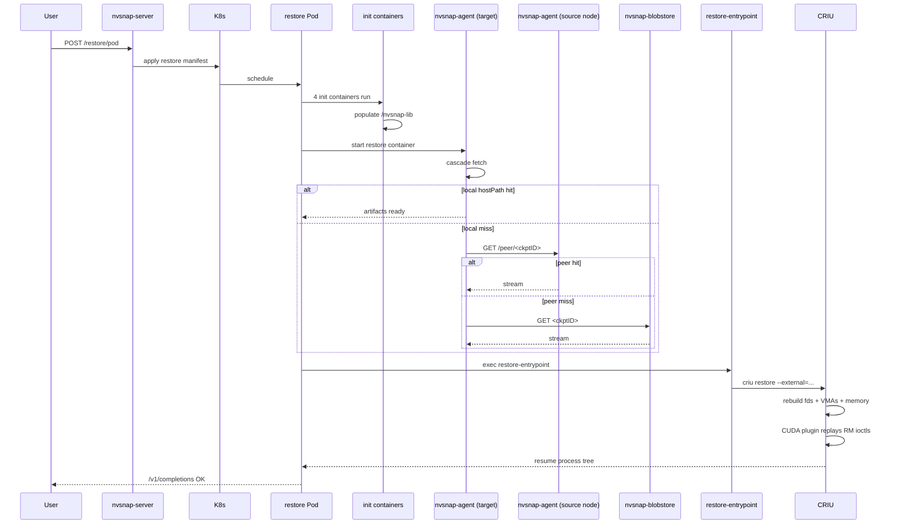
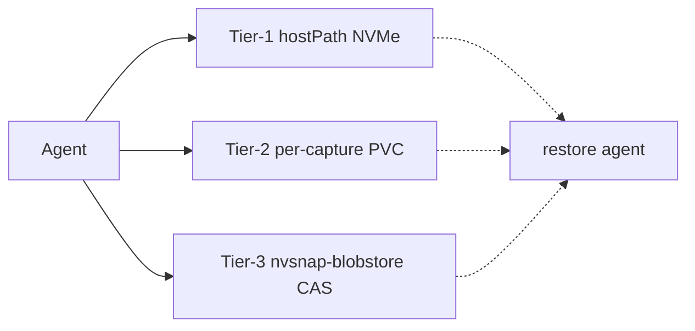

# NvSnap — Architecture & Design

> Software design document for `nvsnap`, a GPU-aware checkpoint/restore
> system for Kubernetes. This is the canonical entry point — other
> `docs/` files dive into specific subsystems.

**Status:** open-source-ready candidate, validated on
`feat/rootfs-only-restore` (GKE H100 cluster, 2026-05-12).
For freshly captured benchmark numbers see
[§ Benchmarks](#benchmarks).

---

## 1. Executive summary

NvSnap lets you snapshot a running GPU workload — vLLM, SGLang, TensorRT-LLM,
NVIDIA NIM, or any CUDA process — into a portable artifact, then bring the
same process back to life on a different node, fully restored: same model
weights in VRAM, same KV cache, same Python interpreter state. From the
client's point of view, an inference endpoint that was running on node A
keeps serving requests on node B after a short pause, without
re-initializing the model.

Concretely, the system delivers:

- **Sub-second to single-digit-minute cold starts** for restored
  workloads, compared to multi-minute model loads from scratch.
- **Cross-node migration**: capture on one host, restore on any other
  host with the same GPU class.
- **Application transparency**: zero changes to the workload's code or
  image. We inject a small set of patched native libraries via
  `LD_PRELOAD` / `LD_LIBRARY_PATH` and a 5-line Python `sitecustomize.py`.
- **Runtime-agnostic operation**: works at the Linux process / namespace
  layer with CRIU + NVIDIA's `cuda-checkpoint`. Container-runtime APIs
  are not on the critical path.

The system is in regular use on a 3-node H100 cluster. NIM Llama-3.1-8B
checkpoints in ~3 min into a 76 GB artifact and restores in ~1 min.
Smaller models (TinyLlama on vLLM / SGLang / TensorRT-LLM) round-trip in
under 7 min end-to-end.

---

## 2. Goals and non-goals

### Goals

| | |
|---|---|
| G1 | Snapshot a running GPU inference workload and bring it back identically on another node. |
| G2 | Application-transparent operation — no recompiles, no SDK calls, no opt-in from the workload. |
| G3 | Support production inference servers (vLLM, NIM, SGLang, TensorRT-LLM) including their multi-process worker pools. |
| G4 | Operate at the Linux process layer, not behind a particular container runtime. |
| G5 | Tiered storage so that a hot-on-node restore is fast and a cold cross-cluster restore still succeeds. |
| G6 | Work on stock Kubernetes — no kernel patches, no custom CNI, no privileged daemons beyond a DaemonSet. |
| G7 | Be open-source friendly: build artifacts are inspectable, design is documented, tests run on any GPU node. |

### Non-goals (today)

- **Heterogeneous restore.** Source and target must have the same GPU
  generation. Migrating an H100 checkpoint to an A100 is out of scope.
- **Generic process migration.** NvSnap is not a general-purpose CRIU UI.
  It is tuned for GPU inference servers.
- **arm64.** x86_64 only at the moment; ARM-side work is parked
  alongside rootfs-only restore.
- **Pre-emptable spot resiliency via continuous-checkpoint.** A user
  triggers a checkpoint; we do not (yet) speculatively snapshot.
- **Standalone (non-Kubernetes) operation.** We assume a K8s control
  plane is present.

---

## 3. System overview


<details>
<summary>Mermaid source</summary>


</details>

The system has five components:

| Component | Lives as | Job |
|---|---|---|
| **nvsnap-agent** | DaemonSet on every GPU node | All low-level work: process discovery, quiescence, CRIU drive, cuda-checkpoint, artifact write, peer fetch. |
| **nvsnap-server** | Deployment | REST + WebSocket API; catalog of checkpoints; orchestrates capture/restore; serves the demo UI. |
| **nvsnap-blobstore** | Deployment | Content-addressed HTTP store (chunked, dedup-friendly) for durable backstop of checkpoint artifacts. |
| **nvsnap CLI / kubectl-nvsnap** | Out-of-cluster tools | Thin clients over the server API (`nvsnap freeze`, `nvsnap thaw`, `nvsnap list`). |
| **Workload pod** | User-supplied | The thing being snapshotted. Init containers stage NvSnap's patched libraries + `sitecustomize.py` into a shared `emptyDir`; the main container picks them up via `LD_PRELOAD` + `PYTHONPATH`. |

We deliberately keep nvsnap-server out of the data path. Capture writes
go agent → local hostPath → (async) → blobstore. Restore reads cascade
agent → local hostPath → peer agent → blobstore. The server only
knows about catalog metadata, not bytes.

---

## 4. Generic Python library injection

The most subtle part of the design. Production inference frameworks
(vLLM, NIM, SGLang) ship statically with their own copies of `uvloop`
and depend on internal libuv / libzmq state that CRIU cannot
transparently restore. We must:

1. Substitute our **patched uvloop** (adds `uv_loop_fork()` for libuv
   reinit after restore).
2. Substitute our **patched libzmq** (epoll re-bind after restore).
3. Substitute our **patched libuv** for non-uvloop libuv users.
4. Inject our **libnvsnap_intercept.so** to drive io_uring quiesce,
   NCCL teardown, and signal handling.

These substitutions must work across Python versions (cp310 → cp313),
across whatever site-packages layout the workload happens to use (venv,
system Python, conda), and **without touching the workload's
`command:` / `args:`** — because in production we will deliver this via
a mutating admission webhook on customer BYOC pods, and rewriting
customer entrypoints is brittle.


<details>
<summary>Mermaid source</summary>


</details>

### How it works

The init container ladder stages four kinds of artifacts under
`/nvsnap-lib` (a per-pod `emptyDir` shared by all containers):

| Path | What | Source image |
|---|---|---|
| `/nvsnap-lib/site-packages-cp310/uvloop/` … `cp313/uvloop/` | Patched uvloop, one extract per Python ABI tag | `uvloop-builder:v0.22.1-multipy1` |
| `/nvsnap-lib/libuv.so.1` | Patched libuv (CRIU restore fixes) | `libuv-builder:v1.48.0-criu-v3` |
| `/nvsnap-lib/libzmq.so.5` | Patched libzmq (epoll reinit) | `libzmq-builder:v4.3.6-criu-epoll-v12` |
| `/nvsnap-lib/libnvsnap_intercept.so` | Interception library (io_uring, NCCL, signals, ZMQ) | `nvsnap-agent:v0.20.0-sitecustomize` |
| `/nvsnap-lib/sitecustomize/sitecustomize.py` | Runtime Python-version router (~5 LOC) | `nvsnap-agent:v0.20.0-sitecustomize` |

Then three environment variables on the main container do the wiring:

```yaml
env:
  - { name: PYTHONPATH,      value: "/nvsnap-lib/sitecustomize" }
  - { name: LD_LIBRARY_PATH, value: "/nvsnap-lib:/usr/local/nvidia/lib64:/usr/local/cuda/lib64" }
  - { name: LD_PRELOAD,      value: "/nvsnap-lib/libnvsnap_intercept.so" }
```

When the workload's Python interpreter starts (whether it's NIM's
`/opt/nim/llm/.venv/bin/python3.12` or vLLM's system Python or anything
else), CPython's site.py walks `sys.path` looking for a module named
`sitecustomize`. Our copy on `PYTHONPATH` wins; it inspects
`sys.version_info` to build the ABI tag (`cp310`/`cp311`/`cp312`/`cp313`)
and prepends the matching `site-packages-cpXY/` directory to `sys.path`:

```python
import os, sys
_PYVER = f"cp{sys.version_info.major}{sys.version_info.minor}"
_PKG_DIR = f"/nvsnap-lib/site-packages-{_PYVER}"
if os.path.isdir(_PKG_DIR) and _PKG_DIR not in sys.path:
    sys.path.insert(0, _PKG_DIR)
```

Now when the workload does `import uvloop`, Python walks `sys.path` in
order, finds our patched copy first, and the stock copy bundled in the
venv is shadowed without being touched on disk.

### Why this design is the right primitive for BYOC

A customer brings any pod — a diffusion server, a custom FastAPI
inference service, a retrieval pipeline. Our mutating admission webhook
(separate branch) sees the `nvsnap.io/quiesce-enabled` annotation, injects
four init containers + one `emptyDir` volume + three env vars, and
**never touches the customer's `command:` or `args:`**. The wiring is
opaque to the workload. If the workload imports uvloop, our copy wins;
if it doesn't, the injection is a harmless no-op. The same mechanism
covers Python 3.10–3.14 (CPython only — PyPy out of scope).

Native libraries (`libzmq.so`, `libuv.so`) are **not** Python-version-
keyed. They're delivered as single C-ABI binaries under `/nvsnap-lib`.
`libnvsnap_intercept.so`'s constructor `dlopen`s `libzmq.so.5` early via
`LD_LIBRARY_PATH=/nvsnap-lib:...` so our patched copy enters the process
first; any subsequent `dlopen` with the same SONAME — including the
copy bundled inside `pyzmq.libs/` — returns the already-resident
instance because Linux's dynamic linker refuses to load a second
library with the same SONAME. Therefore pyzmq does **not** need to be
rebuilt against our libzmq, which keeps the build matrix small.

See [`GENERIC-PYTHON-INJECTION-DESIGN.md`](GENERIC-PYTHON-INJECTION-DESIGN.md)
for the rollout plan and per-PR sequencing.

---

## 5. Checkpoint flow


<details>
<summary>Mermaid source</summary>


</details>

Steps in detail:

1. **API trigger.** The user posts `POST /checkpoint/pod` with the pod
   name and namespace. The server forwards the request to the
   `nvsnap-agent` running on the node the pod is scheduled on.
2. **Process discovery.** The agent walks `/proc`, identifies the
   container's init PID by cgroup, and walks down to find GPU-using
   children (those with file descriptors against `/dev/nvidia*`).
3. **Quiesce.** The agent sends `SIGUSR1` to every relevant PID.
   `libnvsnap_intercept.so`'s handler drains any pending io_uring
   submissions and, on multi-GPU pods, runs `ncclCommAbort` on every
   tracked NCCL communicator (collected via an
   `ncclCommInitRank` interposer). When done, it writes
   `/dev/shm/nvsnap-quiesce-done-<pid>` and the agent waits up to 30s
   for every PID to mark itself quiesced.
4. **GPU state.** `cuda-checkpoint` runs against the GPU process to
   produce `nvidia-files.img` — the userspace RM ioctl replay log
   that CRIU's CUDA plugin needs at restore time.
5. **CRIU dump.** The agent invokes CRIU via go-criu RPC with the
   correct `--external=dev[major/minor]:devname` flags for each
   `/dev/nvidia*` and `/dev/nvidia-uvm` device, plus
   `--tcp-established` for live TCP sockets. CRIU writes ~1000+ image
   files into the checkpoint directory.
6. **Artifact write.** The agent writes everything atomically into
   the local hostPath, streams a copy onto the per-capture PVC (when
   enabled), and kicks off an async upload to nvsnap-blobstore in
   content-addressed chunks for deduplication.
7. **Catalog register.** The agent calls
   `POST /api/v1/checkpoints/register` on nvsnap-server with the
   checkpoint ID, size, location, and the resolved tier set. The
   server records this in its SQLite catalog and emits a
   `CheckpointCreated` audit event.

The pod itself is **not killed** by checkpoint — it remains running
after the dump completes, just having taken a brief pause during the
quiesce + dump window.

---

## 6. Restore flow


<details>
<summary>Mermaid source</summary>


</details>

The novel piece in this flow is **cascading fetch**: on a cross-node
restore the target node usually doesn't have the artifacts locally, so
the agent consults a tier ladder:

1. **Tier-1 local hostPath.** Fast path — fastest possible restore.
2. **Tier-2 peer agent.** Source node's agent serves the artifacts over
   HTTP. Peer fanout is built into the agent (see
   [`docs/architecture/PHASE-5D-CATALOG-FANOUT.md`](architecture/) for
   the wire format and discovery details).
3. **Tier-3 nvsnap-blobstore.** Durable backstop. Content-addressed so
   repeat fetches dedup naturally.

The four init containers stage `/nvsnap-lib` exactly as on the source
side (same uvloop wheels, same intercept lib, same sitecustomize). The
restore container's `command:` invokes
`/nvsnap/restore-entrypoint`, which:

- Re-checks the marker file path (`/run/criu-restored`) so the patched
  uvloop knows to call `uv_loop_fork()` on its first `_run()` after
  resume.
- Drives `criu restore` with the same `--external=dev[major/minor]:`
  list the dump used.
- Waits for the restored process to come back up and signals readiness.

Because the restored process still has our patched uvloop / libzmq /
libuv loaded in memory (from when it was captured), it picks back up
on the right runtime even though the on-disk venv copies were never
mutated.

---

## 7. Storage tiers


<details>
<summary>Mermaid source</summary>


</details>

| Tier | Latency profile | Persistence | Where it lives |
|---|---|---|---|
| **1. Local hostPath** | Lowest latency, NVMe-bound | Survives pod restart, dies with node | `/var/lib/containerd/nvsnap-checkpoints/<ckptID>/` on each GPU node |
| **2. Per-capture PVC** | Network-storage-bound | Survives node death | One CSI-provisioned PVC per checkpoint (the webhook injects the volume reference into the restore pod for cross-node restore) |
| **3. nvsnap-blobstore** | Furthest, content-addressed | Durable | Single deployment per cluster (deduplicated HTTP CAS service) |

The agent writes synchronously to tier-1, streams in parallel to
tier-2, and asynchronously uploads to tier-3. Restore reads cascade
1 → 2 → 3 — a node that already has the bytes pays nothing for the
warm path; a fresh node falls back through the cascade.

---

## 8. Multi-GPU strategy

Single-GPU workloads are well-served by `cuda-checkpoint`. Multi-GPU
workloads (NCCL tensor parallel) hit limitations:

- `cuda-checkpoint`'s checkpoint stage enters a tight polling loop
  waiting for in-flight NCCL ops to complete — and if the peer GPUs
  have stuck NCCL kernels, that wait never returns.
- `ncclCommAbort` itself can deadlock if a `cudaStreamSynchronize`
  inside the abort path blocks on the same stuck kernel
  ([NCCL #829](https://github.com/NVIDIA/nccl/issues/829)).
- Userspace workarounds (`cuDevicePrimaryCtxReset`) only act on one
  device — they don't tear down cross-GPU P2P references.

NvSnap's strategy:

1. **Track NCCL state.** `libnvsnap_intercept.so` intercepts
   `ncclCommInitRank` and records every communicator handle and the
   GPU it was bound to. Symmetric collective ops
   (`ncclAllReduce`, `ncclBroadcast`, `ncclAllGather`,
   `ncclReduceScatter`) are wrapped with a comm-pointer remap table
   so they can be replayed against new communicators on restore.
2. **Versioned signal handlers.** `libtorch` aggressively reinstalls
   its own `SIGUSR1` handler at every loop iteration. We interpose
   the versioned `sigaction@@GLIBC_2.2.5` / `signal@@GLIBC_2.2.5`
   via a linker version script so libtorch's call goes through our
   guard and we don't lose the quiesce signal.
3. **Abort before checkpoint.** During quiesce, every tracked
   communicator is `ncclCommAbort`'d before `cuda-checkpoint` runs.
4. **CRIU-only restore path for multi-GPU.** Until the NCCL+driver
   deadlock is fixed upstream, the multi-GPU restore path bypasses
   `cuda-checkpoint`'s restore and uses CRIU's CUDA plugin alone with
   our patched libraries handling NCCL communicator rebuild.

See [`docs/architecture/QUIESCENCE-ARCHITECTURE.md`](architecture/QUIESCENCE-ARCHITECTURE.md)
for the detailed signal-handling layout, and
[`docs/architecture/05-MULTI-PROCESS.md`](architecture/05-MULTI-PROCESS.md)
for the multi-process coordination protocol.

---

## 9. Component reference

### nvsnap-agent (DaemonSet)

A Go binary running on every GPU node with `hostPID: true`,
`privileged: true`. Responsibilities:

- HTTP API for the server to drive `Checkpoint(pod, ns)` /
  `Restore(ckptID, target)` operations.
- Process discovery via `/proc` + cgroup inspection.
- `libnvsnap_intercept.so` injection (delivered into the workload pod
  via shared `emptyDir`).
- CRIU drive via go-criu RPC (Unix socket `/var/run/criu.sock`).
- `cuda-checkpoint` orchestration.
- Per-capture PVC writes, peer HTTP server for cascade fetch,
  blobstore uploader.
- Prometheus metrics on `:8081`.

**Image:** `stg.nvcr.io/zq9tgrjzrfpo/nvsnap-agent:v0.20.0-sitecustomize`
on this branch; one base layer (CRIU + system libs) + one app layer
(Go binaries + intercept lib + sitecustomize.py).

### nvsnap-server (Deployment)

REST + WebSocket API on `:8080`. Serves:

- `POST /checkpoint/pod`, `POST /restore/pod` — orchestration actions.
- `GET /checkpoints` — paginated, filtered listing of the SQLite
  catalog at `/data/nvsnap.db`.
- `GET /actions` — long-poll history of operations.
- `POST /api/v1/retention-policies` — declarative retention.
- `GET /api/v1/audit` — auto-logged audit trail.
- `GET /api/v1/openapi.json` + `GET /api/v1/docs` — OpenAPI spec and
  Scalar-rendered docs.
- WebSocket log streaming from in-progress operations.

The server is intentionally stateless apart from the SQLite catalog,
and never touches checkpoint bytes.

### nvsnap-blobstore (Deployment)

A small Rust + Tokio HTTP service offering:

- `PUT /chunks/<sha256>` — content-addressed write, returns `201` or
  `200` if already present (dedup).
- `GET /chunks/<sha256>` — content-addressed read with `Range:`
  support.
- `GET /healthz`, `GET /metrics`.

Storage backend is a per-deployment PVC mounted at `/data`. Designed
to be replaceable by S3 / GCS / MinIO with the same interface.

### Workload pod

Application-side wiring is described in
[§ Generic Python library injection](#4-generic-python-library-injection).
The workload's manifest needs:

- 4 init containers (delivered by us in canonical manifest templates,
  or by the mutating webhook for BYOC).
- 1 `emptyDir` volume named `nvsnap-lib`, mounted at `/nvsnap-lib` on the
  main container.
- 3 env vars: `PYTHONPATH`, `LD_LIBRARY_PATH`, `LD_PRELOAD`.
- `securityContext.privileged: true` and on restore pods
  `runAsUser: 0` (CRIU needs `CAP_SYS_ADMIN` and
  `CAP_CHECKPOINT_RESTORE`).

### Native libraries we patch

| Library | Why patched |
|---|---|
| **CRIU 3.17 fork** | NVIDIA externals support, io_uring C/R, `MAP_ANONYMOUS` fix for streaming, premap fixes. Lives at `docker/phase2/criu-src/`. |
| **uvloop 0.22.1 fork** | Calls `uv_loop_fork()` inside `_run()` after restore (detected via `/run/criu-restored` marker). Built per Python ABI tag — see [§ 4](#4-generic-python-library-injection). |
| **libuv 1.48 fork** | Surfaces `uv_loop_fork()` and clears the kernel-state cache on the first call after restore. |
| **libzmq 4.3.6 fork** | Rebuilds epoll FDs and socket monitors on restore (necessary because CRIU restores the FDs but not the kernel-side epoll subscription). |
| **libnvsnap_intercept.so** | LD_PRELOAD'd into every workload process. Hooks `io_uring_*`, `ncclCommInitRank`, signal installers, ZeroMQ surfaces, and dispatches the quiesce protocol. |

---

## 10. Benchmarks

All numbers below are from the same cluster (GKE
`example-gpu-cluster`, 3× H100-80GB-HBM3 nodes, 8 H100s per
node, `/var/lib/containerd` on `/dev/md0` NVMe RAID0) running the
`feat/rootfs-only-restore` branch with
`nvsnap-agent:v0.20.0-sitecustomize`. Each workload is run via
`scripts/test-e2e.sh <name>`, which deploys the source pod, waits for
inference readiness, runs a pre-checkpoint inference call, triggers
capture, deletes the source pod, deploys the restore pod, waits for
readiness, and runs a post-restore inference call.

### Summary (2026-05-12) — 8 of 8 workloads validated

Two restore mechanisms in production. CRIU path freezes/dumps the running
process tree + GPU state and restores it byte-identical. Rootfs-only
path captures the on-disk caches (HF model weights, vLLM compiled
engines, NIM model+engine bundle) and restores by bind-mounting them
into a freshly-started container — the framework cold-starts but skips
the expensive download + compile.

| Workload | Path | GPUs | Cold start | Capture | Ckpt size | Restore | Speedup | Result |
|---|---|---|---|---|---|---|---|---|
| vLLM TinyLlama-1.1B | CRIU | 1× H100 | 1m 21s | 1m 30s | 30 GB | 0m 45s | 1.8× | ✅ PASS |
| TRT-LLM TinyLlama-1.1B | CRIU | 1× H100 | 1m 20s | 2m 05s | 31 GB | 0m 52s | 1.5× | ✅ PASS |
| SGLang TinyLlama-1.1B | CRIU | 1× H100 | 1m 01s | 6m 48s | 59 GB | 3m 04s | — | ✅ PASS |
| vLLM Llama-3.1-8B | CRIU | 1× H100 | 2m 00s | 2m 11s | 67 GB | 0m 56s | 2.1× | ✅ PASS |
| NIM Llama-3.1-8B | CRIU | 1× H100 | 1m 40s | 2m 24s | 76 GB | 1m 05s | 1.5× | ✅ PASS |
| SGLang Llama-3.1-8B | CRIU | 1× H100 | 1m 21s | 6m 40s | 79 GB | 2m 55s | — | ✅ PASS |
| **vLLM Llama-3.1-70B** | **rootfs** | **4× H100** | ~13m est | ~6m | 132 GB | **3m 29s** | **~4×** | ✅ PASS |
| **NIM Qwen3-32B** | **rootfs** | **2× H100** | 3m 16s | ~7m | 61 GB | **0m 33s** | **6×** | ✅ PASS |

Definitions: `Cold start` = `kubectl apply` to readinessProbe pass.
`Capture` = the agent-side time from quiesce to artifact committed
(CRIU) or rootfs delta written + manifest CM materialised (rootfs).
`Restore` = restore pod's container starting to first post-restore
`/v1/completions` succeeding. `Speedup` = cold start / restore.

### Observations

- **NIM Qwen3-32B at 33s restore vs 3m16s cold start** is the
  flagship: 60 GB of TRT-LLM-compiled engines + model weights pinned
  on-disk, bind-mounted in via webhook injection, NIM picks up the
  pre-built engine without recompiling. 6× speedup.
- **vLLM 70B TP=4 restore at 3m29s** vs roughly 13 minutes cold (HF
  download dominates the latter) → ~4× speedup, demonstrates the
  rootfs path scales to multi-GPU.
- **SGLang has a flat tax** on both checkpoint (6-7 min) and restore
  (~3 min) regardless of model size — investigating whether SGLang's
  Triton kernel cache or radix tree warm-up adds the constant. Not
  blocking for OSS; flagged as a tuning item.
- **TRT-LLM cold start** includes a 1m33s pre-checkpoint "warmup"
  inference call that triggers engine compilation. Subsequent
  inference is fast. Restore skips the compile because the engine
  cache survived in CRIU memory.
- **8B+ models** show the clearest restore-vs-cold-start advantage:
  the model-load step is what survives, which dominates cold start
  on bigger models.

---

## 11. Limits and known issues

| Item | Status |
|---|---|
| Multi-GPU NCCL multi-rank restore | Single-process TP=4 works in capture; full restore path validated for vLLM-70b (see benchmark table). NIM multi-GPU restore is the next gap. |
| arm64 (Grace Hopper, Spot ARM) | Parked. Wheel matrix is x86_64 only. Likely paired with rootfs-only restore across all GPU types since CRIU + arm64 + GPU is largely untested upstream. |
| Heterogeneous GPU restore | Out of scope — source and target need same SM major version. |
| Customer-shipped `sitecustomize.py` | Today we shadow it. Chain-load is documented as a 6-line addition in [`GENERIC-PYTHON-INJECTION-DESIGN.md`](GENERIC-PYTHON-INJECTION-DESIGN.md#caveats); will land before customers hit it. |
| PyPy / GraalPy | Out of scope. CPython only. |
| Mutating admission webhook | Designed, not yet implemented (PR-F on the generic-injection track). |
| Pre-emptable spot continuous-checkpoint | Future work — would build on the existing trigger-based capture. |
| Live migration without pause | The current capture pauses the workload briefly during quiesce + dump. Iterative pre-copy is not implemented. |

---

## 12. Project layout

```
gpucr/
├── cmd/                            # Go binaries
│   ├── agent/                      # nvsnap-agent DaemonSet
│   ├── restore-entrypoint/         # Self-restoring placeholder entrypoint
│   ├── nvsnap-server/                # API server
│   ├── nvsnap/                       # CLI
│   ├── kubectl-nvsnap/               # kubectl plugin
│   └── nvsnap-blobstore/             # CAS service
├── internal/                       # Private Go implementation
│   ├── agent/                      # checkpoint.go / restore.go orchestration
│   ├── containerd/                 # containerd integration
│   ├── criu/                       # go-criu wrapper
│   └── server/                     # nvsnap-server internals + manifest templates
├── pkg/                            # Public-ish libraries
│   ├── checkpoint/ restore/ metadata/ discovery/ introspection/
├── lib/                            # C / Python runtime artifacts
│   ├── nvsnap_intercept/             # libnvsnap_intercept.so (LD_PRELOAD)
│   ├── nvsnap_restore_helper/        # cross-mntns restore helper
│   └── sitecustomize/              # Python startup hook (5 LOC)
├── docker/                         # Image build files (one Dockerfile per image)
│   ├── agent/ uvloop/ libuv/ libzmq/ pyzmq/ phase2/
├── deploy/                         # Kubernetes manifests
│   ├── k8s/                        # Workload manifests + DaemonSet
│   └── crds/                       # Custom Resource Definitions
├── docs/                           # Design + reference docs (this directory)
│   ├── ARCHITECTURE.md             # ← this document
│   ├── GENERIC-PYTHON-INJECTION-DESIGN.md
│   ├── BENCHMARK.md
│   ├── architecture/               # Component deep-dives
│   └── diagrams/                   # .mmd sources + rendered .png
├── scripts/                        # Build + test automation
│   ├── test-e2e.sh                 # End-to-end test driver per workload
│   ├── build-agent.sh              # Agent image build / push / deploy
│   ├── build-uvloop-wheel.sh       # Multi-Python uvloop builder
│   └── ...
└── ui/                             # Demo UI (Vite + React)
```

---

## 13. Reference: getting started

```bash
# 1. Build and deploy the agent + dependency images
./scripts/build-agent.sh full-cycle
./scripts/build-uvloop-wheel.sh
./scripts/build-libzmq-image.sh

# 2. Deploy the agent DaemonSet
./scripts/build-agent.sh deploy

# 3. Run an end-to-end test
./scripts/test-e2e.sh vllm-small      # smallest model, fastest cycle
./scripts/test-e2e.sh nim-llama-8b    # production-style flagship test
./scripts/test-e2e.sh vllm-70b        # multi-GPU
```

Each test script prints a step-by-step log and a final structured
timing summary. Failures emit a complete diagnostic block (last 200
lines of agent log + restore-entrypoint log + container log) so
post-mortems don't need a re-run.

---

## 14. Further reading

- [`GENERIC-PYTHON-INJECTION-DESIGN.md`](GENERIC-PYTHON-INJECTION-DESIGN.md) — the design behind §4
- [`BENCHMARK.md`](BENCHMARK.md) — historical benchmark archive
- [`architecture/01-OVERVIEW.md`](architecture/01-OVERVIEW.md) — earlier component breakdown
- [`architecture/03-INTERCEPTION-LAYER.md`](architecture/03-INTERCEPTION-LAYER.md) — LD_PRELOAD layer deep dive
- [`architecture/QUIESCENCE-ARCHITECTURE.md`](architecture/QUIESCENCE-ARCHITECTURE.md) — quiesce signal flow
- [`architecture/05-MULTI-PROCESS.md`](architecture/05-MULTI-PROCESS.md) — multi-process coordination
- [`architecture/VLLM-DEEP-DIVE.md`](architecture/VLLM-DEEP-DIVE.md) — vLLM-specific notes

---

*Last updated: 2026-05-12. Numbers in §10 are live for the
`feat/rootfs-only-restore` branch and `nvsnap-agent:v0.20.0-sitecustomize`.
For an older snapshot see git history.*
