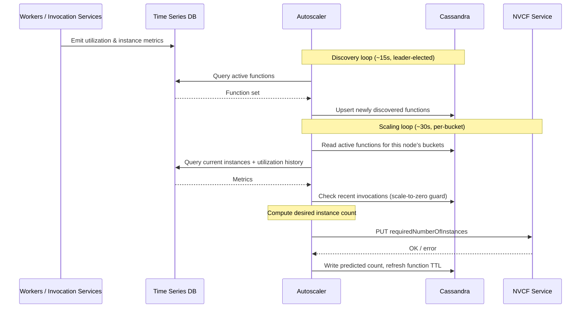

# NVCF Autoscaler

A high-performance, distributed autoscaling service for NVIDIA Cloud Functions (NVCF) built in Rust. This service periodically monitors function invocation and usage patterns and horizontally scales NVCF functions.



## 🛠️ Development

### Prerequisites

- **Rust**: 1.75+ (see `rust-toolchain.toml`)
- **Docker**: For local development and testing
- **Cassandra**: Local instance or access to cluster
- **VictoriaMetrics**: Local instance (included in docker-compose)

### Local Development Setup

1. **Start the Local Environment**:
   ```bash
   # Start core services (Cassandra, VictoriaMetrics, Grafana)
   cd local_env
   docker-compose up

   # OR start all services including Mock Server for local development
   docker-compose --profile local up
   ```

   **Core services** (`docker-compose up`) will start:
   - Cassandra database on port 9042
   - VictoriaMetrics on port 8428
   - Grafana on port 3000

   **With local profile** (`docker-compose --profile local up`) additionally includes:
   - Mock NVCF API Server on port 8082

2. **Configure Settings**:
   For local setup, passing a settings.yaml file is not supported yet. It uses the default settings set by `AppSettings`.

3. **Mock NVCF API Server**:

   The mock server can be started in two ways:

   **Option 1: Docker Compose with local profile (Recommended)**
   ```bash
   cd local_env
   docker-compose --profile local up

   # Or with custom function count
   FUNCTION_COUNT=5 docker-compose --profile local up
   ```

   **Option 2: Manual setup (when not using local profile)**

   - Install dependencies:
   ```bash
   cd local_env/mock_server
   pip install -r requirements.txt
   ```

   - Start the mock server on port 8082:
   ```bash
   python mock_server.py
   ```

   The server will be available at `http://localhost:8082`

   The mock server simulates the NVCF API scaling functionality and provides test metrics to VictoriaMetrics.

   **Scale Function Endpoint**:
   - **URL**: `/v2/nvcf/accounts/{ncaId}/predictions/functions/{funcId}/versions/{versionId}`
   - **Method**: `PUT`
   - **Content-Type**: `application/json`

   **Request Body**:
   ```json
   {
       "requiredNumberOfInstances": 5,
       "deploymentId": "uuid-string",
       "predictedAt": "2024-03-14T12:00:00Z"
   }
   ```

   **Example using curl**:
   ```bash
   curl -X PUT http://localhost:8082/v2/nvcf/accounts/test-nca/predictions/functions/$(uuidgen)/versions/$(uuidgen) \
     -H "Content-Type: application/json" \
     -d '{
       "requiredNumberOfInstances": 5,
       "deploymentId": "'$(uuidgen)'",
       "predictedAt": "'$(date -u +"%Y-%m-%dT%H:%M:%SZ")'"
     }'
   ```

4. **Run the Service**:
   ```bash
   cargo run --bin server
   ```

### Configuration

The service uses YAML configuration with the following key sections:

- `server`: HTTP/gRPC server settings
- `cassandra`: Database connection and SSL settings
- `timeseries_db`: Metrics collection configuration
- `nvcf_api`: NVCF API endpoints and authentication
- `metrics`: Prometheus and OpenTelemetry settings
- `tracing`: Distributed tracing configuration

## 📊 Monitoring & Observability

### Health Endpoints

- `GET /admin/health/liveness` - Always returns 200; used by Kubernetes liveness probes
- `GET /admin/health/readiness` - Returns 200 when all components are healthy, 503 otherwise; used by Kubernetes readiness probes
- `GET /health` - Full health status with per-component detail (Cassandra, TSDB)

### Metrics

Metrics are exposed in Prometheus format on port `41337` (configurable via `metrics.exporters`).

| Metric | Type | Description |
|--------|------|-------------|
| `nvcf_autoscaler.autoscaling.status` | Gauge | Scaling status per function (reason code) |
| `nvcf_autoscaler.scaling.current_instances` | Gauge | Current instance count per function |
| `nvcf_autoscaler.scaling.desired_instances` | Gauge | Desired instance count per function |
| `nvcf_autoscaler.scaling.utilization` | Gauge | Utilization percentage per function |
| `nvcf_autoscaler.requests.queued_total` | Counter | Total scaling requests queued |
| `nvcf_autoscaler.requests.processed_total` | Counter | Total scaling requests processed |
| `nvcf_autoscaler.requests.rejected_total` | Counter | Total scaling requests rejected |
| `nvcf_autoscaler.requests.rate_limited_total` | Counter | Total scaling requests rate-limited |
| `nvcf_autoscaler.queue.size` | Gauge | Current request queue depth |
| `nvcf_autoscaler.queue.capacity` | Gauge | Request queue capacity |
| `nvcf_autoscaler.function_table_state` | Gauge | Active function table state per function |
| `nvcf_autoscaler.function_discovery_duration_seconds` | Histogram | Duration of each discovery loop run |
| `nvcf_autoscaler.timeseries_db.requests_total` | Counter | Total TSDB requests by status |
| `nvcf_autoscaler.timeseries_db.request_duration_milliseconds` | Histogram | TSDB request latency |
| `nvcf_autoscaler.timeseries_db.auth_failure_total` | Counter | TSDB authentication failures |
| `nvcf_autoscaler.timeseries_db.server_side_failure_total` | Counter | TSDB server-side query failures |
| `nvcf_autoscaler.nvcf_api.request_duration_milliseconds` | Histogram | NVCF API request latency |
| `nvcf_autoscaler.cassandra.health_status` | Gauge | Cassandra health (1 = healthy) |
| `nvcf_autoscaler.health.overall_status` | Gauge | Overall service health |
| `nvcf_autoscaler.health.component_status` | Gauge | Per-component health status |
| `nvcf_autoscaler.distributed_lock` | Gauge | Distributed lock state |
| `nvcf_autoscaler.distributed_lock.acquisition_failures_total` | Counter | Lock acquisition failures |
| `nvcf_autoscaler.processing.utilization_data_age_milliseconds` | Histogram | Age of utilization data used in scaling decisions |

### Tracing

Distributed tracing is configured via the `tracing` section in settings. Spans are emitted for TSDB queries and NVCF API calls.

## 🧪 Testing

```bash
# Run all tests
cargo test

# Run specific test suite
cargo test --lib

# Run integration tests
cargo test --test integration

# Test with coverage
# Goal is 65% (we are at 50% now)
cargo tarpaulin --out html

# Run end-to-end local test
cd local_env
docker-compose --profile local up -d
# Or with custom function count for testing with more data
FUNCTION_COUNT=10 docker-compose --profile local up -d
# Wait for all services to start, then in another terminal
cargo run
```

## 📋 API Reference

### Autoscaling Operations

The service automatically handles:

- Function discovery and registration
- Bucket assignment and rebalancing
- Node health monitoring
- Scaling decision execution

### Integration Points

- **NVCF API**: Function scaling operations
- **TSDB**: Historical metrics collection
- **Cassandra**: Distributed state storage

## 🔧 Troubleshooting

### Common Issues

1. **Cassandra Connection Issues**:
   - Verify SSL certificates are properly configured
   - Check network connectivity to Cassandra cluster
   - Validate credentials in secrets file
   - Create `/etc/app/config` directory if it does not exist

2. **TSDB Query Failures**:
   - Confirm TSDB endpoint accessibility
   - Verify authentication tokens are valid
   - Check query syntax and time ranges

3. **NVCF API Errors**:
   - Validate JWT token generation
   - Check function permissions and status
   - Verify API endpoint configurations

### Logging

Set log levels using the `envfilter_directive` configuration:

```yaml
server:
  envfilter_directive: "server=debug,cassandra=info,timeseries_db=warn"
```

## 🤝 Contributing

1. **Code Standards**: Follow Rust conventions and run `cargo fmt`
2. **Testing**: Add unit tests for new functionality
3. **Documentation**: Update README and inline docs
4. **Linting**: Ensure `cargo clippy` passes without warnings

### Development Workflow

1. Create feature branch from `main`
2. Implement changes with tests
3. Run full test suite
4. Submit PR
5. Address review feedback

## 📄 License

SPDX-License-Identifier: Apache-2.0

Copyright (c) 2024 NVIDIA CORPORATION & AFFILIATES. All rights reserved.

Licensed under the Apache License, Version 2.0 (the "License"); you may not use this file except in compliance with the License. You may obtain a copy of the License at http://www.apache.org/licenses/LICENSE-2.0. Unless required by applicable law or agreed to in writing, software distributed under the License is distributed on an "AS IS" BASIS, WITHOUT WARRANTIES OR CONDITIONS OF ANY KIND, either express or implied. See the License for the specific language governing permissions and limitations under the License.
