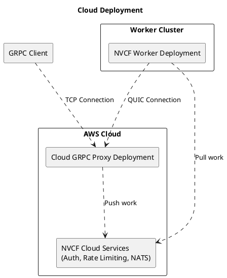
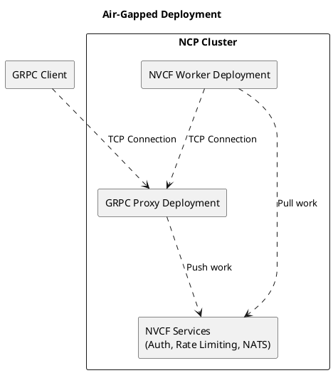
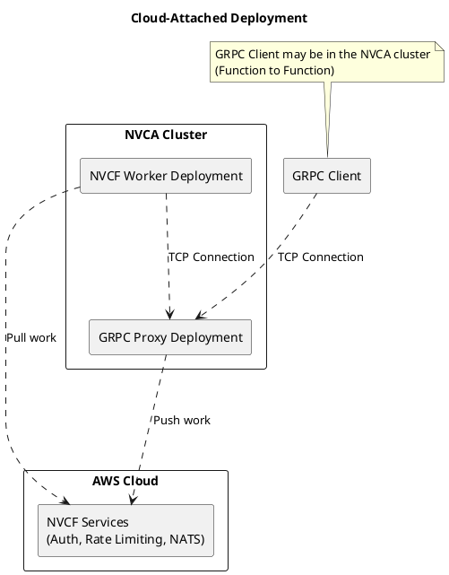
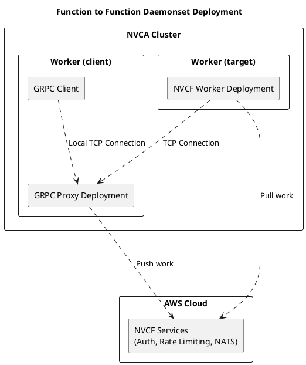

<!--
SPDX-FileCopyrightText: Copyright (c) NVIDIA CORPORATION & AFFILIATES. All rights reserved.
SPDX-License-Identifier: Apache-2.0

Licensed under the Apache License, Version 2.0 (the "License");
you may not use this file except in compliance with the License.
You may obtain a copy of the License at

    http://www.apache.org/licenses/LICENSE-2.0

Unless required by applicable law or agreed to in writing, software
distributed under the License is distributed on an "AS IS" BASIS,
WITHOUT WARRANTIES OR CONDITIONS OF ANY KIND, either express or implied.
See the License for the specific language governing permissions and
limitations under the License.
-->
# NVCF GRPC Proxy

A proxy service that facilitates communication between clients and NVIDIA Cloud Functions (NVCF) workers. This service handles HTTP/3 CONNECT endpoints, HTTP/1 CONNECT endpoints, and HTTP/1-2 forwarding for GRPC requests.

## Overview

The NVCF GRPC Proxy runs the following endpoints:
- HTTP/3 CONNECT endpoint: `http://localhost:10084/v1/proxy`
- HTTP/1 CONNECT endpoint: `http://localhost:10086/v1/proxy` (configurable)
- HTTP/1-2 forwarder: `http://localhost:10081`

Its primary purpose is to forward GRPC requests over QUIC/TCP channels established via the CONNECT proxy endpoints.

## How It Works

### Session Management

GRPC clients typically use one TCP connection per session. The proxy assumes that requests coming from the same TCP connection with identical function routing headers belong to a single stateful session. Note that:

- The proxy routes client calls to the appropriate worker QUIC/TCP connection
- A client can make multiple calls to the same function over one QUIC/TCP connection
- Workers cannot be shared between clients
- If a client terminates, the associated worker should also terminate
- Idle workers will eventually terminate
- If a worker terminates while the client remains active, the next RPC to that function will trigger a new worker request

### Request Headers

**Standard Headers:**
- `authorization` - Bearer token for authentication (required)
- `function-id` - Function ID to invoke (required)  
- `function-version-id` - Optional function version ID

### Reconnection Support

The proxy supports reconnection flows, allowing clients to reconnect to existing sessions if they get disconnected.

- `nvcf-reqid` - Request ID for session management and reconnection
- `Sec-WebSocket-Protocol` - Supported for browser websocket connections which cannot set traditional headers
- `nvcf-request-id` - `Cookie` - For automatic support of clients that do not manage the request id headers themselves

**WebSocket Protocol Headers:**
For browser based WebSocket connections, http headers can be passed via `Sec-WebSocket-Protocol` using a dot-separated
key-value format (e.g., `authorization.token`, `function-id.my-function`) as standard header control is not available
to browsers. HTTP Header structured values are not used, as browsers cannot send separator characters in websocket
headers either.

**Request ID Priority:**
1. `nvcf-reqid` header (for manual client management of sessions)
2. `Sec-WebSocket-Protocol` header (for browser based WebSocket connections)
3. `nvcf-request-id` cookie (fallback)

**Response Headers:**
- `nvcf-reqid` - Request ID returned in all responses
- `Set-Cookie: nvcf-request-id` - Cookie automatically set for session persistence

## Client Flow Diagrams

### Single Client Flow

```plantuml
participant Client as client
participant "NVCF GRPC Proxy" as proxy
participant "NVCF API" as api
participant Worker as worker
participant Queue as queue

client -> proxy: grpc request,\nwith function id and\noptional function version
proxy -> proxy: parse request metadata
proxy -> api: stateful function invoke
api -> api: auth function

api -> api : gen random key for worker,\nscoped to this request

api -> queue: new request\nstateful = true \nrequestId = req ID\napiKey = key\nproxyUrl = proxy url

api --> proxy: stateful function invoke response\nwith request id and key

proxy -> proxy: hold client connection open\nuntil worker backend is present,\nkeyed by req ID

worker -> api: wait for new request
api -> queue: wait for new request
api --> worker: respond with stateful request

loop until request finish
worker -> api: stateful request keepalive
end

worker -> proxy: register self as a backend,\nconnect with HTTP(S) CONNECT
proxy -> proxy: verify key matches request id

proxy --> worker: quic/tcp comms
worker --> proxy: quic/tcp comms
client --> proxy: grpc comms
proxy --> client: grpc comms

worker -> api: on finish ack stateful request
api -> queue: ack stateful request
```

### Reconnect Flow

```plantuml
participant Client as client
participant "NVCF GRPC Proxy" as proxy
participant "NVCF API" as api
participant Worker as worker
participant NATS as nats

client -> proxy: http request
note right
    with function-id and optional function-version-id in header
    and with request-id in header if reconnecting
end note
proxy -> proxy: parse request metadata
proxy -> api: validate function auth
api -> api: auth function
api --> proxy: auth result

proxy -> proxy : gen random key for worker,\nscoped to this request

proxy -> nats: check for existing request-id session registration

group if request-id absent
    proxy -> nats: new request on rq\nstateful = true \nrequestId = req ID\napiKey = key\nproxyUrl = proxy url
end group

group if request-id present and metadata matches
    proxy -> nats: new message to subject stateful_session.reconnect.${request_id} \nstateful = true \nrequestId = req ID\napiKey = key\nproxyUrl = proxy url
end group

api --> proxy: stateful function invoke response\nwith request id and key

proxy -> proxy: hold client connection open\nuntil worker backend is present,\nkeyed by req ID

worker -> nats: wait for new request on stream rq_*_${function-version-id}
nats --> worker: respond with stateful request

loop until request finish
    worker -> nats: stateful request keepalive
    worker -> nats: request id session registration keepalive
end

loop until request finish
    worker -> nats: subscribe to stateful_session.reconnect.${request_id}
    nats --> worker: reconnect messages
    note right 
        containing same info as stateful request
    end note
    worker -> proxy: (re)connect as normal with HTTP(S) CONNECT
    note right
        this supports multiple connections, not just reconnect
    end note
end

worker -> proxy: register self as a backend,\nconnect with HTTP(S) CONNECT
proxy -> proxy: verify key matches request id

loop until connection close
    proxy --> worker: quic/tcp comms
    worker --> proxy: quic/tcp comms
    client --> proxy: http comms
    proxy --> client: http comms
    note right
        proxy injects nvcf-request-id to all http response headers
    end note
end loop

group if client disconnects and wants to reconnect
    client -> proxy: http request
    note right
        same request flow as the start of this diagram
    end note
end group

worker -> worker: wait for all quic/tcp connections to close
group after close [if last connection close was not clean]
    note right
        clean connection close meaning no read
        or write errors other than io.EOF
    end note
    worker --> worker: wait at least 30s for any reconnects
end
worker -> nats: on finish ack stateful request
worker -> nats: remove request id session registration
```

## Deployment Types

### Cloud



### Air Gapped



### In Cluster Cloud Attached



### In Cluster Daemonset



## Usage Guide

### GRPC Client Configuration

1. Set the inference path to `/grpc`. (An explicit `inferenceType` will likely be added in the future)
2. Use `stg.grpc.nvcf.nvidia.com:443` as your GRPC endpoint
3. Set your bearer token in the per-RPC credentials under the "authorization" header/metadata
4. Include function-id and optional function-version-id in the headers

### Python Example

```python
def test_worker_grpc(
        nvcf_client: nvcf.NVCFClient, # oauth2 client to provide access tokens
        create_grpc_function: CreateFunctionResponse, # function def info
) -> None:
    channel = grpc.secure_channel("stg.grpc.nvcf.nvidia.com:443",
                                  grpc.ssl_channel_credentials())
    # proto generated grpc client
    grpc_client = grpc_service_pb2_grpc.GRPCInferenceServiceStub(channel)
    
    function_id = create_grpc_function.function.id
    function_version_id = create_grpc_function.function.version_id
    logging.info(f"function at {create_grpc_function}")

    token = nvcf_client.get_token().get("access_token")
    metadata = [("function-id", function_id), # required
                ("function-version-id", function_version_id), # optional
                ("authorization", "Bearer " + token)] # required

    # make 100 unary inferences in a row
    for i in range(ITERATIONS):
        # this would be your client, request, and body.
        # it does not have any proto def restriction.
        infer = grpc_client.ModelInfer(MODEL_INFER_REQUEST,
                                       metadata=metadata)
        _ = infer
    logging.info(f"finished invoking {ITERATIONS} times")
```

### HTTP Support

Raw HTTP is also supported:

```python
def test_worker_http():
    # http2 to ensure one tcp connection
    with httpx.Client() as client:
        get = client.get("https://stg.grpc.nvcf.nvidia.com/test-get",
                         headers={"Authorization": f"Bearer {token}"})
        get.raise_for_status()
        post = client.post("https://stg.grpc.nvcf.nvidia.com/test-post", json={
            "foo": "bar",
        }, headers={"Authorization": f"Bearer {token}"})
        post.raise_for_status()
```

**Note**: When hosting an HTTP function, set the inference URL to anything except `/grpc`. This is because `/grpc` triggers the utils container to use GRPC-based health checks rather than HTTP-based health checks.

## Development and Configuration

### Prerequisites

- Go 1.24 or higher
- Access to NVIDIA Vault

### Environment Setup

Configuration is primarily handled through environment variables or command-line flags. Key configuration parameters include:

- `OTEL_EXPORTER_OTLP_ENDPOINT`: Endpoint for OpenTelemetry tracing
- `NATS_PRIVATE_NKEY`: NATS authentication key
- `NVCF_FQDN_GRPC`: FQDN for the NVCF API
- `ENABLE_HTTP1_CONNECT`: Enable HTTP/1 CONNECT endpoints
- `ENABLE_HTTP3_CONNECT`: Enable HTTP/3 CONNECT endpoints

See the `Config` struct in the code for a complete list of configuration options.

GRPC Client credentials are provided by either OAuth2 Client Credentials or a bearer token loaded from the secrets.json file.
OAuth2 Client Credentials should be provided at the json key "id" and "secret".
Alternatively, bearer token credentials should be provided at the json key "nvcfApiToken" and "ratelimiterToken".

### Vault Access

Login to Vault as shown below:

```shell
# stg
export VAULT_ADDR="https://stg.vault.nvidia.com"
export VAULT_NAMESPACE="nvcf"
export AWS_ACCOUNT_ID=130889915494
vault login -method=oidc -path=oidc role=namespace-operator

# prod
export VAULT_ADDR="https://"
export VAULT_NAMESPACE="nvcf"
export AWS_ACCOUNT_ID=052277528122
vault login -method=oidc -path=oidc role=namespace-operator
```

### Managing NATS Keys

Put a new nkey in Vault:

```shell
vault kv put /cloud/aws/${AWS_ACCOUNT_ID}/services/nvcf-grpc-proxy/regions/all/kv/nats \
        user='' userSeed=''
```

Render the secrets:

```shell
pushd vault
vault agent -config=config-qat.hcl -log-level=debug
popd
```

Note: `namespace operator` spans all NVCF services. The role `nvcf-grpc-proxy-vault-admins` is also
suitable with more finely-scoped permissions.
