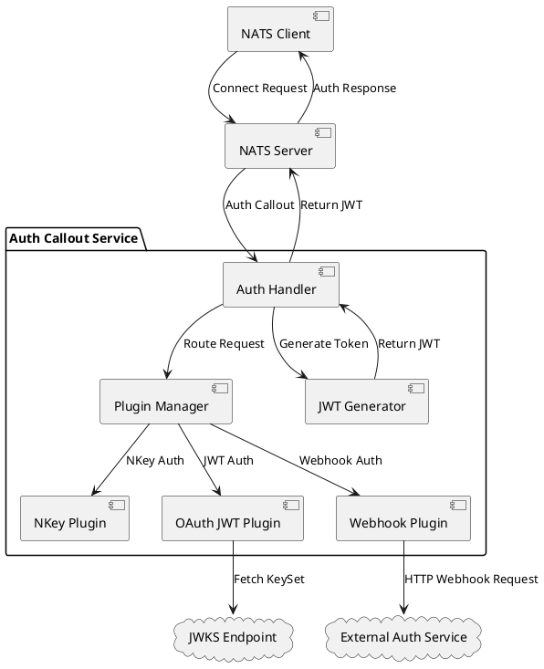

# NVCF NATS Auth Callout Service - Software Design Document

## Overview

The NVCF NATS Auth Callout Service is a pluggable authentication service that integrates with NATS Server's authorization callout feature. It provides a flexible, multi-plugin architecture for authenticating NATS clients using various authentication mechanisms including NKeys, OAuth2 JWT tokens, and external webhooks.

## Architecture Overview



### Core Components

1. **Service Layer**: Main NATS integration and request coordination
2. **Auth Handler**: Orchestrates authentication requests and JWT generation
3. **Plugin Manager**: Manages plugin instances and routing
4. **Plugin System**: Extensible authentication providers
5. **Configuration System**: Account and plugin configuration management

## Plugin System Architecture

### Plugin Interface

All authentication plugins implement a common interface with a single `Authenticate` method that takes a context and request, returning either an authentication result or an error.

### Plugin Configuration Model

The service uses a two-tier configuration system:

1. **Plugin Configurations**: Define plugin instances and their settings
2. **Account Configurations**: Map NATS accounts to enabled plugins

```yaml
# Plugin definitions with configurations
plugin_configs:
  oauth-instance-1:
    plugin_type: "oauth"
    config:
      jwks_endpoint_url: "https://auth.example.com/.well-known/jwks.json"
      issuer: "https://auth.example.com"
      audience: "nats-cluster"
  
  webhook-instance-1:
    plugin_type: "webhook"
    config:
      url: "https://auth.example.com/validate"
      timeout: "30s"

# Account-to-plugin mappings
account_configs:
  production:
    enabled_plugins:
      - id: "oauth-instance-1"
        alias: "oauth"
      - id: "webhook-instance-1"
        alias: "custom"
```

### Plugin Manager

The Plugin Manager creates and manages plugin instances using a composite key system that combines account names with plugin names to route authentication requests to the appropriate plugin instance.

The manager:
- Creates plugin instances from configuration
- Routes authentication requests to appropriate plugins
- Manages plugin lifecycle and error handling

## Available Plugins

### 1. NKey Plugin

**Purpose**: Authenticates NATS clients using cryptographic NKey signatures.

**Configuration**:
```yaml
plugin_type: "nkey"
config:
  nkey_mappings:
    - nkey: "UABC123..." # Public user NKey
      account: "production"
    - nkey: "UXYZ789..." 
      account: "development"
```

**Authentication Flow**:
1. Client connects with NKey public key and signed nonce
2. Plugin verifies the public key exists in mappings
3. Plugin cryptographically verifies the signature using the public key
4. Returns account mapping if signature is valid

**Special Behavior**: The NKey plugin maintains its own account mappings and is special-cased in the plugin manager since account determination happens during authentication.

### 2. OAuth (OAuth2 JWT) Plugin

**Purpose**: Authenticates using OAuth2 JWT Bearer tokens with JWKS validation.

**Configuration**:
```yaml
plugin_type: "oauth"
config:
  jwks_endpoint_url: "https://auth.provider.com/.well-known/jwks.json"
  issuer: "https://auth.provider.com"
  audience: "nats-cluster"
  scope_permissions:
    read:
      subscribe:
        allow: ["data.read.>", "_INBOX.>"]
    write:
      publish:
        allow: ["data.write.>"]
      subscribe:
        allow: ["data.write.>", "_INBOX.>"]
```

**Authentication Flow**:
1. Client provides JWT token in request payload
2. Plugin validates JWT signature using JWKS
3. Plugin verifies issuer, audience, and expiration
4. Plugin maps OAuth2 scopes to NATS permissions
5. Returns user identity and permissions

**Key Features**:
- Automatic JWKS key rotation support
- Scope-based permission mapping
- JWT validation with configurable leeway
- Supports multiple scopes per token

### 3. Webhook Plugin

**Purpose**: Delegates authentication to external HTTP services.

**Configuration**:
```yaml
plugin_type: "webhook"
config:
  url: "https://auth.service.com/validate"
  timeout: "30s"
  retry_attempts: 3
  insecure_skip_verify: false
```

**Authentication Flow**:
1. Client provides authentication payload (token, credentials, etc.)
2. Plugin sends HTTP POST to configured webhook URL
3. Webhook service validates credentials and returns response
4. Plugin processes response and returns result

**Request Format**:
```json
{
  "account": "production",
  "pluginName": "webhook",
  "payload": "client-provided-token"
}
```

**Response Format**:
```json
{
  "userId": "user123",
  "account": "production",
  "permissions": {
    "publish": {"allow": ["events.>"]},
    "subscribe": {"allow": ["events.>", "_INBOX.>"]}
  },
  "ttl": "1h"
}
```

**Key Features**:
- Configurable retry logic with exponential backoff
- TLS configuration options
- Flexible payload handling
- Error mapping to appropriate HTTP status codes

## Authentication Flow

### Request Processing

1. **NATS Authorization Request**: NATS server receives client connection and calls the auth service
2. **Request Parsing**: Service parses the authorization request based on connection type:
   - **Token-based**: Base64-decode JSON payload containing account, plugin, and credentials
   - **NKey-based**: Route to NKey plugin with signature validation data
3. **Plugin Resolution**: Plugin manager identifies the appropriate plugin for the account/plugin combination
4. **Plugin Authentication**: Selected plugin validates credentials and returns authentication result
5. **JWT Generation**: Auth handler creates NATS user JWT with permissions and account mapping
6. **Response**: JWT token returned to NATS server for client authorization

### JWT Generation

The service generates NATS user JWTs using the authentication result from plugins. The JWT includes the user's NKey, account assignment, user identity, permissions (publish/subscribe allow/deny lists), and expiration time. The JWT is signed using the service's configured signing key and returned to NATS server for client authorization.

### Error Handling

The system provides comprehensive error handling with specific error types:

- `ErrTypeInvalidToken`: Malformed or missing authentication tokens
- `ErrTypeExpiredToken`: Expired authentication credentials
- `ErrTypeUnauthorized`: Valid credentials but insufficient permissions
- `ErrTypeInternalError`: System or plugin errors
- `ErrTypePluginError`: Plugin-specific configuration or runtime errors

## Plugin Development

### Creating Custom Plugins

To implement a custom authentication plugin:

1. **Implement the Interface**: Create a plugin struct that implements the authentication interface, taking a request and returning either a successful result with user identity, account, permissions, and TTL, or an appropriate error.

2. **Add to Plugin Manager**: Register the new plugin type in the plugin manager's factory method to enable instantiation from configuration.

3. **Configuration Schema**: Define configuration structure with mapstructure tags for parsing from YAML/JSON configuration files.

### Plugin Best Practices

- **Timeout Handling**: Respect context timeouts and cancellation
- **Error Classification**: Use appropriate error types for different failure modes
- **Logging**: Provide structured logging for observability
- **Configuration Validation**: Validate configuration at plugin creation time
- **Resource Management**: Properly manage HTTP clients, connections, and other resources

## Security Considerations

### NKey Security
- NKey seeds must be securely stored and transmitted
- Signature verification provides cryptographic authentication
- Public keys can be safely stored in configuration

### JWT Security
- JWKS endpoints should use HTTPS
- JWT validation includes signature, expiration, issuer, and audience checks
- Scope-based permissions provide fine-grained access control

### Webhook Security
- Webhook endpoints should use HTTPS
- Consider webhook authentication (API keys, mutual TLS)
- Implement proper timeout and retry logic
- Validate webhook responses thoroughly

### General Security
- All configuration secrets should be externalized (environment variables, secrets management)
- Service-to-service communication should be encrypted
- Audit logging should capture authentication events
- Regular rotation of signing keys and credentials

## Observability

### Metrics
- Authentication request rates and latencies
- Success/failure rates by plugin and account
- Plugin-specific performance metrics

### Logging
- Structured logging with correlation IDs
- Authentication events with user and account context
- Plugin-specific debug information
- Error tracking and alerting

### Tracing
- Distributed tracing through authentication flow
- Plugin execution timing and dependencies
- External service call tracing (JWKS, webhooks)

## Configuration Management

### Environment-Based Configuration
- CLI flags override environment variables
- Environment variables override configuration files
- Configuration files provide defaults and documentation


### Secrets Management
- NKey seeds and signing keys via vault agent json file

This architecture provides a flexible, secure, and observable authentication system that can adapt to various organizational authentication requirements while maintaining strong integration with NATS Server's authorization model. 